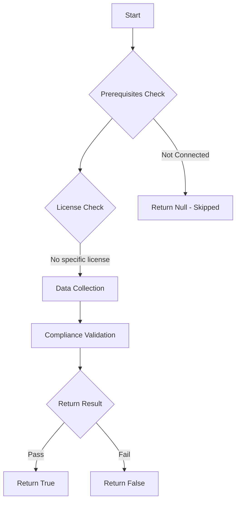

# Test-MtXspmEnabledPrivilegedUsersLinkedToDisabledIdentity: Tests if enabled privileged users with assigned high privileged Entra ID roles or criticality level (<= 1) are linked to a disabled identity in Microsoft Defender XDR.

## Overview

**Function Name:** `Test-MtXspmEnabledPrivilegedUsersLinkedToDisabledIdentity`
**Category:** XSPM

## Description

This function checks if any enabled privileged users with assigned high privileged Entra ID roles or criticality level (<= 1) are linked to a disabled identity in Microsoft Defender XDR. Having enabled privileged users linked to disabled identities can pose a security risk, as it may indicate orphaned privileged accounts that could be exploited by attackers.

## Workflow

## Phase Details

### Phase 1: Prerequisites Check

No specific prerequisites required.

### Phase 2: Data Collection

**Cmdlets/Functions Used:**
- `Get-MtXspmUnifiedIdentityInfo`
- `Get-MtXspmPrivilegedClassificationIcon`

### Phase 3: Compliance Validation

**Properties Checked:**

| Property | Expected Value |
| --- | --- |
| `Type` | `User` |
| `AccountStatus` | `Enabled` |
| `Classification` | `ControlPlane` |
| `Classification` | `ManagementPlane` |
| `CriticalityLevel` | `1)` |
| `RoleIsPrivileged` | `$True` |

### Phase 4: Return Result

| Return Value | Meaning |
| --- | --- |
| `$true` | Compliant |
| `$false` | Non-Compliant |
| `$null` | Skipped (missing prerequisites, license, or error) |

## Original Documentation

Reviewing the enabled status of a privileged account when the linked user identity has been disabled is critical to prevent orphaned high‑risk access. If a normal work account is deactivated (for example, because the user left the organization) but the related privileged account remains enabled, an attacker or former employee could still use that privileged identity to access sensitive systems, change security settings, or exfiltrate data unnoticed. Regularly checking and aligning the status of privileged accounts with their primary identities helps enforce least privilege, reduces the attack surface, and ensures that privileges are revoked promptly when a user’s employment or role ends.

### How to fix
Review the results from this check and verify whether it is legitimate for the privileged user account to remain enabled when the associated primary work account has been disabled.

<!--- Results --->
%TestResult%

## Standalone Function

See the standalone compliance check function: [`Test-MtXspmEnabledPrivilegedUsersLinkedToDisabledIdentityCompliance.ps1`](../../standalone-functions/XSPM/Test-MtXspmEnabledPrivilegedUsersLinkedToDisabledIdentityCompliance.ps1)
