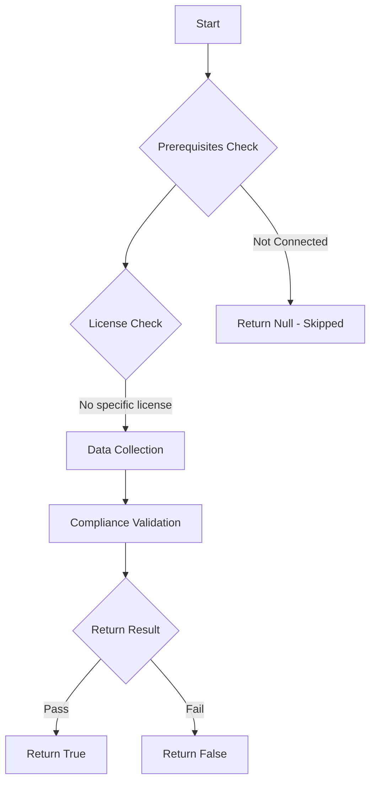

# Test-MtXspmExposedCredentialsForPrivilegedUsers: Tests if exposed credentials for highly privileged users are present on vulnerable endpoints with high risk or exposure score.

## Overview

**Function Name:** `Test-MtXspmExposedCredentialsForPrivilegedUsers`
**Category:** XSPM

## Description

This function checks all credential artifacts exposed on vulnerable endpoints and correlates them with highly privileged users.

## Workflow

## Phase Details

### Phase 1: Prerequisites Check

No specific prerequisites required.

### Phase 2: Data Collection

**Cmdlets/Functions Used:**
- `Get-MtXspmUnifiedIdentityInfo`
- `Get-MtXspmExposedAuthenticationArtifact`
- `Get-MtXspmPrivilegedClassificationIcon`
- `Get-MtXspmAuthenticationArtifactIcon`

### Phase 3: Compliance Validation

**Properties Checked:**

| Property | Expected Value |
| --- | --- |
| `RiskScore` | `High` |
| `ExposureScore` | `High` |
| `AccountObjectId` | `$ExposedUserAuthArtifact.AccountObjectId` |

### Phase 4: Return Result

| Return Value | Meaning |
| --- | --- |
| `$true` | Compliant |
| `$false` | Non-Compliant |
| `$null` | Skipped (missing prerequisites, license, or error) |

## Original Documentation

Exfiltration of authentication artifacts on vulnerable device poses a significant security risk. Attackers who gain access to these credentials (e.g., by infostealer) can impersonate privileged users, bypass Conditional Access, and access sensitive the assigned sensitive roles. Protecting endpoints, especially used by privileged users, is essential to prevent unauthorized access and reduce attack surface.

### How to fix
Review the details of risk and exposure score on the related [device page from the Device Inventory](https://learn.microsoft.com/en-us/defender-endpoint/machines-view-overview#device-inventory-overview) in the Microsoft Defender XDR portal to improve the device's security posture.

<!--- Results --->
%TestResult%

## Standalone Function

See the standalone compliance check function: [`Test-MtXspmExposedCredentialsForPrivilegedUsersCompliance.ps1`](../../standalone-functions/XSPM/Test-MtXspmExposedCredentialsForPrivilegedUsersCompliance.ps1)
