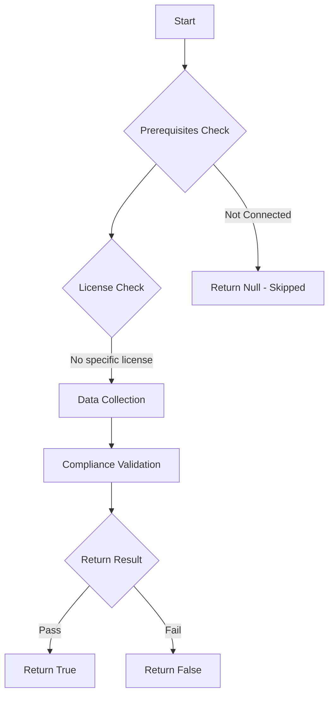

# Test-MtXspmHybridUsersWithAssignedEntraIdRoles: Tests if hybrid users have been assigned eligible or permanent to Entra ID roles.

## Overview

**Function Name:** `Test-MtXspmHybridUsersWithAssignedEntraIdRoles`
**Category:** XSPM

## Description

This function checks if any hybrid users (synchronized from on-premises Active Directory) have been assigned eligible or permanent Entra ID roles, which can lead to privilege escalation by compromising the on-premises AD.

## Workflow

## Phase Details

### Phase 1: Prerequisites Check

No specific prerequisites required.

### Phase 2: Data Collection

**Cmdlets/Functions Used:**
- `Get-MtXspmUnifiedIdentityInfo`
- `Get-MtXspmPrivilegedClassificationIcon`

### Phase 3: Compliance Validation

**Properties Checked:**

| Property | Expected Value |
| --- | --- |
| `Type` | `User` |
| `SourceProvider` | `ActiveDirectory` |
| `SourceProvider` | `Hybrid` |
| `Classification` | `ControlPlane` |
| `Classification` | `ManagementPlane` |
| `RoleIsPrivileged` | `$True` |

### Phase 4: Return Result

| Return Value | Meaning |
| --- | --- |
| `$true` | Compliant |
| `$false` | Non-Compliant |
| `$null` | Skipped (missing prerequisites, license, or error) |

## Original Documentation

Microsoft strongly recommends avoiding the use of synchronized identities to manage Microsoft 365 or Microsoft Entra environments for [protecting against on-premises attacks](https://learn.microsoft.com/en-us/entra/architecture/protect-m365-from-on-premises-attacks).

### How to fix
Create [dedicated privileged users](https://learn.microsoft.com/en-us/microsoft-365/enterprise/protect-your-global-administrator-accounts?view=o365-worldwide) to assign and use Entra ID roles, and remove the previous role assignments for the on-premises accounts.

<!--- Results --->
%TestResult%

## Standalone Function

See the standalone compliance check function: [`Test-MtXspmHybridUsersWithAssignedEntraIdRolesCompliance.ps1`](../../standalone-functions/XSPM/Test-MtXspmHybridUsersWithAssignedEntraIdRolesCompliance.ps1)
