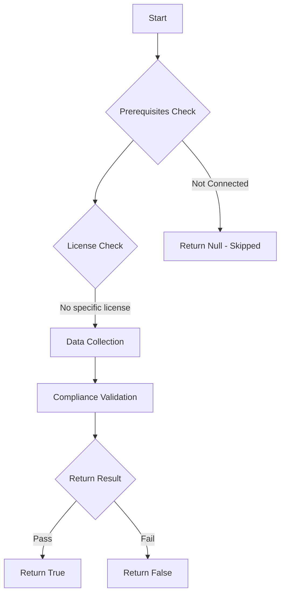

# Test-MtXspmPendingApprovalCriticalAssetManagement: Tests for pending approval for Critical Asset Management.

## Overview

**Function Name:** `Test-MtXspmPendingApprovalCriticalAssetManagement`
**Category:** XSPM

## Description

Tests for pending approval for Critical Asset Management.

## Workflow

## Phase Details

### Phase 1: Prerequisites Check

No specific prerequisites required.

### Phase 2: Data Collection

**Cmdlets/Functions Used:**
- `Invoke-MtGraphSecurityQuery`

### Phase 3: Compliance Validation

The function validates the collected data against compliance requirements.

### Phase 4: Return Result

| Return Value | Meaning |
| --- | --- |
| `$true` | Compliant |
| `$false` | Non-Compliant |
| `$null` | Skipped (missing prerequisites, license, or error) |

## Original Documentation

Microsoft provides an approval step for assets that do not meet the automatic classification threshold. Assets with a lower classification confidence score must be approved by a security administrator.
Stale pending approvals can lead to limited visibility in Microsoft Defender XDR and potential security risks if critical assets are not properly identified.

Therefore, you should regularly [review critical assets](https://learn.microsoft.com/en-us/security-exposure-management/classify-critical-assets#review-critical-assets) to ensure the correct classification has been applied to your assets.

### How to fix
On the [Critical asset management page](https://security.microsoft.com/securitysettings/defender/critical_asset_management), review the asset classification named in the Maester test results. Review the pending approvals and verify the correct classification of the listed assets.

More details are available in the Microsoft Learn article: "[Add assets to predefined classifications](https://learn.microsoft.com/en-us/security-exposure-management/classify-critical-assets#add-assets-to-predefined-classifications)".

<!--- Results --->
%TestResult%

## Standalone Function

See the standalone compliance check function: [`Test-MtXspmPendingApprovalCriticalAssetManagementCompliance.ps1`](../../standalone-functions/XSPM/Test-MtXspmPendingApprovalCriticalAssetManagementCompliance.ps1)
