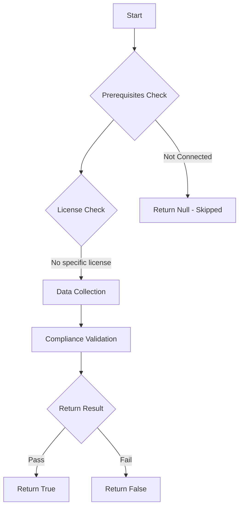

# Test-MtXspmPrivilegedUsersLinkedToIdentity: Tests if privileged users with assigned high privileged Entra ID roles are linked to an identity.

## Overview

**Function Name:** `Test-MtXspmPrivilegedUsersLinkedToIdentity`
**Category:** XSPM

## Description

This function checks if any enabled privileged users with assigned high privileged Entra ID roles are linked to an identity in Microsoft Defender XDR.
    Emergency access accounts defined in the Maester config under 'EmergencyAccessAccounts' are excluded from this test.
    Entra ID role members should be a separate account from the day-to-day user account to reduce the attack surface but also linked in Defender XDR for visibility and option to apply containment to all associated accounts in case of a identity compromise.

## Workflow

## Phase Details

### Phase 1: Prerequisites Check

No specific prerequisites required.

### Phase 2: Data Collection

**Cmdlets/Functions Used:**
- `Get-MtXspmUnifiedIdentityInfo`
- `Get-MtMaesterConfigGlobalSetting`
- `Get-MtXspmPrivilegedClassificationIcon`

### Phase 3: Compliance Validation

**Properties Checked:**

| Property | Expected Value |
| --- | --- |
| `Type` | `User` |
| `AccountStatus` | `Enabled` |
| `Classification` | `ControlPlane` |
| `RoleIsPrivileged` | `$True` |

### Phase 4: Return Result

| Return Value | Meaning |
| --- | --- |
| `$true` | Compliant |
| `$false` | Non-Compliant |
| `$null` | Skipped (missing prerequisites, license, or error) |

## Original Documentation

Linking a privileged user account to the primary work account in Microsoft Defender XDR makes it easier to detect, prioritize, and contain attacks that target highly sensitive identities. It also improves incident response because all relevant activity and risk signals are correlated to the real person behind both identities, reducing blind spots and investigation time.

This use case is explicitly described in the Defender XDR documentation:
A user might have two accounts, one for everyday work and another with elevated permissions for administrative tasks.
Example

john.smith@company.com (regular account)
john.smith.admin@company.com (privileged account)

### How to fix
Review the accounts in the Identity inventory of Microsoft Defender portal and add a [manual link](https://learn.microsoft.com/en-us/defender-for-identity/link-unlink-account-to-identity) from the identity page of the (primary) user account to the privileged account.

<!--- Results --->
%TestResult%

## Standalone Function

See the standalone compliance check function: [`Test-MtXspmPrivilegedUsersLinkedToIdentityCompliance.ps1`](../../standalone-functions/XSPM/Test-MtXspmPrivilegedUsersLinkedToIdentityCompliance.ps1)
