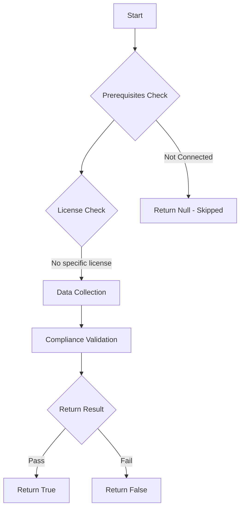

# Test-MtXspmPublicRemotelyExploitableHighExposureDevices: Test to find public exposed devices with remotely exploitable, highly likely to be exploited, high or critical severity CVE's

## Overview

**Function Name:** `Test-MtXspmPublicRemotelyExploitableHighExposureDevices`
**Category:** XSPM

## Description

Test to find devices that comply to the following:
    - Incoming connections from public IP addresses in the last 7 days (internet exposed)
    - High or Critical severity CVE's
    - CVE's must have known exploits
    - CVE's are remotely exploitable over the network
    - No user interaction required to exploit CVE's
    - EPSS score of CVE must be above 10% (likelihood of exploitation)

## Workflow

## Phase Details

### Phase 1: Prerequisites Check

No specific prerequisites required.

### Phase 2: Data Collection

**Cmdlets/Functions Used:**
- `Invoke-MtGraphSecurityQuery`

### Phase 3: Compliance Validation

The function validates the collected data against compliance requirements.

### Phase 4: Return Result

| Return Value | Meaning |
| --- | --- |
| `$true` | Compliant |
| `$false` | Non-Compliant |
| `$null` | Skipped (missing prerequisites, license, or error) |

## Original Documentation

The query behind this test searches for devices that comply with the following criteria:

- Incoming connections from public IP addresses in last 7 days (internet exposed)
- High or Critical severity CVE's
- CVE's must have known exploits
- CVE's are remotely exploitable over the network
- No user interaction is required to exploit the CVE's
- EPSS score of CVE must be above 10% (likelihood of exploitation)

> NOTE! If devices are placed behind a proxy, they will not be returned in this query by default

Devices that return from these results are possible high-risk devices that could be exploited successfully any time.

### How to fix
Review the devices in the list and either patch the severities, or make sure to implement mitigative controls to reduce exposure. If you want to have more details on the exposed devices and their related CVE's, you can [run the following query manually](https://github.com/HybridBrothers/Hunting-Queries-Detection-Rules/blob/main/Exposure%20Management/HuntPublicRemotelyExploitableDevicesWithHighEPSS.md) in Advanced Hunting.

<!--- Results --->
%TestResult%

## Standalone Function

See the standalone compliance check function: [`Test-MtXspmPublicRemotelyExploitableHighExposureDevicesCompliance.ps1`](../../standalone-functions/XSPM/Test-MtXspmPublicRemotelyExploitableHighExposureDevicesCompliance.ps1)
