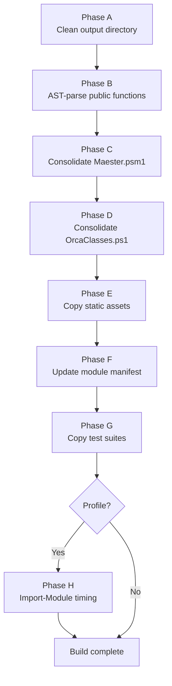

# Build-MaesterModule

Builds the Maester PowerShell module into a consolidated, publishable artifact
under `./module/`. The source tree (`powershell/`, `tests/`) is never modified.

## Usage

```powershell
# Standard build
./build/Build-MaesterModule.ps1

# Build with import-time profiling
./build/Build-MaesterModule.ps1 -Profile

# Custom output location
./build/Build-MaesterModule.ps1 -OutputRoot ./out
```

## Parameters

| Parameter | Type | Default | Description |
| ----------- | ------ | --------- | ------------- |
| `SourceRoot` | string | `../powershell` | Path to the module source directory |
| `TestsRoot` | string | `../tests` | Path to the test suites directory |
| `OutputRoot` | string | `../module` | Output directory (cleaned on every run) |
| `Profile` | switch | — | Measure and report `Import-Module` time |

## Build Phases



### Phase A — Clean output directory

Removes and recreates the output directory (`./module/` by default) to ensure a
clean build with no stale artifacts.

### Phase B — AST-parse public functions

Scans every `.ps1` file under `powershell/public/` (excluding `*.Tests.ps1`)
using the PowerShell AST parser to discover top-level function definitions.

- Only functions matching the `Verb-Noun` naming convention are exported.
- Helper functions without a `-` separator are logged and skipped.
- Duplicate function names across files are deduplicated and logged.
- Functions with unapproved verbs or mismatched filenames generate warnings.

### Phase C — Consolidate Maester.psm1

Concatenates all internal and public `.ps1` source files into a single
`Maester.psm1`, organized as:

1. **Module preamble** — `#Requires`, `$__MtSession` initialization
2. **Internal functions** — from `powershell/internal/` (excluding
   `check-ORCA*.ps1`, which go to Phase D)
3. **Public functions** — from `powershell/public/`
4. **Export-ModuleMember** — auto-generated function and alias exports
5. **Manifest loader** — `Import-PowerShellDataFile` for runtime metadata

Two transformations are applied to each source file:

- **Preamble stripping** — Removes file-level `[SuppressMessageAttribute]`,
  `param()`, `using module`, and `# Generated by` lines that are only valid at
  the top of standalone `.ps1` files. Attributes inside function bodies are
  preserved.
- **`$PSScriptRoot` path adjustment** — Strips parent-directory traversals
  (`../`) that were needed in the original subdirectory structure but are
  incorrect after consolidation to a flat module root. Any remaining
  `$PSScriptRoot/..` references trigger a warning for manual review.

### Phase D — Consolidate OrcaClasses.ps1

Merges the ORCA class hierarchy into a single `OrcaClasses.ps1`:

1. **Base classes and enums** from `orcaClass.psm1` (preamble preserved since
   this file runs standalone via `ScriptsToProcess`)
2. **Derived check classes** from each `check-ORCA*.ps1` file, with preambles
   stripped and `using module` directives removed (the base classes are now
   defined inline above)

This file is registered as `ScriptsToProcess` in the manifest so that class
definitions are available before the module's `.psm1` loads.

### Phase E — Copy static assets

Copies unchanged files to the output directory:

- `assets/` directory (icons, images)
- `Maester.Format.ps1xml` (type formatting)
- `README.md`

This phase runs before the manifest update (Phase F) so that
`FormatsToProcess` references can be validated by `Update-ModuleManifest`.

### Phase F — Update module manifest

Copies the source `Maester.psd1` to the output directory and updates:

- `FunctionsToExport` — set to the sorted, deduplicated list from Phase B
- `ScriptsToProcess` — set to `@('OrcaClasses.ps1')`

All other manifest fields (version, GUID, `RequiredModules`,
`AliasesToExport`, etc.) are preserved from the source.

### Phase G — Copy test suites

Copies the `tests/` directory to `maester-tests/` in the output. Tests are
copied as-is and not consolidated.

### Phase H — Build profiling (optional)

When `-Profile` is specified, imports the built module and reports:

- `Import-Module` wall-clock time
- Number of exported commands

The module is unloaded after profiling.

## Output Structure

```text
module/
├── assets/                    # Icons and images
├── maester-tests/             # Test suites (copied from tests/)
├── Maester.Format.ps1xml      # Type formatting definitions
├── Maester.psd1               # Updated module manifest
├── Maester.psm1               # Consolidated module script
├── OrcaClasses.ps1            # Consolidated ORCA class definitions
└── README.md
```

## Design Notes

- **Source is never modified.** The build reads from `powershell/` and `tests/`
  and writes exclusively to the output directory.
- **Deterministic output.** Files are sorted by full path before concatenation.
  The `FunctionsToExport` list is sorted alphabetically. Repeated builds from
  the same source produce identical output.
- **Encoding.** All generated PowerShell files use UTF-8 with BOM (`utf8BOM`),
  matching the project convention.
- **Preamble stripping is position-aware.** Only lines in the file-level
  preamble region (before the first function/class definition) are stripped.
  Identical attributes inside function bodies are preserved.
- **The hardcoded PSM1 preamble** (module header, `#Requires`,
  `$__MtSession`) is extracted from the source `Maester.psm1`. If new session
  variables are added to the source, they must also be added to the build
  script's preamble.
