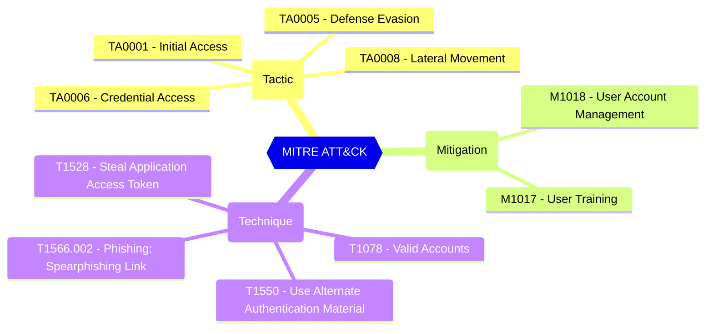

# Risk-based step-up consent

Indicates whether user consent for risky apps is allowed. For example, consent requests for newly registered multi-tenant apps that are not publisher verified and require non-basic permissions are considered risky.

| | |
|-|-|
| **Name** | allowUserConsentForRiskyApps |
| **Control** | Default Authorization Settings |
| **Description** | Manages authorization settings in Azure AD |
| **Severity** | High |

## MITRE ATT&CK

## How to fix
| | |
|-|-|
| **Recommendation** | [Configure risk-based step-up consent - Microsoft Entra ID - Microsoft Learn](https://learn.microsoft.com/en-us/azure/active-directory/manage-apps/configure-risk-based-step-up-consent) |
| **Configuration** | policies/authorizationPolicy |
| **Setting** | `allowUserConsentForRiskyApps` |
| **Recommended Value** | 'false' |
| **Default Value** | false |
| **Graph API Docs** | [authorizationPolicy resource type - Microsoft Graph v1.0 - Microsoft Learn](https://learn.microsoft.com/en-us/graph/api/resources/authorizationpolicy) |
| **Graph Explorer** | [View in Graph Explorer](https://developer.microsoft.com/en-us/graph/graph-explorer?request=policies/authorizationPolicy&method=GET&version=beta&GraphUrl=https://graph.microsoft.com) |

