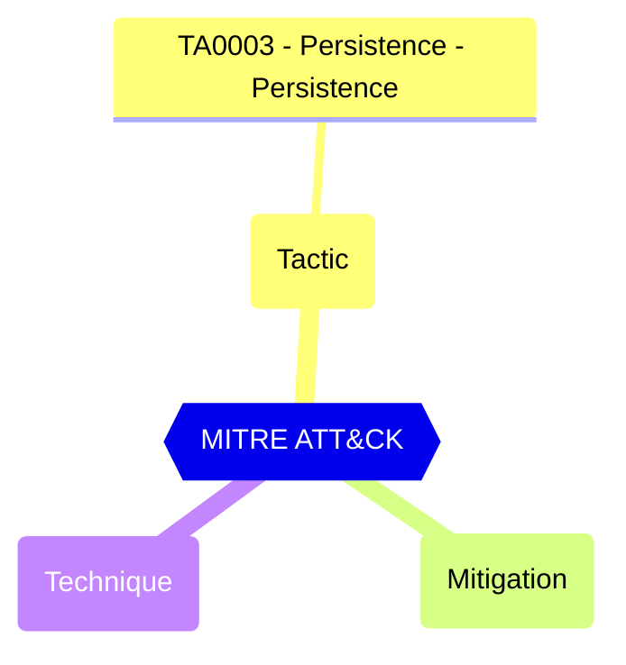

# Default User Role Permissions - Allowed to read BitLocker Keys for Owned Devices

Controls default access for members (end-user) to read BitLocker Keys of company-owned devices (device assigned to user).

| | |
|-|-|
| **Name** | allowedToReadBitlockerKeysForOwnedDevice |
| **Control** | Default Authorization Settings |
| **Description** | Manages authorization settings in Azure AD |
| **Severity** | Informational |

## How to fix
| | |
|-|-|
| **Recommendation** |  |
| **Configuration** | policies/authorizationPolicy |
| **Setting** | `allowedToReadBitlockerKeysForOwnedDevice` |
| **Recommended Value** | '' |
| **Default Value** | true |
| **Graph API Docs** | [authorizationPolicy resource type - Microsoft Graph v1.0 - Microsoft Learn](https://learn.microsoft.com/en-us/graph/api/resources/authorizationpolicy) |
| **Graph Explorer** | [View in Graph Explorer](https://developer.microsoft.com/en-us/graph/graph-explorer?request=policies/authorizationPolicy&method=GET&version=beta&GraphUrl=https://graph.microsoft.com) |

## MITRE ATT&CK

|Tactic|Technique|Mitigation|
|---|---|---|
|[TA0003 - Persistence - Persistence](https://attack.mitre.org/tactics/TA0003)|||

