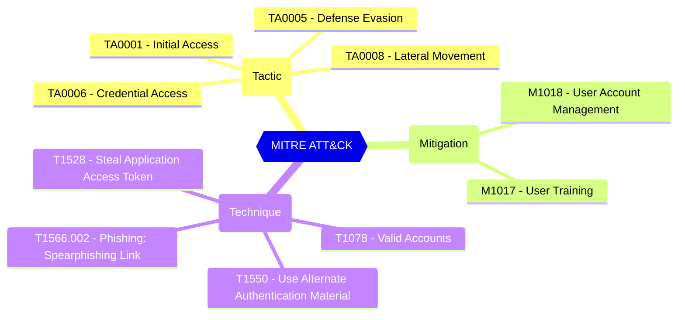

# User consent policy assigned for applications

Defines if user consent to apps is allowed, and if it is, which app consent policy (permissionGrantPolicy) governs the permissions.

| | |
|-|-|
| **Name** | permissionGrantPolicyIdsAssignedToDefaultUserRole |
| **Control** | Default Authorization Settings |
| **Description** | Manages authorization settings in Azure AD |
| **Severity** | High |

## MITRE ATT&CK

## How to fix
| | |
|-|-|
| **Recommendation** | Microsoft recommends to allow to user consent for apps from verified publisher for selected permissions. CISA SCuBA 2.7 defines that all Non-Admin Users SHALL Be Prevented From Providing Consent To Third-Party Applications. |
| **Configuration** | policies/authorizationPolicy |
| **Setting** | `permissionGrantPolicyIdsAssignedToDefaultUserRole` |
| **Recommended Value** | 'ManagePermissionGrantsForSelf.microsoft-user-default-low' |
| **Default Value** | ManagePermissionGrantsForSelf.microsoft-user-default-legacy |
| **Graph API Docs** | [authorizationPolicy resource type - Microsoft Graph v1.0 - Microsoft Learn](https://learn.microsoft.com/en-us/graph/api/resources/authorizationpolicy) |
| **Graph Explorer** | [View in Graph Explorer](https://developer.microsoft.com/en-us/graph/graph-explorer?request=policies/authorizationPolicy&method=GET&version=beta&GraphUrl=https://graph.microsoft.com) |
| **Azure Portal** | [View in Azure Portal](https://portal.azure.com/#view/Microsoft_AAD_IAM/ConsentPoliciesMenuBlade/~/UserSettings) | 

