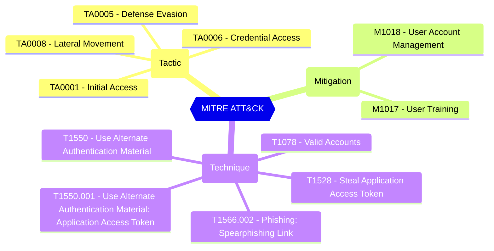

# Reviewers will receive email notifications when admin consent requests are about to expire???

Specifies whether reviewers will receive reminder emails

| | |
|-|-|
| **Name** | notifyReviewers |
| **Control** | Consent Framework - Admin Consent Request (Coming soon) |
| **Description** | Represents the policy for enabling or disabling the Azure AD admin consent workflow. The admin consent workflow allows users to request access for apps that they wish to use and that require admin authorization before users can use the apps to access organizational data.  |
| **Severity** |  |

## MITRE ATT&CK

## How to fix
| | |
|-|-|
| **Recommendation** |  |
| **Configuration** | policies/adminConsentRequestPolicy |
| **Setting** | `notifyReviewers` |
| **Recommended Value** | 'true' |
| **Default Value** |  |
| **Graph API Docs** | [adminConsentRequestPolicy resource type - Microsoft Graph v1.0 - Microsoft Learn](https://learn.microsoft.com/en-us/graph/api/resources/adminconsentrequestpolicy) |
| **Graph Explorer** | [View in Graph Explorer](https://developer.microsoft.com/en-us/graph/graph-explorer?request=policies/adminConsentRequestPolicy&method=GET&version=beta&GraphUrl=https://graph.microsoft.com) |
| **Azure Portal** | [View in Azure Portal](https://portal.azure.com/#view/Microsoft_AAD_IAM/ConsentPoliciesMenuBlade/~/AdminConsentSettings) | 

