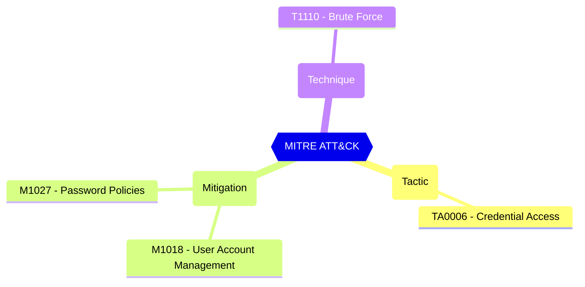

# Password Protection - Mode

If set to Enforce, users will be prevented from setting banned passwords and the attempt will be logged. If set to Audit, the attempt will only be logged.

| | |
|-|-|
| **Name** | BannedPasswordCheckOnPremisesMode |
| **Control** | Default Settings - Password Rule Settings |
| **Description** | Define the password protection and Smart Lockout configurations that can be used to customize the tenant-wide and object-specific restrictions and allowed behavior |
| **Severity** | High |

## MITRE ATT&CK

## How to fix
| | |
|-|-|
| **Recommendation** | [Microsoft Entra Password Protection - Microsoft Entra ID - Microsoft Learn](https://learn.microsoft.com/en-us/azure/active-directory/authentication/concept-password-ban-bad-on-premises) |
| **Configuration** | settings |
| **Setting** | `BannedPasswordCheckOnPremisesMode` |
| **Recommended Value** | 'Enforce' |
| **Default Value** | Audit |
| **Graph API Docs** | [directorySetting resource type - Microsoft Graph beta - Microsoft Learn](https://learn.microsoft.com/en-us/graph/api/resources/directorysetting) |
| **Graph Explorer** | [View in Graph Explorer](https://developer.microsoft.com/en-us/graph/graph-explorer?request=settings&method=GET&version=beta&GraphUrl=https://graph.microsoft.com) |
| **Azure Portal** | [View in Azure Portal](https://portal.azure.com/#view/Microsoft_AAD_IAM/AuthenticationMethodsMenuBlade/~/PasswordProtection) | 

