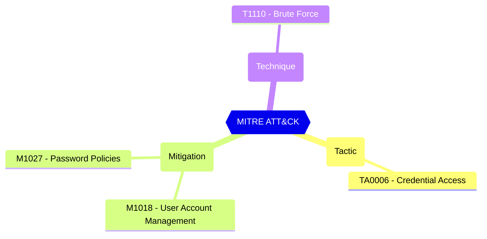

# Password Protection - Custom banned password list

A list of words, one per line, to prevent your users from using in their passwords. You should include words specific to your organization, such as your products, trademarks, industries, local cities and towns, and local sports teams. Your list can contain up to 1000 words. These are case insensitive, and common character substitutions (o for 0, etc) are automatically considered.

| | |
|-|-|
| **Name** | BannedPasswordList |
| **Control** | Default Settings - Password Rule Settings |
| **Description** | Define the password protection and Smart Lockout configurations that can be used to customize the tenant-wide and object-specific restrictions and allowed behavior |
| **Severity** | High |

## MITRE ATT&CK

## How to fix
| | |
|-|-|
| **Recommendation** | [Password protection in Microsoft Entra ID - Microsoft Entra ID - Microsoft Learn](https://learn.microsoft.com/en-us/azure/active-directory/authentication/concept-password-ban-bad#custom-banned-password-list) |
| **Configuration** | settings |
| **Setting** | `BannedPasswordList` |
| **Recommended Value** | '' |
| **Default Value** |  |
| **Graph API Docs** | [directorySetting resource type - Microsoft Graph beta - Microsoft Learn](https://learn.microsoft.com/en-us/graph/api/resources/directorysetting) |
| **Graph Explorer** | [View in Graph Explorer](https://developer.microsoft.com/en-us/graph/graph-explorer?request=settings&method=GET&version=beta&GraphUrl=https://graph.microsoft.com) |
| **Azure Portal** | [View in Azure Portal](https://portal.azure.com/#view/Microsoft_AAD_IAM/AuthenticationMethodsMenuBlade/~/PasswordProtection) | 

