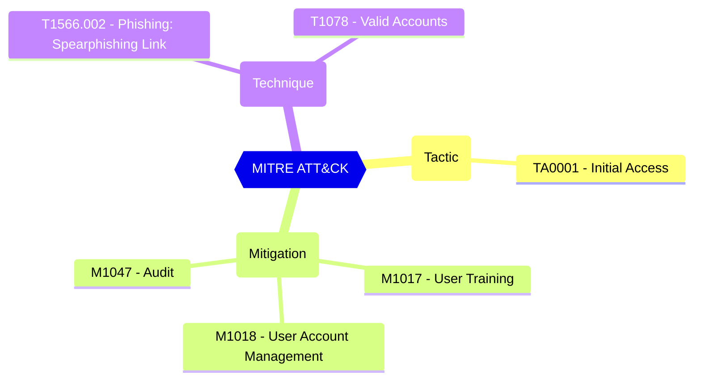

# Block user consent for risky apps

Defines whether user consent will be blocked when a risky request is detected

| | |
|-|-|
| **Name** | BlockUserConsentForRiskyApps |
| **Control** | Default Settings - Consent Policy Settings |
| **Description** | Define the consent configurations that can be used to customize the tenant-wide and object-specific restrictions and allowed behavior |
| **Severity** | High |

## MITRE ATT&CK

## How to fix
| | |
|-|-|
| **Recommendation** | [Configure risk-based step-up consent - Microsoft Entra ID - Microsoft Learn](https://learn.microsoft.com/en-us/azure/active-directory/manage-apps/configure-risk-based-step-up-consent) |
| **Configuration** | settings |
| **Setting** | `values.BlockUserConsentForRiskyApps` |
| **Recommended Value** | 'true' |
| **Default Value** | true |
| **Graph API Docs** | [directorySetting resource type - Microsoft Graph beta - Microsoft Learn](https://learn.microsoft.com/en-us/graph/api/resources/directorysetting) |
| **Graph Explorer** | [View in Graph Explorer](https://developer.microsoft.com/en-us/graph/graph-explorer?request=settings&method=GET&version=beta&GraphUrl=https://graph.microsoft.com) |

