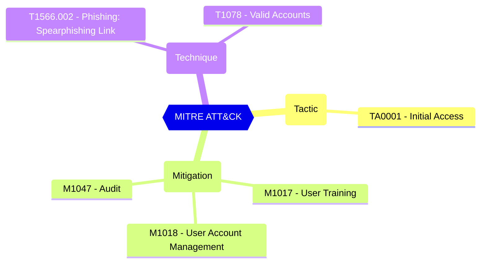

# Group owner consent for apps accessing data - Restricted to selected group owners

Only selected group owners can allow applications to access data for the groups they own.

| | |
|-|-|
| **Name** | ConstrainGroupSpecificConsentToMembersOfGroupId |
| **Control** | Default Settings - Consent Policy Settings |
| **Description** | Define the consent configurations that can be used to customize the tenant-wide and object-specific restrictions and allowed behavior |
| **Severity** | Medium |

## MITRE ATT&CK

## How to fix
| | |
|-|-|
| **Recommendation** |  |
| **Configuration** | settings |
| **Setting** | `values.ConstrainGroupSpecificConsentToMembersOfGroupId` |
| **Recommended Value** | '' |
| **Default Value** |  |
| **Graph API Docs** | [directorySetting resource type - Microsoft Graph beta - Microsoft Learn](https://learn.microsoft.com/en-us/graph/api/resources/directorysetting) |
| **Graph Explorer** | [View in Graph Explorer](https://developer.microsoft.com/en-us/graph/graph-explorer?request=settings&method=GET&version=beta&GraphUrl=https://graph.microsoft.com) |
| **Azure Portal** | [View in Azure Portal](https://portal.azure.com/#view/Microsoft_AAD_IAM/ConsentPoliciesMenuBlade/~/UserSettings) | 

