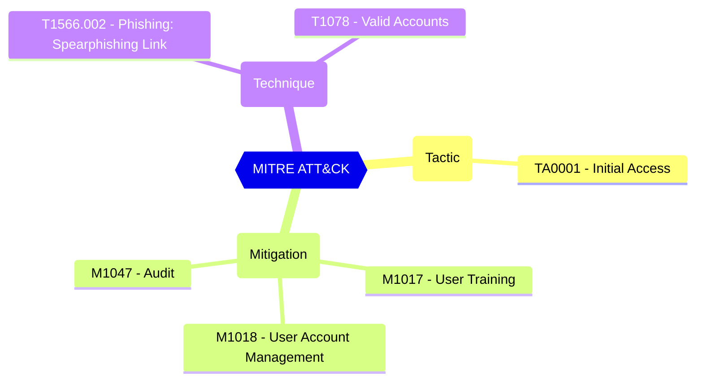

# Users can request admin consent to apps they are unable to consent to???

If this option is set to enabled, then users request admin consent to any app that requires access to data they do not have the permission to grant. If this option is set to disabled, then users must contact their admin to request to consent in order to use the apps they need.

| | |
|-|-|
| **Name** | EnableAdminConsentRequests |
| **Control** | Default Settings - Consent Policy Settings |
| **Description** | Define the consent configurations that can be used to customize the tenant-wide and object-specific restrictions and allowed behavior |
| **Severity** | High |

## MITRE ATT&CK

## How to fix
| | |
|-|-|
| **Recommendation** | CISA SCuBA 2.7: Non-Admin Users SHALL Be Prevented From Providing Consent To Third-Party Applications. |
| **Configuration** | settings |
| **Setting** | `values.EnableAdminConsentRequests` |
| **Recommended Value** | 'true' |
| **Default Value** | false |
| **Graph API Docs** | [directorySetting resource type - Microsoft Graph beta - Microsoft Learn](https://learn.microsoft.com/en-us/graph/api/resources/directorysetting) |
| **Graph Explorer** | [View in Graph Explorer](https://developer.microsoft.com/en-us/graph/graph-explorer?request=settings&method=GET&version=beta&GraphUrl=https://graph.microsoft.com) |
| **Azure Portal** | [View in Azure Portal](https://portal.azure.com/#view/Microsoft_AAD_IAM/ConsentPoliciesMenuBlade/~/AdminConsentSettings) | 

