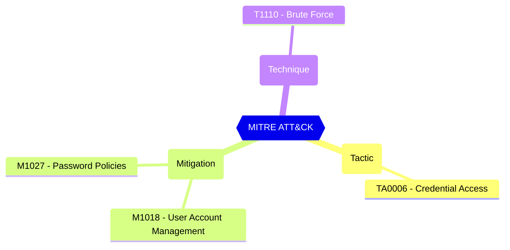

# Password Protection - Enable password protection on Windows Server Active Directory

If set to Yes, password protection is turned on for Active Directory domain controllers when the appropriate agent is installed.

| | |
|-|-|
| **Name** | EnableBannedPasswordCheckOnPremises |
| **Control** | Default Settings - Password Rule Settings |
| **Description** | Define the password protection and Smart Lockout configurations that can be used to customize the tenant-wide and object-specific restrictions and allowed behavior |
| **Severity** | High |

## MITRE ATT&CK

## How to fix
| | |
|-|-|
| **Recommendation** | [Azure identity & access security best practices - Microsoft Learn](https://learn.microsoft.com/en-us/azure/security/fundamentals/identity-management-best-practices#enable-password-management) |
| **Configuration** | settings |
| **Setting** | `EnableBannedPasswordCheckOnPremises` |
| **Recommended Value** | 'True' |
| **Default Value** | False |
| **Graph API Docs** | [directorySetting resource type - Microsoft Graph beta - Microsoft Learn](https://learn.microsoft.com/en-us/graph/api/resources/directorysetting) |
| **Graph Explorer** | [View in Graph Explorer](https://developer.microsoft.com/en-us/graph/graph-explorer?request=settings&method=GET&version=beta&GraphUrl=https://graph.microsoft.com) |
| **Azure Portal** | [View in Azure Portal](https://portal.azure.com/#view/Microsoft_AAD_IAM/AuthenticationMethodsMenuBlade/~/PasswordProtection) | 

