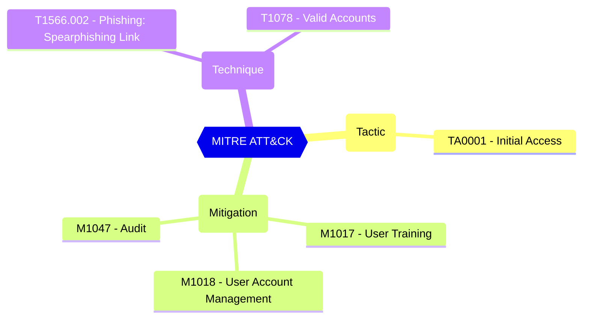

# Group owner consent for apps accessing data

Group and team owners can authorize applications, such as applications published by third-party vendors, to access your organization's data associated with a group. For example, a team owner in Microsoft Teams can allow an app to read all Teams messages in the team, or list the basic profile of a group's members.

| | |
|-|-|
| **Name** | EnableGroupSpecificConsent |
| **Control** | Default Settings - Consent Policy Settings |
| **Description** | Define the consent configurations that can be used to customize the tenant-wide and object-specific restrictions and allowed behavior |
| **Severity** | High |

## MITRE ATT&CK

## How to fix
| | |
|-|-|
| **Recommendation** | CISA SCuBA 2.7: Non-Admin Users SHALL Be Prevented From Providing Consent To Third-Party Applications. |
| **Configuration** | settings |
| **Setting** | `values.EnableGroupSpecificConsent` |
| **Recommended Value** | 'False' |
| **Default Value** | True |
| **Graph API Docs** | [directorySetting resource type - Microsoft Graph beta - Microsoft Learn](https://learn.microsoft.com/en-us/graph/api/resources/directorysetting) |
| **Graph Explorer** | [View in Graph Explorer](https://developer.microsoft.com/en-us/graph/graph-explorer?request=settings&method=GET&version=beta&GraphUrl=https://graph.microsoft.com) |
| **Azure Portal** | [View in Azure Portal](https://portal.azure.com/#view/Microsoft_AAD_IAM/ConsentPoliciesMenuBlade/~/UserSettings) | 

