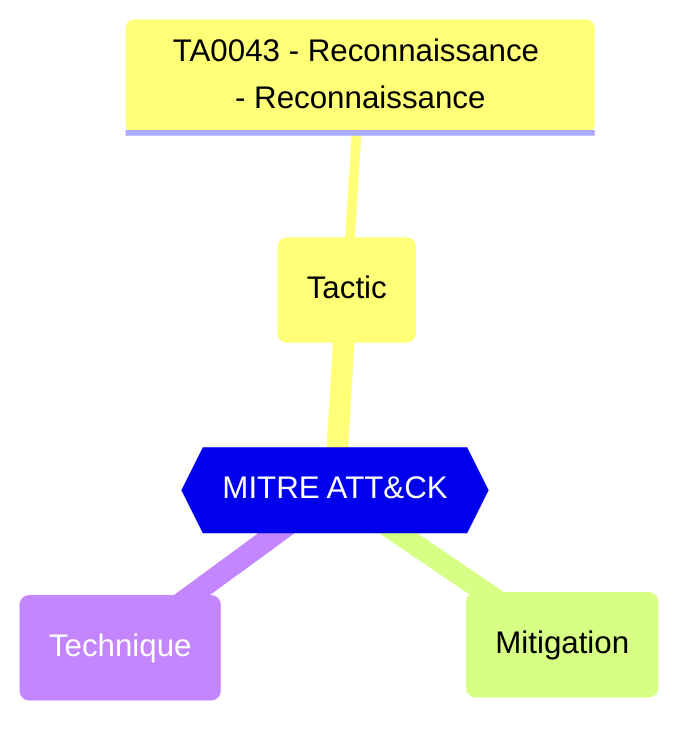

# Default User Role Permissions - Allowed to read other users

Prevents all non-admins from reading user information from the directory. This flag doesn't prevent reading user information in other Microsoft services like Exchange Online.

| | |
|-|-|
| **Name** | allowedToReadOtherUsers |
| **Control** | Default Authorization Settings |
| **Description** | Manages authorization settings in Azure AD |
| **Severity** | Informational |

## How to fix
| | |
|-|-|
| **Recommendation** | Restrict this default permissions for members have huge impact on collaboration features and user lookup. |
| **Configuration** | policies/authorizationPolicy |
| **Setting** | `allowedToReadOtherUsers` |
| **Recommended Value** | 'true' |
| **Default Value** | true |
| **Graph API Docs** | [authorizationPolicy resource type - Microsoft Graph v1.0 - Microsoft Learn](https://learn.microsoft.com/en-us/graph/api/resources/authorizationpolicy) |
| **Graph Explorer** | [View in Graph Explorer](https://developer.microsoft.com/en-us/graph/graph-explorer?request=policies/authorizationPolicy&method=GET&version=beta&GraphUrl=https://graph.microsoft.com) |

## MITRE ATT&CK

|Tactic|Technique|Mitigation|
|---|---|---|
|[TA0043 - Reconnaissance - Reconnaissance](https://attack.mitre.org/tactics/TA0043)|||

