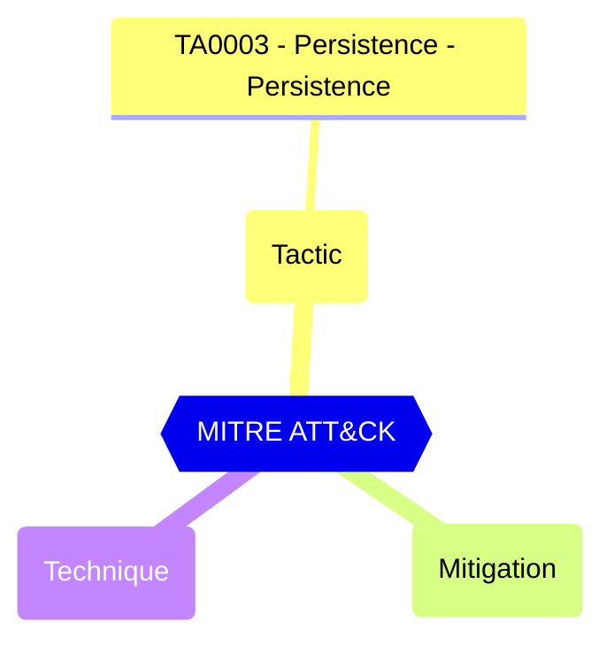

# Enabled Self service password reset

Designates whether users in this directory can reset their own password.

| | |
|-|-|
| **Name** | allowedToUseSSPR |
| **Control** | Default Authorization Settings |
| **Description** | Manages authorization settings in Azure AD |
| **Severity** | Informational |

## How to fix
| | |
|-|-|
| **Recommendation** | [Azure identity & access security best practices - Microsoft Learn](https://learn.microsoft.com/en-us/azure/security/fundamentals/identity-management-best-practices#enable-password-management) |
| **Configuration** | policies/authorizationPolicy |
| **Setting** | `allowedToUseSSPR` |
| **Recommended Value** | 'true' |
| **Default Value** | false |
| **Graph API Docs** | [authorizationPolicy resource type - Microsoft Graph v1.0 - Microsoft Learn](https://learn.microsoft.com/en-us/graph/api/resources/authorizationpolicy) |
| **Graph Explorer** | [View in Graph Explorer](https://developer.microsoft.com/en-us/graph/graph-explorer?request=policies/authorizationPolicy&method=GET&version=beta&GraphUrl=https://graph.microsoft.com) |
| **Azure Portal** | [View in Azure Portal](https://portal.azure.com/#view/Microsoft_AAD_IAM/PasswordResetMenuBlade/~/Properties) | 

## MITRE ATT&CK

|Tactic|Technique|Mitigation|
|---|---|---|
|[TA0003 - Persistence - Persistence](https://attack.mitre.org/tactics/TA0003)|||

