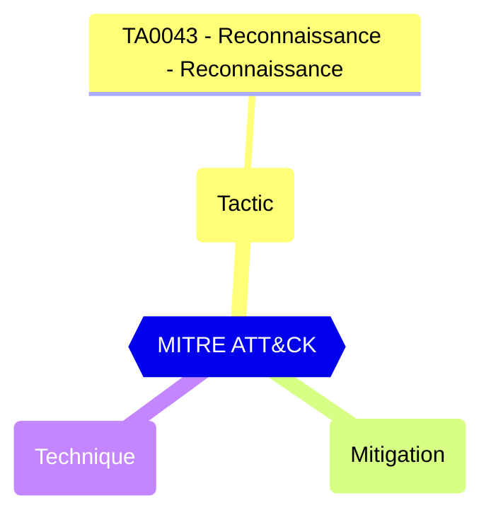

# Guest user access

Represents role templateId for the role that should be granted to guest user.

| | |
|-|-|
| **Name** | guestUserRoleId |
| **Control** | Default Authorization Settings |
| **Description** | Manages authorization settings in Azure AD |
| **Severity** |  |

## How to fix
| | |
|-|-|
| **Recommendation** | CISA SCuBA 2.18: Guest users SHOULD have limited access to Azure AD directory objects. |
| **Configuration** | policies/authorizationPolicy |
| **Setting** | `guestUserRoleId` |
| **Recommended Value** | '2af84b1e-32c8-42b7-82bc-daa82404023b' |
| **Default Value** | 10dae51f-b6af-4016-8d66-8c2a99b929b3 |
| **Graph API Docs** | [authorizationPolicy resource type - Microsoft Graph v1.0 - Microsoft Learn](https://learn.microsoft.com/en-us/graph/api/resources/authorizationpolicy) |
| **Graph Explorer** | [View in Graph Explorer](https://developer.microsoft.com/en-us/graph/graph-explorer?request=policies/authorizationPolicy&method=GET&version=beta&GraphUrl=https://graph.microsoft.com) |
| **Azure Portal** | [View in Azure Portal](https://portal.azure.com/#view/Microsoft_AAD_IAM/AllowlistPolicyBlade) | 

## MITRE ATT&CK

|Tactic|Technique|Mitigation|
|---|---|---|
|[TA0043 - Reconnaissance - Reconnaissance](https://attack.mitre.org/tactics/TA0043)|||

