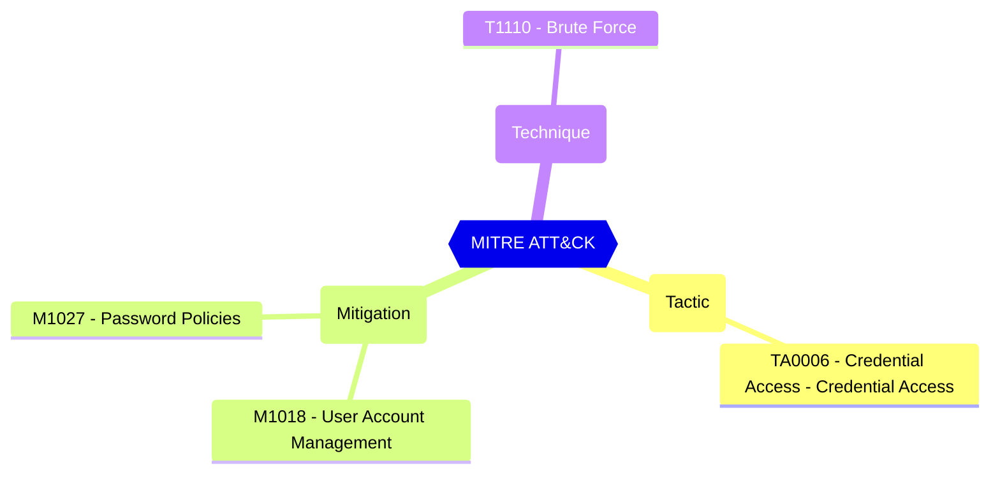

# Enforce custom list

When enabled, the words in the list below are used in the banned password system to prevent easy-to-guess passwords.

| | |
|-|-|
| **Name** | EnableBannedPasswordCheck |
| **Control** | Default Settings - Password Rule Settings |
| **Description** | Define the password protection and Smart Lockout configurations that can be used to customize the tenant-wide and object-specific restrictions and allowed behavior |
| **Severity** | High |

## How to fix
| | |
|-|-|
| **Recommendation** | [Password protection in Microsoft Entra ID - Microsoft Entra ID - Microsoft Learn](https://learn.microsoft.com/en-us/azure/active-directory/authentication/concept-password-ban-bad#global-banned-password-list) |
| **Configuration** | settings |
| **Setting** | `EnableBannedPasswordCheck` |
| **Recommended Value** | 'True' |
| **Default Value** | True |
| **Graph API Docs** | [directorySetting resource type - Microsoft Graph beta - Microsoft Learn](https://learn.microsoft.com/en-us/graph/api/resources/directorysetting) |
| **Graph Explorer** | [View in Graph Explorer](https://developer.microsoft.com/en-us/graph/graph-explorer?request=settings&method=GET&version=beta&GraphUrl=https://graph.microsoft.com) |
| **Azure Portal** | [View in Azure Portal](https://portal.azure.com/#view/Microsoft_AAD_IAM/AuthenticationMethodsMenuBlade/~/PasswordProtection) | 

## MITRE ATT&CK

|Tactic|Technique|Mitigation|
|---|---|---|
|[TA0006 - Credential Access - Credential Access](https://attack.mitre.org/tactics/TA0006)|[T1110 - Brute Force](https://attack.mitre.org/techniques/T1110)|[ M1018 - User Account Management](https://attack.mitre.org/mitigations/M1018) [M1027 - Password Policies](https://attack.mitre.org/mitigations/M1027)|

