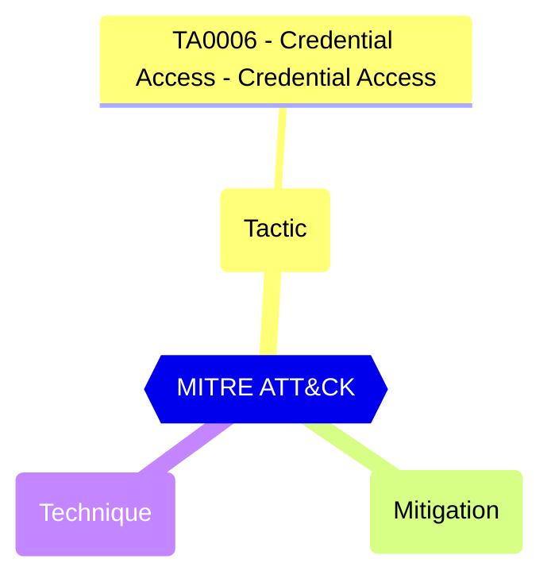

Indicates whether administrators of the tenant can use the Self-Service Password Reset (SSPR). The policy applies to some critical critical roles in Microsoft Entra ID.

Administrators with sensitive roles should use phishing-resistant authentication methods only and therefore not able to reset their password using SSPR.

#### Test script
```
https://graph.microsoft.com/beta/policies/authorizationPolicy
.allowedToUseSSPR -eq 'false'
```

#### Remediation action

Microsoft Graph PowerShell: ```Update-MgPolicyAuthorizationPolicy -BodyParameter @{ allowedToUseSSPR = $false }```

#### Related links

- [Open in Graph Explorer](https://developer.microsoft.com/graph/graph-explorer?request=policies/authorizationPolicy&method=GET&version=beta&GraphUrl=https://graph.microsoft.com)
- [authorizationPolicy resource type - Microsoft Graph v1.0 | Microsoft Learn](https://learn.microsoft.com/graph/api/resources/authorizationpolicy)
- [View in Microsoft Entra admin center](https://entra.microsoft.com/#view/Microsoft_AAD_IAM/PasswordResetMenuBlade/~/AdminPasswordResetPolicy)

## MITRE ATT&CK


|Tactic|Technique|Mitigation|
|---|---|---|
|[TA0006 - Credential Access - Credential Access](https://attack.mitre.org/tactics/TA0006)|||


<!--- Results --->
%TestResult%
