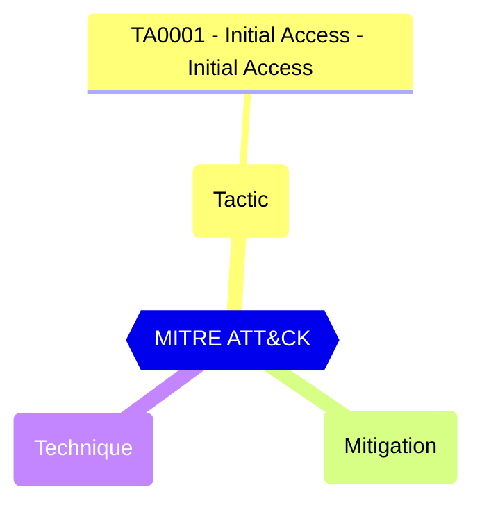

Indicates whether users can sign up for email based subscriptions.


#### Test script
```
https://graph.microsoft.com/beta/policies/authorizationPolicy
.allowedToSignUpEmailBasedSubscriptions -eq 'false'
```

#### Related links

- [Open in Graph Explorer](https://developer.microsoft.com/en-us/graph/graph-explorer?request=policies/authorizationPolicy&method=GET&version=beta&GraphUrl=https://graph.microsoft.com)
- [authorizationPolicy resource type - Microsoft Graph v1.0 | Microsoft Learn](https://learn.microsoft.com/en-us/graph/api/resources/authorizationpolicy)


## MITRE ATT&CK


|Tactic|Technique|Mitigation|
|---|---|---|
|[TA0001 - Initial Access - Initial Access](https://attack.mitre.org/tactics/TA0001)|||


<!--- Results --->
%TestResult%
