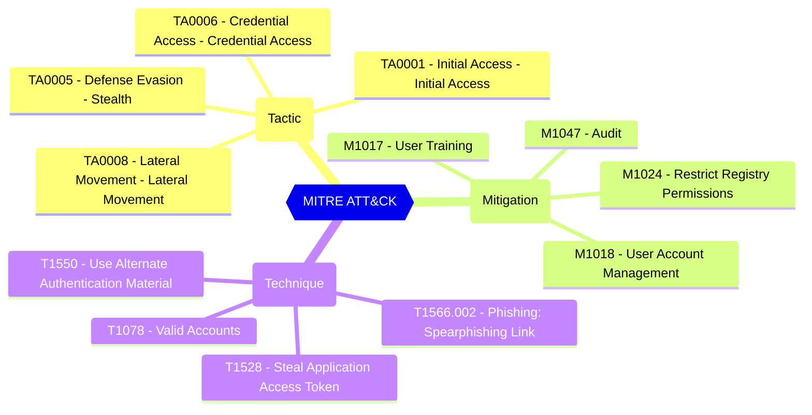

Controls if non-admin users may register custom-developed applications for use within this directory.

CISA SCuBA 2.6: Only Administrators SHALL Be Allowed To Register Third-Party Applications

#### Test script
```
https://graph.microsoft.com/beta/policies/authorizationPolicy
.defaultUserRolePermissions.allowedToCreateApps -eq 'false'
```

#### Related links

- [Open in Graph Explorer](https://developer.microsoft.com/en-us/graph/graph-explorer?request=policies/authorizationPolicy&method=GET&version=beta&GraphUrl=https://graph.microsoft.com)
- [authorizationPolicy resource type - Microsoft Graph v1.0 | Microsoft Learn](https://learn.microsoft.com/en-us/graph/api/resources/authorizationpolicy)
- [View in Microsoft Entra admin center](https://entra.microsoft.com/#view/Microsoft_AAD_UsersAndTenants/UserManagementMenuBlade/~/UserSettings)

## MITRE ATT&CK


|Tactic|Technique|Mitigation|
|---|---|---|
|[TA0001 - Initial Access - Initial Access](https://attack.mitre.org/tactics/TA0001)<br/>[TA0005 - Defense Evasion - Stealth](https://attack.mitre.org/tactics/TA0005)<br/>[TA0006 - Credential Access - Credential Access](https://attack.mitre.org/tactics/TA0006)<br/>[TA0008 - Lateral Movement - Lateral Movement](https://attack.mitre.org/tactics/TA0008)|[T1566.002 - Phishing: Spearphishing Link](https://attack.mitre.org/techniques/T1566/002)<br/>[T1078 - Valid Accounts](https://attack.mitre.org/techniques/T1078)<br/>[T1550 - Use Alternate Authentication Material](https://attack.mitre.org/techniques/T1550)<br/>[T1528 - Steal Application Access Token](https://attack.mitre.org/techniques/T1528)|[M1017 - User Training](https://attack.mitre.org/mitigations/M1017)<br/>[M1018 - User Account Management](https://attack.mitre.org/mitigations/M1018)<br/>[M1024 - Restrict Registry Permissions](https://attack.mitre.org/mitigations/M1024)<br/>[M1047 - Audit](https://attack.mitre.org/mitigations/M1047)|


<!--- Results --->
%TestResult%
