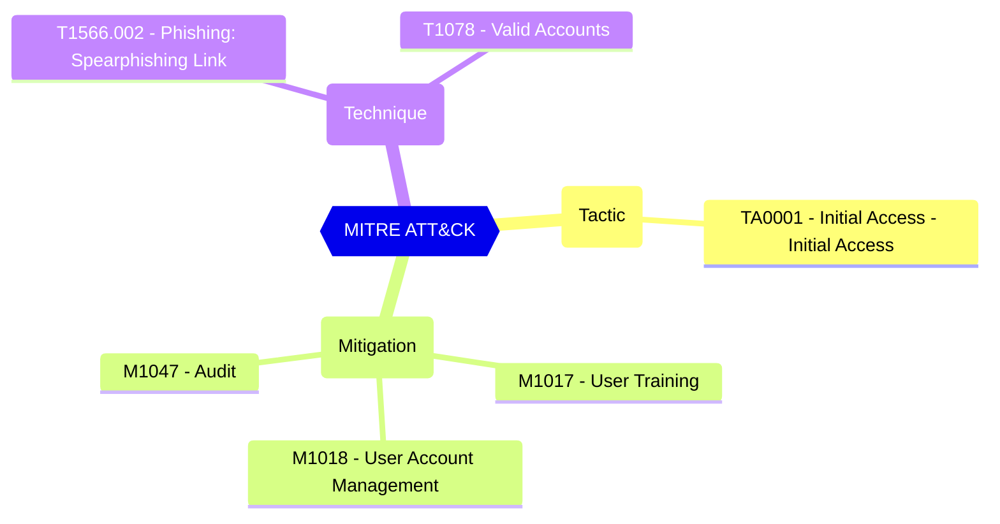

Group and team owners can authorize applications, such as applications published by third-party vendors, to access your organization's data associated with a group. For example, a team owner in Microsoft Teams can allow an app to read all Teams messages in the team, or list the basic profile of a group's members.

CISA SCuBA 2.7: Non-Admin Users SHALL Be Prevented From Providing Consent To Third-Party Applications.

#### Test script
```
https://graph.microsoft.com/beta/settings
.values -eq 'False'
```

#### Related links

- [Open in Graph Explorer](https://developer.microsoft.com/en-us/graph/graph-explorer?request=settings&method=GET&version=beta&GraphUrl=https://graph.microsoft.com)
- [directorySetting resource type - Microsoft Graph beta | Microsoft Learn](https://learn.microsoft.com/en-us/graph/api/resources/directorysetting)
- [View in Microsoft Entra admin center](https://entra.microsoft.com/#view/Microsoft_AAD_IAM/ConsentPoliciesMenuBlade/~/UserSettings)

## MITRE ATT&CK


|Tactic|Technique|Mitigation|
|---|---|---|
|[TA0001 - Initial Access - Initial Access](https://attack.mitre.org/tactics/TA0001)|[T1566.002 - Phishing: Spearphishing Link](https://attack.mitre.org/techniques/T1566/002)<br/>[T1078 - Valid Accounts](https://attack.mitre.org/techniques/T1078)|[M1017 - User Training](https://attack.mitre.org/mitigations/M1017)<br/>[M1018 - User Account Management](https://attack.mitre.org/mitigations/M1018)<br/>[M1047 - Audit](https://attack.mitre.org/mitigations/M1047)|


<!--- Results --->
%TestResult%
