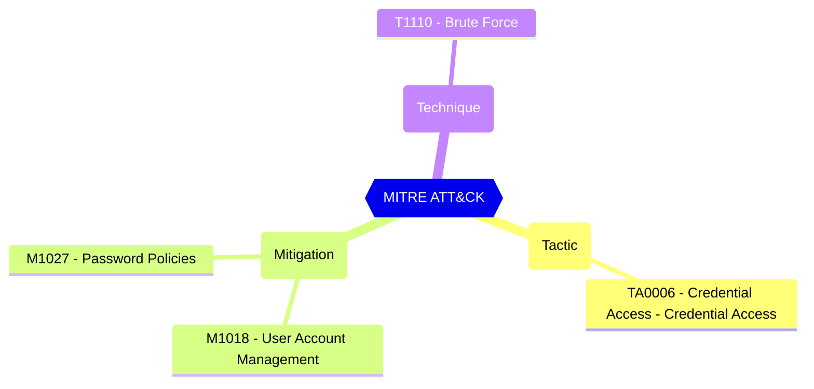

The minimum length in seconds of each lockout. If an account locks repeatedly, this duration increases.

[Prevent attacks using smart lockout - Microsoft Entra ID - Microsoft Learn](https://learn.microsoft.com/en-us/azure/active-directory/authentication/howto-password-smart-lockout)

#### Test script
```
https://graph.microsoft.com/beta/settings
.values -ge 60
```

#### Related links

- [Open in Graph Explorer](https://developer.microsoft.com/en-us/graph/graph-explorer?request=settings&method=GET&version=beta&GraphUrl=https://graph.microsoft.com)
- [directorySetting resource type - Microsoft Graph beta | Microsoft Learn](https://learn.microsoft.com/en-us/graph/api/resources/directorysetting)
- [View in Microsoft Entra admin center](https://entra.microsoft.com/#view/Microsoft_AAD_IAM/AuthenticationMethodsMenuBlade/~/PasswordProtection)

## MITRE ATT&CK


|Tactic|Technique|Mitigation|
|---|---|---|
|[TA0006 - Credential Access - Credential Access](https://attack.mitre.org/tactics/TA0006)|[T1110 - Brute Force](https://attack.mitre.org/techniques/T1110)|[M1018 - User Account Management](https://attack.mitre.org/mitigations/M1018)<br/>[M1027 - Password Policies](https://attack.mitre.org/mitigations/M1027)|


<!--- Results --->
%TestResult%
