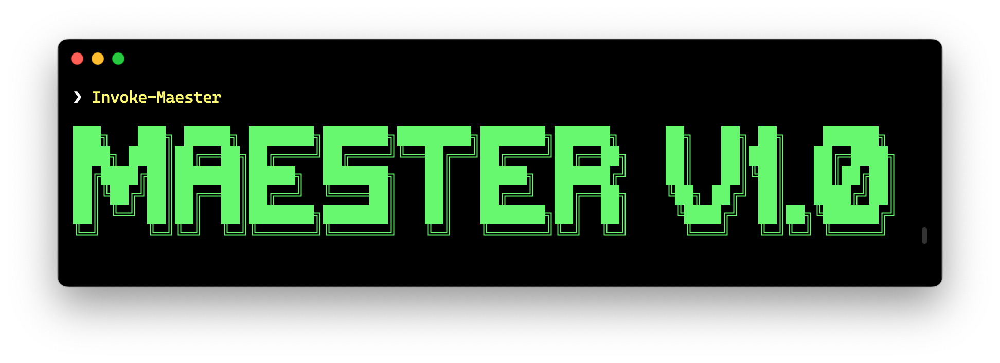

Today we are super excited to announce a huge milestone.

## Maester reaches v1! 🎉

{/* truncate */}

We [launched Maester](https://www.youtube.com/watch?v=xfs02tjSU24) at the PowerShell + DevOps Global Summit in March this year and it has been an amazing journey since then.

Here are some quick stats for you:
* 🚀 100,000+ downloads on PowerShell Gallery
* 🌐 17,000 monthly visitors to [maester.dev](https://maester.dev)
* 💻 1,800+ commits on GitHub
* 🤝 48+ contributors
* ✳️ 194 Maester tests
* 📦 155 releases

We have added a lot of new features and improvements based on your feedback. Thank you for that! 🙏

## What's new since March v0.1.0

It’s taken a whole village to bring you **Maester v1**. 🌟 Here are some of the highlights:

### 🧪 **New Tests**
We've almost doubled the number of tests, growing from 96 to 194! 🎉 Check out the [test list](https://github.com/maester365/maester/blob/main/docs/tests.md) for the full breakdown. Special mentions go to:
- [**Mike**](https://github.com/soulemike) – Mike started adding [CISA tests](/docs/tests/cisa/entra) to Maester the very next day after Maester was unveiled at the PowerShell conference. 🚀 Since then, he’s been instrumental in contributing code, replying to issues on GitHub, and engaging on Discord. Maester wouldn’t be where it is today without him. Thank you, Mike! 🙌
- [**Ben**](https://github.com/NZLostboy) – Ben took the initiative to add [CIS benchmark tests](/docs/tests/cis/) and is now our #6 highest contributor. Thanks, Ben, for the tremendous value you've brought to Maester! 💪

### 🤖 **Maester GitHub Action**
[**Fabian**](https://github.com/f-bader) built the [Maester - GitHub Action](https://github.com/marketplace/actions/maester-action), simplifying the setup and running of Maester on GitHub. He completed this just in time for the [PowerShell Conference Europe](https://www.youtube.com/watch?v=SGXExUmwmBQ). Thank you, Fabian! 👏

### 🛡️ **Entra ID - Security Config Analyzer Updates**
[**Thomas**](https://github.com/Cloud-Architekt) has done phenomenal work keeping Maester updated with [EIDSCA](/docs/tests/eidsca/). His vigilance in monitoring Entra ID and adding new security checks has been invaluable in improving the security posture of countless Entra tenants. 🙏

### 📊 **Pester Test & Report Improvements**
A massive shout-out to [**Frode Flaten**](https://github.com/fflaten) for refactoring the Maester codebase and elevating it to new heights. 🚀 From enhancing performance for PSScriptAnalyzer to improving test reports with filtering and tag support, Frode has made Maester run smoother and more efficiently. Thank you, Frode! 🌟

### 🛠️ **New & Improved Test Folder Installation**
Thanks to [**Sam Erde**](https://github.com/SamErde) for making Maester more robust. From improving the test install/update process to fixing PowerShell mistakes (😉), Sam has been a powerhouse!

### 🫂 **New Teams Tests**
Kudos to [**Stefan Wey**](https://github.com/weyCC81) for a whirlwind of contributions! Stefan added new tests for Microsoft Teams meeting policies, fixed Entra Recommendations tests, and ensured PowerShell 5 compatibility. Incredible work! 👏

### 💬 **Teams Alerts**
Thanks to [**Guido Baijense**](https://github.com/GuidoBaijense) for adding support to send Teams alerts from Maester using a cmdlet with Adaptive Card templates. 💬

### 🗨️ **Slack Alerts**
Shout-out to [**Fabrizio Di Carlo**](https://github.com/fdicarlo) for adding Slack alert support to Maester. 💻

### ☁️ **Azure Automation**
[**Daniel Bradley**](https://github.com/DanielBradley1) added Azure Automation support to Maester. 🚀

### 🏗️ **Azure Automation with Bicep**
[**Brian Veldman**](https://github.com/brianveldman) elevated Azure Automation by adding Bicep support. Amazing! 🙌

### 🐳 **Azure Container App Job**
Thanks to [**Mike Soule**](https://github.com/soulemike) for enabling Docker and Azure Container App Job support for Maester. ⚙️

### 🖥️ **Azure DevOps - Virtual Machine Scale Set Support**
[**Ilija Ranogajec**](https://github.com/iranogajec) added support for running Maester in VMSS hosted agents. Awesome work! 🚀

### ✍️ **New Maester Blog**
We’ve started a [new blog](https://maester365.github.io/) to share ideas on tests, security, DevOps, and automation. Don’t forget to subscribe via RSS! 📰

### 📚 **Test Documentation Updates**
Big thanks to the following contributors for improving remediation steps for tests, making them clearer and easier to follow:
- [**Michael Morten Sonne**](https://github.com/michaelmsonne)
- [**Jan Bakker**](https://github.com/BakkerJan)
- [**Christian Frohn**](https://github.com/ChrFrohn)

## Thank you to all our amazing contributors! 🙏
There are many, many more new features, improvements and fixes that have gone in by this amazing list of contributors 👇

    {[
        { username: 'soulemike', name: 'Mike Soule' },
        { username: 'f-bader', name: 'Fabian' },
        { username: 'Cloud-Architekt', name: 'Thomas' },
        { username: 'fflaten', name: 'Frode Flaten' },
        { username: 'NZLostboy', name: 'Ben' },
        { username: 'SamErde', name: 'Sam Erde' },
        { username: 'michaelmsonne', name: 'Michael Sonne' },
        { username: 'ChrFrohn', name: 'Christian Frohn' },
        { username: 'weyCC81', name: 'Stefan Wey' },
        { username: 'DanielBradley1', name: 'Daniel Bradley' },
        { username: 'tdcthosc', name: 'Thomas Schmidt' },
        { username: 'Arcath', name: 'Adam Laycock' },
        { username: 'GuidoBaijense', name: 'Guido Baijense' },
        { username: 'corpca-Admin', name: 'corpca-Admin' },
        { username: 'BenStreet365', name: 'Ben Street' },
        { username: 'dnsinit', name: 'dnsinit' },
        { username: 'Oppedijk', name: 'Erik Oppedijk' },
        { username: 'tbisque', name: 'Tom Biscardi' },
        { username: 'brianveldman', name: 'Brian Veldman' },
        { username: 'DrPye', name: 'Tom Pye' },
        { username: 'deleugpn', name: 'Marco Deleu' },
        { username: 'pkothare', name: 'Pranav Kothare' },
        { username: 'PTMohr', name: 'PT Mohr' },
        { username: 'DanielWahlgren', name: 'Daniel Wahlgren' },
        { username: 'tlaukkanen', name: 'Tommi Laukkanen' },
        { username: 'wesmacdonald', name: 'Wes MacDonald' },
        { username: 'nathanmcnulty', name: 'Nathan McNulty' },
        { username: 'joshuafdo', name: 'Joshua Fernando' },
        { username: 'milanschwartz', name: 'Milan Schwartz' },
        { username: 'irwins', name: 'Irwin Strachan' },
        { username: 'fdicarlo', name: 'Fabrizio Di Carlo' },
        { username: 'iranogajec', name: 'Ilija Ranogajec' },
        { username: 'BakkerJan', name: 'Jan Bakker' },
        { username: 'RobinDadswell', name: 'Robin Dadswell' },
        { username: 'FrederikLeed', name: 'Frederik Leed' },
        { username: 'ThorstenSauter', name: 'Thorsten Sauter' },
        { username: 'Haakonak', name: 'Håkon Kristiansen' },
        { username: 'BurgerhoutJ', name: 'Jeroen Burgerhout' },
        { username: 'm-hanisch', name: 'm-hanisch' },
        { username: 'mattcave', name: 'Matt Cave' },
        { username: 'lbrauns', name: 'Lennart' },
        { username: 'DevSecNinja', name: 'Jean-Paul' },
        { username: 'PetterFauske', name: 'Petter Fauske' },
        { username: 'gerlasch', name: 'Gerald Lasch' },
        { username: 'tbalthazar', name: 'Thomas Balthazar' },
        { username: 'svrooij', name: 'Stephan van Rooij' },
        { username: 'mircodemo', name: 'mircodemo' },

    ].map(contributor => (
        

            <a href={`https://github.com/${contributor.username}`} target="_blank" rel="noopener noreferrer">
                
                 
                {contributor.name}
            </a>
        

    ))}

## What's next?

We are super excited about the future of Maester and we have a lot of ideas for new features and improvements. We are even more excited to have you come and shape the future of Maester with us! 🙌
