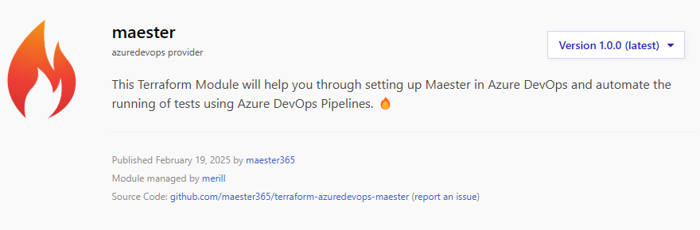

Today, we are thrilled to announce the release of the Maester DevOps Terraform Module! This module streamlines the setup of Maester in Azure DevOps and automates test execution via Azure DevOps Pipelines. 🔥

## Maester Terraform Module 🎉

### Quick Stats
- 🚀 Automated security tests using Azure DevOps Pipelines
- 🔥 Up and running within 5 minutes
- 🤝 Downloadable and viewable Maester reports
- ✳️ Detailed view of each test, including name, duration, and status

### DevOps Tests Page

### 📚 **Documentation**
Follow the step-by-step guide to start using the Terraform Module:

- [Azure DevOps with Terraform Module](https://maester.dev/docs/monitoring/azure-devops-terraform)
- [Terraform Registry](https://registry.terraform.io/modules/maester365/maester/azuredevops/latest)

## Contributors 🙏
We have built this Terraform Module: 👇

    {[
        { username: 'merill', name: 'Merill Fernando' },
        { username: 'brianveldman', name: 'Brian Veldman' },

    ].map(contributor => (
        

            <a href={`https://github.com/${contributor.username}`} target="_blank" rel="noopener noreferrer">
                
                 
                {contributor.name}
            </a>
        

    ))}

## What's Next?

We are incredibly excited about Maester Terraform and have many ideas for new features and improvements. 🙌
