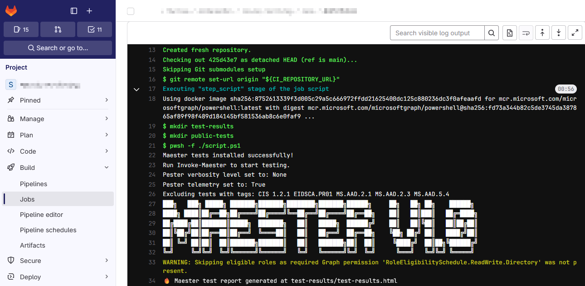

Maester now works seamlessly with GitLab 👏!

Teams using GitLab pipelines can easily integrate Maester into their CI/CD workflows to run automated security checks and enhance their security monitoring.

<!-- truncate -->

## Maester running on GitLab

### Why It Matters

- Run automated Microsoft 365 security tests in GitLab pipelines
- Quick setup - get started in minutes
- Clear and actionable security test reports

### Get Started

Follow the step-by-step guide to set up Maester in GitLab:

- Documentation: [Set up Maester in GitLab](https://maester.dev/docs/monitoring/gitlab)

## Contributor

- [Stefan Wey](https://maester.dev/blog/authors/wey)

<!--
@weyCC81 Would love it if you could do a short Maester blog post 'Maester add's support for GitLab' and point to this doc page!
-->