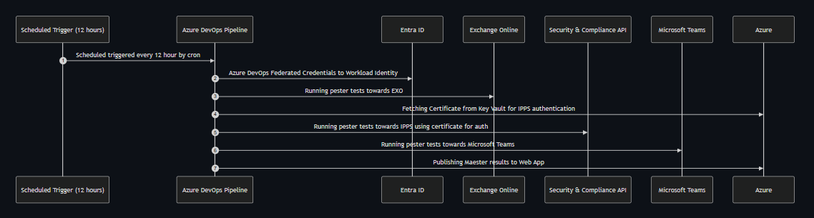

We are excited to announce that you can now deploy your Maester results (using Azure DevOps) to a web app in Azure! 🚀

Teams using Azure DevOps pipelines can now easily integrate Maester into their CI/CD workflows to run automated security checks and enhance their security monitoring on a daily basis.

Utiziling an Azure web app providing access to the results using Entra id as authentication.

<!-- truncate -->

## Azure DevOps Web App Flowchart

### Quick Stats

- 🚀 Automated security tests using Azure DevOps Pipelines updated every 12th hour by default
- 🔥 Up and running within 10 minutes
- 🤝 Viewable Maester reports using Azure Web App
- 🔐 Pipeline with authentication support for Exchange Online, ISSP (using certificate based authentication) and Microsoft Teams

### Get Started

Follow the step-by-step guide to set up Maester in Azure DevOps with required resources:

- Documentation: [Set up Maester in Azure DevOps with Web App](/docs/monitoring/azure-devops-web-app-bicep)

## Contributor

- [Sebastian Claesson](/blog/authors/sebastian)
