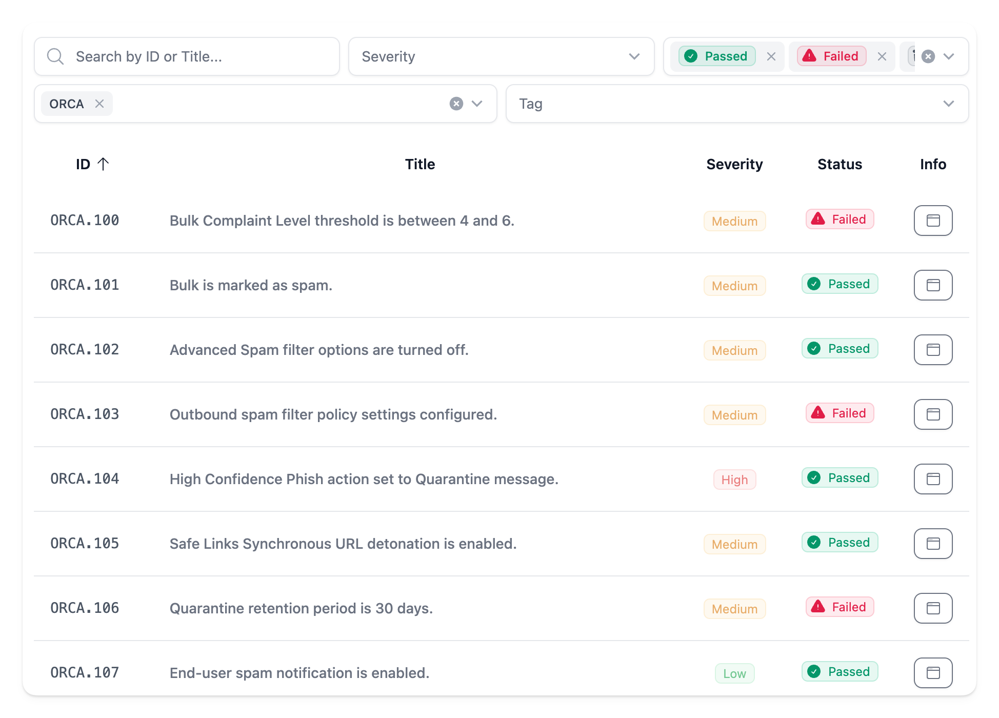
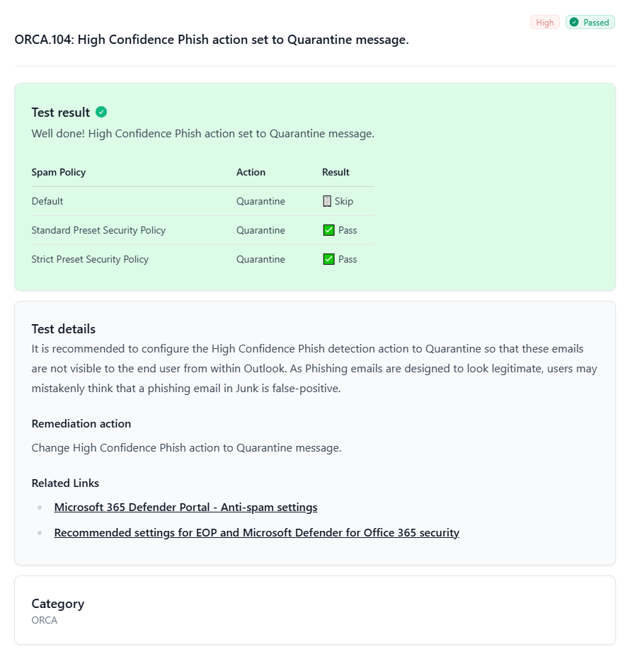

The Maester module can now dynamically build the necessary files for testing and reporting on all the [Office 365 Recommended Configuration Analyzer (ORCA)](https://github.com/cammurray/orca) controls. Providing users with a single report covering many controls that existed before Maester and which are still valuable. 🚀

<!-- truncate -->

Here's a sneak peek at the some of the checks from ORCA that will be included in the next Maester release.

## What is ORCA?

[Cam Murray](https://github.com/cammurray) created the [Office 365 Recommended Configuration Analyzer (ORCA)](https://github.com/cammurray/orca) PowerShell module to help align tenant configuration with Microsoft's recommended configurations. Many of these settings are available in the [configuration analyzer](https://learn.microsoft.com/en-us/defender-office-365/configuration-analyzer-for-security-policies) today, but ORCA provided these insights earlier and often in a more concise approach. Building these configuration items as tests in Maester provided an awesome way to build on the core ORCA module value and bring even more context into the configuration state of a tenant.

## How to build?

The ORCA module utilizes user defined types with [enumerations](https://learn.microsoft.com/en-us/powershell/module/microsoft.powershell.core/about/about_enum) and [classes](https://learn.microsoft.com/en-us/powershell/module/microsoft.powershell.core/about/about_classes) heavily. This is the best approach for an individual module and helps produce well-typed and structured code bases. It also can be challenging when trying to merge code bases dynamically as those types within the module need to exist outside the module.

> [Git Submodules](https://git-scm.com/book/en/v2/Git-Tools-Submodules) have their own issues too so definitely avoid those unless the challenges are worth it.

To handle this, PowerShell has this awesome feature called the [abstract syntax tree (AST)](https://learn.microsoft.com/en-us/dotnet/api/system.management.automation.language.ast). This feature allows you to parse PowerShell files and interface with them as structured objects. Using the AST the Maester team was able to build a [script](https://github.com/maester365/maester/blob/main/build/orca/Update-OrcaTests.ps1) to parse the ORCA code base and dynamically build the necessary functions, tests, and report details for incorporating with the Maester module.

> Similarly and even more elegantly the EIDSCA team was able to incorporate their module as [well](https://github.com/maester365/maester/blob/main/build/eidsca/Update-EidscaTests.ps1).

## How to contribute?

### Update-OrcaTests.ps1

Located in `/build/orca/Update-OrcaTests.ps1` is the build mechanism for each test derived from ORCA.

1. The latest ORCA module is pulled from [orca.git](https://github.com/cammurray/orca.git) into the subfolder `/orca`.
2. Prerequisits are initialized as decribed above and the following files are created in `/powershell/internal/orca`:
    - Add-IsPresetValue.ps1
    - Get-ORCACollection.ps1
    - Get-PolicyStateInt.ps1
    - Get-PolicyStates.ps1
    - Get-AnyPolicyState.ps1
3. Each ORCA check located in `/build/orca/orca/Checks/` are processed and compiled into Maester tests like so:
    1. A `$content` variable is prepared and contains the following properties:
        | Property | Purpose |
        | ----------- | --- |
        | file        | Name of the check script  |
        | content     | Content of the check script |
        | name        | Name of the check |
        | pass        | Text requirement of passing |
        | fail        | Text for remediation |
        | func        | Name of the test function |
        | control     | Check control number |
        | area        | Check category/area |
        | description | Check description |
        | links       | Check related links |
    2. Each property listed above are populated using regular expressions on the raw value of the ORCA check content.
    3. `$testId` is derived from `$content.func` to fit the Maester test id format.
        > If it is not possible to derive it using the expected ORCA test function name format (ORCA.n or ORCA.n.n), where the last number is optional and can be any number of digits, it will skip processing this test. A manual fixed id must be added to `$mapping = @{}` at line ~187
    4. A pester test instruction file is generated and added to `/tests/orca/` for each processed test, that instructs Maester to run the below mentioned function and process the result.
    5. A powershell function file is generated and added to `/powershell/public/orca/` that contains the logic of initiating and processing the ORCA check result.
    6. A markdown file is generated and added to `/powershell/public/orca/` that is associated with the above mentioned PowerShell file in which the description, remediation action and related links are placed.
4. `ScriptsToProcess` is made available for the Maester module manifest.
5. `FunctionsToExport` is made available for the Maester module manifest.

When modifying the `/build/orca/Update-OrcaTests.ps1` it is important to run it as well in order to build all ORCA test files as described. See [How to build?](#how-to-build)

### Test function

Each test function generated for each ORCA check contains various logic:

1. Skip if not connected to Exchange Online.
2. Set `$SCC` to `true` if connected to Security & Compliance, otherwise set to `false`.
3. If `Get-ORCACollection` has not been run before and stored in `$__MtSession.OrcaCache` then execute `Get-ORCACollection -SCC:$SCC` and store it in the cache.
4. Run the ORCA class `New-Object -TypeName <Check>` associated with the test upon the ORCA result `$obj.Run($Collection)` stored in the cache.
5. First, if the ORCA check should be skipped if it `SkipInReport` is specified in the check output.
6. Second, determine if the ORCA check should be skipped by evaluating if `$obj.CheckFailed` is `true`, if `$obj.Completed` is `false` or if the check output specifies that this is a Security & Compliance check and we are not connected to Security & Compliance.
7. Determine if the check passed or failed based on `$obj.ResultStandard` (See [ORCA config level](#orca-config-level) for more information).
8. Determine if we need to expand the results of the check `$obj.ExpandResults` otherwise add details to Maester and return.
9. Expand each nested result in `$obj.ExpandResults` into a markdown table showing the result of each individual result.
10. Add details to Maester and return.

### Markdown file

Each test function has it's associated markdown file that provides Maester with test descriptions. It is comprised of description, remediation action and related links from the ORCA check.

## Caveats to be aware of

### ORCA result is only processed once

Each test will call `Get-ORCACollection` only if it has not been run and stored in the cache `$__MtSession.OrcaCache` before.

### SkipInReport

Some ORCA checks might have the property `SkipInReport` set. This must be handled in each test within a try-catch-finally block due to ORCA returning a `Continue` statement.

### Test name should fit Maester format

Every ORCA test should fit into the Maester test name format.

### Regular expressions

Regular expressions used to capture the raw content of each ORCA check is carefully crafted and allows us to adapt and overcome differences, such as:

- Always add punctuation to fail recommendation text if not present to stay consistent between tests.
- Dynamically populate name of the test if there are more than one ORCA check (The file name contains `_`) determined by property uniqueness.
- Replace `_` with `.`
- Capture entire text of ORCA check importance, even if it varies between apostrophe and qoutes.
- Remove HTML tags from ORCA check description.

### Security & Compliance

The command `Get-ORCACollection` requires the parameter of `-SCC` in order to include Security & Compliance tests in each test. However, we only set this to true if we are connected to Security & Compliance.

> ⚠️ WARNING: We require each ORCA check to include the property `SCC` in it's object output in order for us to skip it in Maester if we are not connected to Security & Compliance. A [pull request](https://github.com/cammurray/orca/pull/326) has been submitted by [Thomas S. Schmidt](https://github.com/tdcthosc) to add this in the upstream module and is awaiting approval. For now it has been manually implemented in `/build/orca/orca/ORCA.psm1 @ line 388` and `/build/orca/orca/Checks/check-ORCA242.ps1 @ line 29`.

### ORCA config level

Maester base the result on ORCA config level **Standard**. The property `ResultStandard` of the ORCA check output will be either **Pass** or **Informational** if the test passed.

## Results

With this build script, the Maester module can now dynamically build the necessary files for testing and reporting on all the ORCA controls. Providing users with a single report covering many controls that existed before Maester and which are still valuable.

## Acknowledgements

Huge shoutout to the Maester team for all of their awesome contributions in this substantial addition, including:
* [Thomas S. Schmidt](https://github.com/tdcthosc) @ [TDC Erhverv Security Insights](https://tdc.dk/securityinsights/)
* [Cameron Moore](https://github.com/moorereason)
* [Cam Murray](https://github.com/cammurray)

## Contributors

- [Mike Soule](/blog/authors/mike)
- [Thomas S. Schmidt](/blog/authors/thomas)