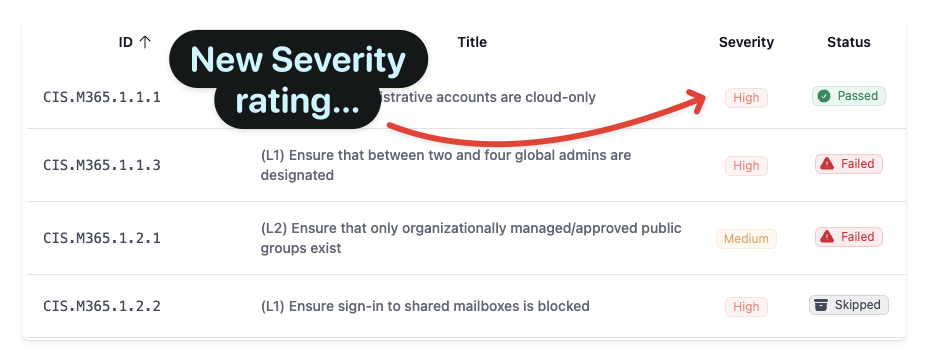

The Maester community of contributors have been hard at work and we are excited to announce the June 2025 release of Maester! 🎉

Here are some quick stats for you:

❇️ 55,000+ tenants have used Maester to improve their security posture

🚀 260,000+ downloads of Maester on PowerShell Gallery

💻 2,600+ commits on GitHub

🤝 72+ contributors

✳️ 285 Maester tests (90+ new tests!)

📦 252 releases

There's a lot to cover, so let's dive right in!

{/* truncate */}

We have added a lot of new features and improvements based on your feedback. Thank you for that! 🙏

Here are all the new features and improvements in this release:

## 🌟 **New Tests**

We've added a whole bunch of new tests to check your security configuration, growing from 194 to 286! 🎉 Check out the [test list](../../docs/tests) for the full breakdown.

### ORCA

[Mike Soule](/blog/authors/mike) came up with the idea to integrate [Cam Murray](https://github.com/cammurray)'s excellent [Office 365 Recommended Configuration Analyzer (ORCA)](https://github.com/cammurray/orca) with Maester.

We reached out to Cam and he was all for helping Microsoft customers become more secure. With the greenlight, Mike started integrating ORCA and we had amazing support from [Thomas Schmidt](/blog/authors/thomasschmidt) who really helped improve the quality and polish of the ORCA tests in Maester. Call out to [Cameron Moore](https://github.com/moorereason) who pitched in with a huge number of PRs.

You can read more about this  in our previous blog post [Maester adds ORCA tests](/blog/maester-with-orca)

### Entra app tests

We have a number of app related tests that help you identify potential security issues with your Entra applications.

Note: We don't run these new app related tests by default since they can take a long time to run. You will need to explicitly include them using `Invoke-Maester -IncludeLongRunning`.

This is because it needs to query all applications and service principals in the tenant which can take many hours in large tenants.

The application risk tests are based on the excellent Azure Tiering research by [Emilien Socchi](https://github.com/emiliensocchi/azure-tiering). These help identity apps that have a path to Global Admin permissions, which can lead to a full tenant takeover.

## Maester - Platform Updates

Special call out to Thomas Schmidt, Sam Erde, Stephan van Rooij and Cameron Moore for their amazing contributions to this release. They have been instrumental in making Maester more robust, performant and easier to use.

In addition, we have had a **lot** of contributions from the community, which has helped us improve Maester even further. Thank you to all our contributors! 🙏

### 🤖 **Maester GitHub Action**

We are excited to announce the new [Maester GitHub Action](https://github.com/marketplace/actions/run-maester)! 🎉

This version is a huge update and adds performance improvements as well a number of new features and configuration options.

We moved the Maester GitHub Action to a new repository, which allows us to better manage the action and its dependencies.

However, this means that you will need to update your workflow files to use the new action. See the Usage section in the [Maester GitHub Action documentation](https://github.com/marketplace/actions/run-maester#%EF%B8%8F-usage) for more details.

### 📋 Excel and CSV Export Formats

We have added new export formats for the Maester report. You can now export the report in Excel and CSV formats, which makes it even more easier to share and analyze the results.

It's as simple as adding an `-ExportExcel` or `-ExportCsv` switch when running `Invoke-Maester`!

### 🚥 Severity levels

Each test now includes a severity rating. This will help you prioritize the tests and focus on the most critical issues first.

You can also change the severity levels of the tests to suite your needs.

Check the [Severity Levels documentation](/docs/next/configuration/severity-levels) for all the details including how you can add Severity to your custom tests.

### 📊 **Maester Report Improvements**

You can now search and filter the results list by name, severity, tags and more.

The test details view now support navigating to the next and previous test, making it easier to review the results.

## Thank you to all our amazing contributors! 🙏

There are many, many more new features, improvements and fixes that have gone in by this amazing list of contributors 👇
