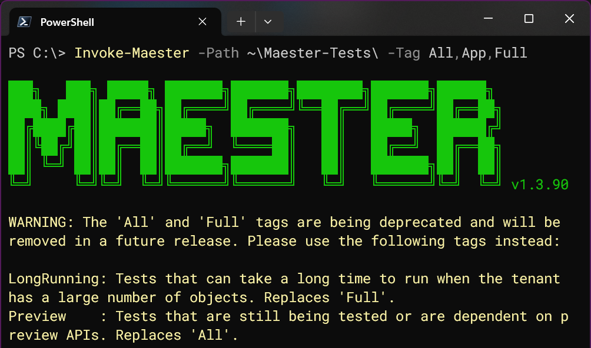
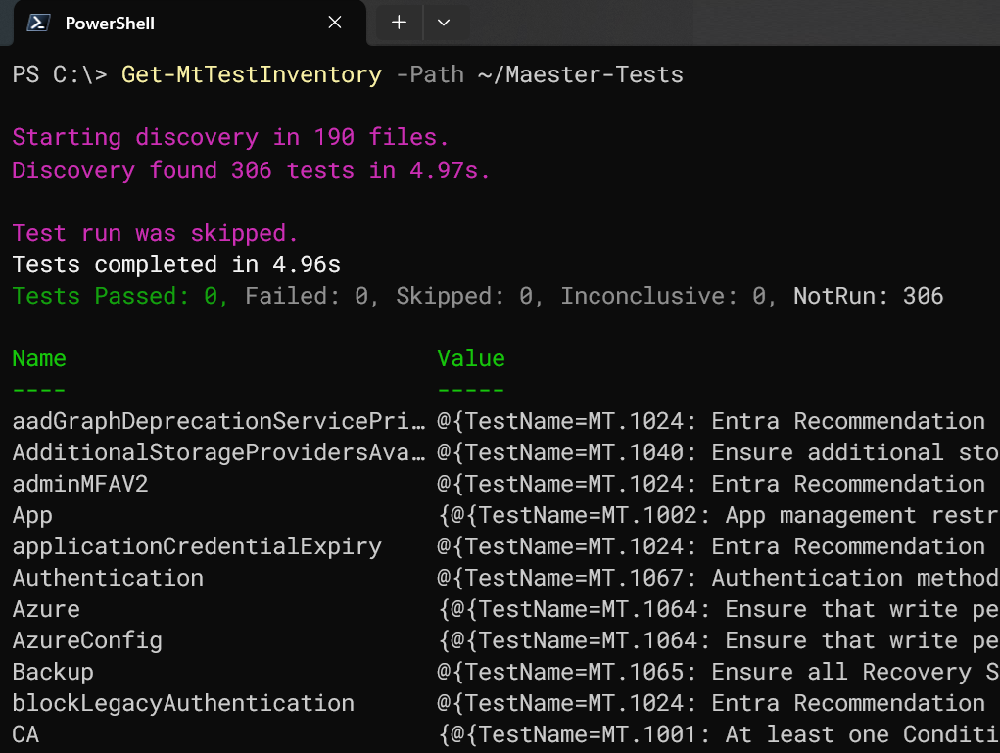

Today we are happy to announce that it is now easier to assess your M365 environment with specific types of tagged tests. Key Maester tags are now less ambiguous, and a new function makes it easy to see all of the tests associated with each tag! 🏷️

<!-- truncate -->

## A Review of How Tags are Used

When you run Maester with no tag-related parameters, it automatically includes all available tests *except* (1) tests that rely on features that are still in preview and (2) tests that can take a very long time in large environments. The goal with this default behavior is to quickly get meaningful results with minimum learning curve.

### 🏷️ Run All Default Tests

```powershell
Invoke-Maester -Path './maester-tests'
```

Runs all the default tests in the folder `./maester-tests` (excludes long running and preview, as noted above) and generates a report of the results in the default `./test-results` location.

### 🏷️ Run Tests with Specific Tags

You can use the **Tag** parameter to target tests with specific tags. For example:

```powershell
Invoke-Maester -Path './maester-tests' -Tag 'CA', 'MFA'
```

Only run tests with the 'CA' or 'MFA' tags in the `./maester-tests` directory.

### 🏷️ Exclude Tests with Specific Tags

```powershell
Invoke-Maester -ExcludeTag 'App', 'Azure'
```

Run all default tests *excluding* tests that are tagged with 'App' or 'Azure'. By default, tests that can take a very long time in large environments and tests that rely on preview features are still excluded as well.

## What has changed?

As noted above, Maester's default execution excludes long-running tests and tests in preview status. Two new switch parameters have been introduced so we can begin the removal of the ambiguous tags that targeted these two categories.

| Original Tag | Original Intent | New Parameter |
| --- | --- | --- |
| All | "All" tests, including those still in preview. | **IncludePreview** |
| Full | "Full" tests, including those that may take a long time in large environments. | **IncludeLongRunning** |

As you can imagine, the original naming lead to many people adding the `All` and `Full` tags to their test scripts with the goal of being generally included. Now, running Maester with every available test can be accomplished as shown below. Note that you can still combine these parameters with other options:

### 🏷️ Run Maester with Default Tests, Long-Running Tests, and Preview Tests

```powershell
Invoke-Maester -Path './maester-tests' -IncludeLongRunning -IncludePreview
```

Runs all tests in the path `./maester-tests` including preview and long running tests.

### 🏷️ Run Maester with Default Tests and Long-Running Tests, Excluding 'App' Tests

```powershell
Invoke-Maester -Path './maester-tests' -IncludeLongRunning -ExcludeTag 'App'
```

Runs all tests in the path `./maester-tests` including long running tests and excluding tests tagged with 'App'.

### Details

#### IncludeLongRunning

These tests that may take a long time in tenants that have a large number of user, group, or application objects. In the future, we hope to add the ability to set a dynamic threshold after checking the number of each object type in the tenant before testing. Then, for example, a tenants with less than a hypothetical threshold of 2000 users would run these tests by default, but tenants with more than 2000 users (as an example) would require the **IncludeLongRunning** switch to include these tests. Tenants with a very large number of users, groups, or applications can take hours to assess or even timeout completely due to the extra processing time required to get the objects and then report on them. Available memory on the system running Maester can also become a limiting factor in these scenarios.

#### IncludePreview

Include tests that rely on functionality that is still in preview status. These might be tests that are based on new techniques that are still being validated by the Maester team or tests that are using a beta API.

:::info

We can use these two options with any other combination of tags or excluded tags. However, tag exclusions will always override inclusions.

:::

### How Will This Affect Me?

We have done our best to deprecate the `All` and `Full` tags gracefully. They have been removed from all tests, but the `Invoke-Maester` function has also been updated to handle their use. However, this code may be removed in the future to keep Maester streamlined and easy to maintain. We currently support use of the tags and/or switches with the following logic:

- The `-IncludeLongRunning` switch is automatically enabled when the **Full** tag is included in the **Tag** parameter.
- The `-IncludePreview` switch is automatically enabled when the **All** tag is included in the **Tag** parameter.

In addition, if these deprecated tags are used, you will now see a warning in the output:



:::warning

If you have implemented Maester through a scheduled task, workflow, or pipeline; please be sure to replace any use of the `All` and `Full` tags with their new switch parameter replacements.

:::

### Bonus: Get-MtTestInventory

Several commonly requested features have been related to the ability to get an inventory of the tests and their tags. The new `Get-MtTestInventory` function delivers exactly that. It enables users of Maester to gain more insights about the tests at their disposal.



The test inventory results are returned as an ordered dictionary (hash table) with the tags as the keys, and a list of the related tests as their associated values.

One way that this can be used is to list all tests associated with a specific tag such as "CIS."

```powershell
$TestInventory = Get-MtTestInventory -Path ~/Maester-Tests -PassThru
$TestInventory['CIS']
```

Try those two commands to see the output, and then explore the tests associated with other tags such as '**XSPM**.' You can also see the full list of discovered tags by running `$TestInventory.Keys` after the above command.

### Conclusion

For more information, please refer to the Maester documentation for `Invoke-Maester` and `Get-MtTestInventory`.

- [Invoke-Maester](https://maester.dev/docs/commands/Invoke-Maester)
- [Get-MtTestInventory](https://maester.dev/docs/commands/Get-MtTestInventory)

As always, Maester is a community project that thrives on your input! We gladly welcome any [feedback](https://github.com/maester365/maester/discussions) or [suggestions for improvements](https://github.com/maester365/maester/issues). You can also join our community on [Discord](https://discord.gg/CQs76Wa9). Thank you!
