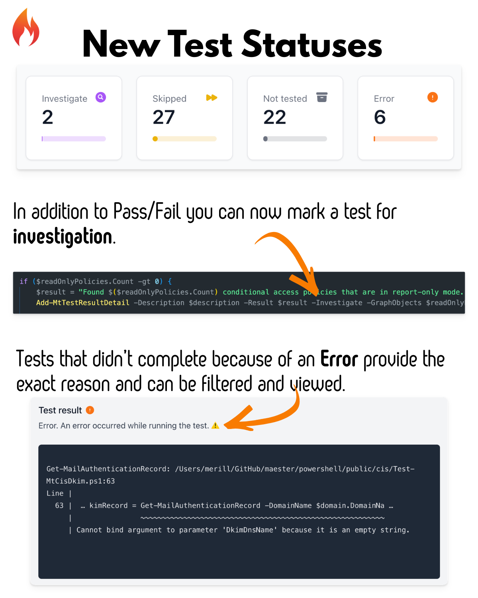
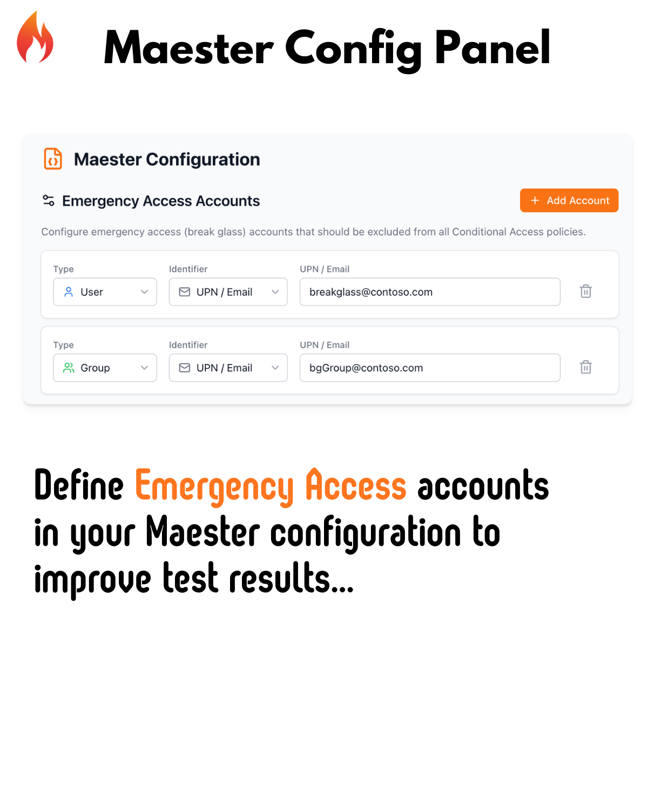
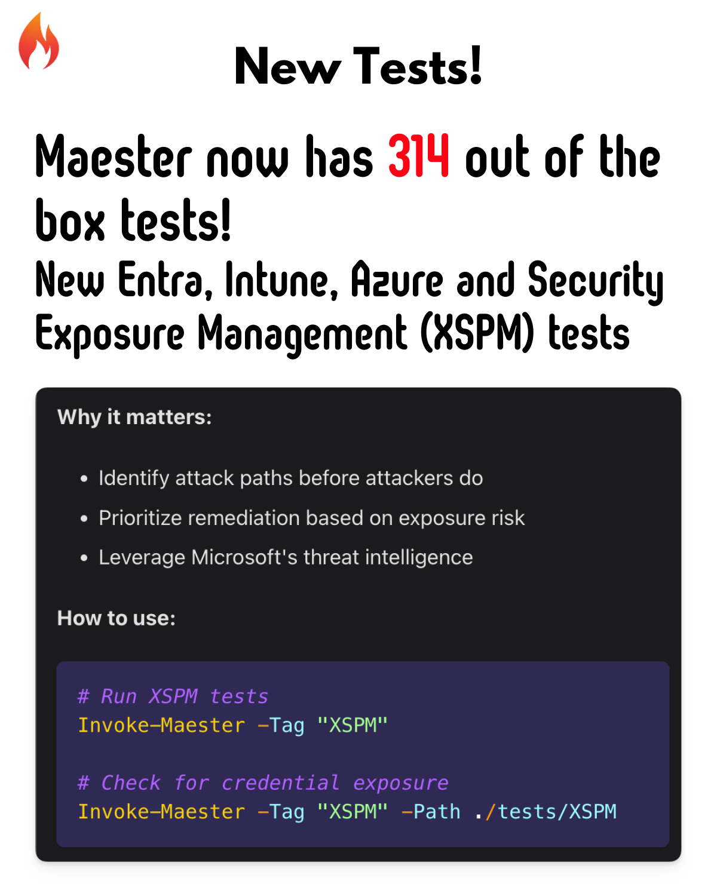
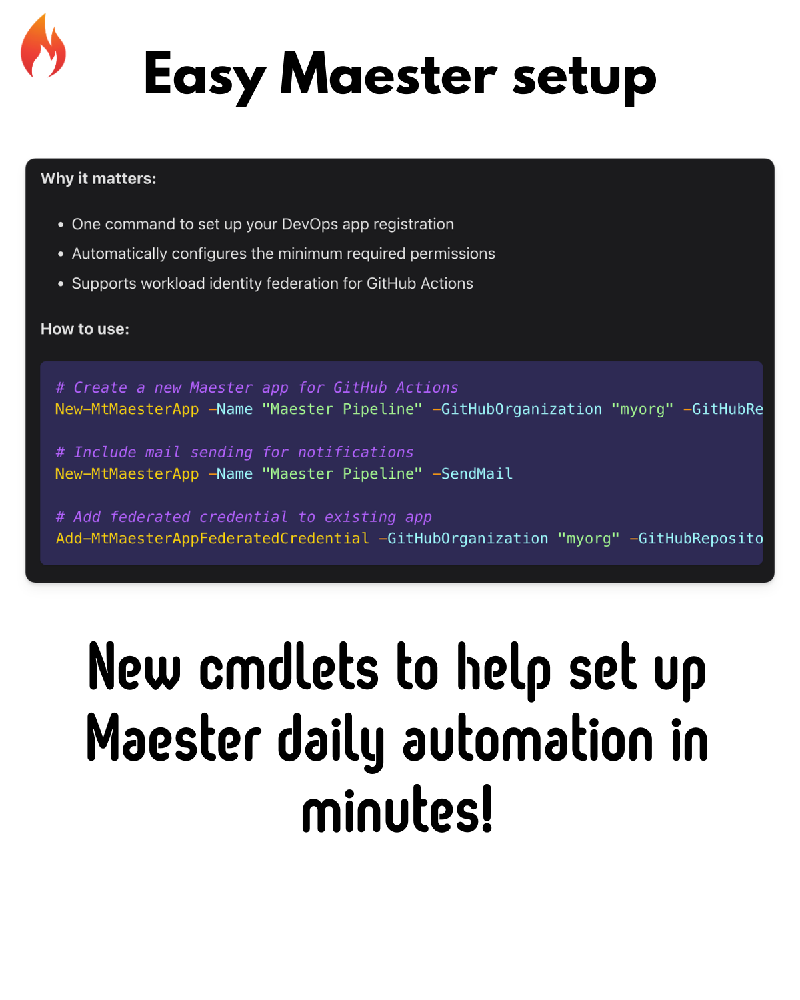
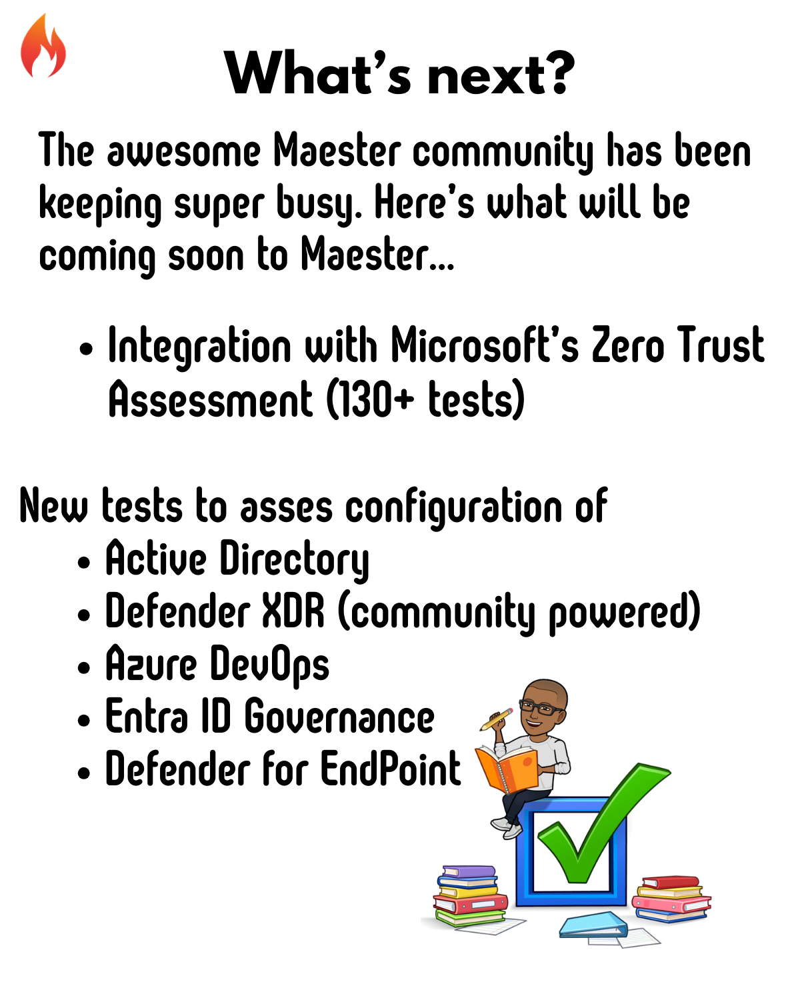
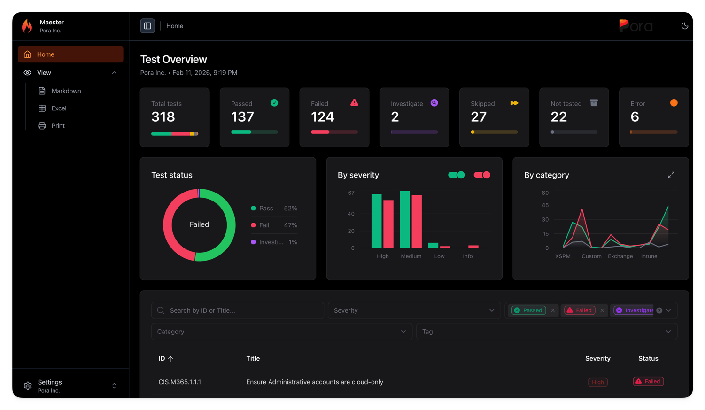

# Introducing Maester 2.0 🚀

We're excited to announce **Maester 2.0** - our biggest release yet! With over 400 commits since version 1.3.0, this release brings powerful new capabilities for Microsoft 365 security testing.

<!-- truncate -->

---

## 🎯 Highlights at a Glance

- **Brand new reporting capabilities** with print, markdown, and Excel export views
- **New Security Tests** covering Intune, Entra ID, Conditional Access and Azure
- **Microsoft Security Exposure Management (XSPM) Integration** - Leverage Defender insights
- **Enhanced HTML Report** with print, markdown, and Excel export views
- **Emergency Access Accounts Configuration** - Define your break-glass accounts
- **New Maester App Management Commands** - Simplified DevOps pipeline setup

---

Here's a deeper dive into what's new in Maester 2.0:
















## New Reporting Capabilities

The Maester report has been completely redesigned with new views and capabilities.



## 🔐 New Security Tests

We've added over 15 new tests to help you secure your Microsoft 365 environment. Here are the highlights:

#### Intune Security

| Test ID | Description |
|---------|-------------|
| **MT.1053** | Ensure intune device clean-up rule is configured |
| **MT.1054** | Ensure built-in Device Compliance Policy marks devices with no compliance policy assigned as 'Not compliant' |
| **MT.1092** | Intune APNS certificate should be valid for more than 30 days |
| **MT.1093** | Apple Automated Device Enrollment Tokens should be valid for more than 30 days |
| **MT.1094** | Apple Volume Purchase Program Tokens should be valid for more than 30 days |
| **MT.1095** | Android Enterprise account connection should be healthy |
| **MT.1096** | Ensure at least one Intune Multi Admin Approval policy is configured |
| **MT.1097** | Ensure all Intune Certificate Connectors are healthy and running supported versions |
| **MT.1098** | Mobile Threat Defense Connectors should be healthy |
| **MT.1099** | Windows Diagnostic Data Processing should be enabled |
| **MT.1100** | Intune Diagnostic Settings should include Audit Logs |
| **MT.1101** | Default Branding Profile should be customized |
| **MT.1102** | Windows Feature Update Policy Settings should not reference end of support builds |
| **MT.1103** | Ensure Intune RBAC groups are protected by Restricted Management Administrative Units or Role Assignable groups |
| **MT.1105** | Ensure MDM Authority is set to Intune |

### Identity & Access Management

| Test ID | Description |
|---------|-------------|
| **MT.1068** | Restrict non-admin users from creating tenants |
| **MT.1069** | Restrict non-admin users from creating security groups |
| **MT.1070** | Restrict device join permissions to selected users |
| **MT.1071** | Ensure Conditional Access policy covers Azure DevOps |
| **MT.1073** | Block soft/hard matching for on-prem sync objects |
| **MT.1074** | Limit onmicrosoft.com domain usage |
| **MT.1075** | Require explicit assignment of third-party Entra apps |

### Azure Security

| Test ID | Description |
|---------|-------------|
| **MT.1063** | All App Registration owners should have MFA enabled |
| **MT.1065** | Ensure Soft Delete is enabled on Recovery Services Vaults |
| **MT.1083** | Ensure Delicensing Resiliency is enabled |

**Why it matters:**
- Prevent shadow IT by restricting tenant and group creation
- Protect your hybrid identity by blocking on-prem sync attacks
- Secure your Azure backup infrastructure

**How to use:**
```powershell
# Run all new tests
Invoke-Maester -Tag "MT.1068", "MT.1069", "MT.1070"

# Run all Entra tests
Invoke-Maester -Tag "Entra"
```

---

## 🛡️ Microsoft Security Exposure Management (XSPM) Tests

A brand new category! Integrate with **Microsoft Security Exposure Management** to test for exposure risks across your environment.

### New XSPM Tests

| Test | Description |
|------|-------------|
| **Privileged API Owners** | App registrations with privileged API permissions and external owners |
| **Privileged Role Owners** | Apps with privileged roles and external owners |
| **Unused Permissions** | Apps with privileged but unused permissions |
| **Credential Guard** | Devices with critical credentials not protected by Credential Guard |
| **TPM Protection** | Devices with critical credentials not protected by TPM |
| **Exposed Credentials** | Privileged users with exposed credentials |
| **Hybrid Role Assignments** | Hybrid users with assigned Entra ID roles |
| **High Exposure Devices** | Publicly exploitable devices with high exposure scores |

**Why it matters:**
- Identify attack paths before attackers do
- Prioritize remediation based on exposure risk
- Leverage Microsoft's threat intelligence

**How to use:**
```powershell
# Run XSPM tests
Invoke-Maester -Tag "XSPM"

# Check for credential exposure
Invoke-Maester -Tag "XSPM" -Path ./tests/XSPM
```

---

## 📊 Enhanced HTML Report

The Maester report has been completely redesigned with new views and capabilities.

### New Report Features

| Feature | Description |
|---------|-------------|
| **Print View** | Clean, printer-friendly format for executive reports |
| **Markdown Export** | Copy results as markdown for docs and tickets |
| **Excel Export** | Download test results for further analysis |
| **Config Editor** | View and manage test configurations in the report |
| **Severity Charts** | Visual breakdown of issues by severity |
| **Dark Mode** | Beautiful dark mode for late-night security reviews |

**Why it matters:**
- Share results with stakeholders in their preferred format
- Track remediation progress over time
- Present findings to leadership with professional reports

**How to use:**
```powershell
# Generate the enhanced report
Invoke-Maester -OutputFolder ./results

# Open the HTML report and explore the new views
# Click the tabs: Print | Markdown | Excel | Config
```

---

## 🚨 Emergency Access Accounts

Define your break-glass accounts in the Maester configuration to improve test accuracy.

**Why it matters:**
- Tests correctly identify your emergency access accounts
- No more false positives on Conditional Access exclusions
- Audit trail for break-glass account usage

**How to use:**

Edit your `maester-config.json`:
```json
{
  "GlobalSettings": {
    "EmergencyAccessAccounts": [
      "emergency-admin@contoso.com",
      "break-glass-group-id"
    ]
  }
}
```

Then run your tests:
```powershell
Invoke-Maester
# Tests will now recognize your defined emergency access accounts
```

---

## ⚡ Maester App Management

New cmdlets to simplify setting up Maester for DevOps pipelines.

### New Commands

| Command | Description |
|---------|-------------|
| `New-MtMaesterApp` | Create a Maester app with required permissions |
| `Get-MtMaesterApp` | Retrieve existing Maester app details |
| `Update-MtMaesterApp` | Update app permissions and settings |
| `Add-MtMaesterAppFederatedCredential` | Add GitHub Actions federated credentials |

**Why it matters:**
- One command to set up your DevOps app registration
- Automatically configures the minimum required permissions
- Supports workload identity federation for GitHub Actions

**How to use:**
```powershell
# Create a new Maester app for GitHub Actions
New-MtMaesterApp -Name "Maester Pipeline" -GitHubOrganization "myorg" -GitHubRepository "maester-tests"

# Include mail sending for notifications
New-MtMaesterApp -Name "Maester Pipeline" -SendMail

# Add federated credential to existing app
Add-MtMaesterAppFederatedCredential -GitHubOrganization "myorg" -GitHubRepository "maester-tests"
```

---

## 🔍 Test Inventory Discovery

A new command to discover and explore available tests.

**Why it matters:**
- Understand what tests are available before running
- Filter tests by tags or capabilities
- Export inventory for documentation

**How to use:**
```powershell
# Get all available tests grouped by tag
$inventory = Get-MtTestInventory

# View tests for a specific tag
$inventory['CIS']

# Export inventory to CSV
Get-MtTestInventory -OutputType CSV -ExportPath ./TestInventory.csv
```

---

## 🔧 Improvements & Fixes

### Performance
- Optimized `Invoke-MtGraphRequest` for faster batch operations
- Improved `ConvertTo-QueryString` with better null handling

### CISA Compliance
- Enhanced CISA test accuracy and reliability
- Individual test IDs for CA What-If analysis

### CIS Benchmarks
- Improved DKIM test with skip logic for onmicrosoft.com domains
- Cleaner test names without level numbers for better readability

### Defender for Identity
- Refactored health issue detection
- Better integration with MDI alerts

---

## 🙏 Thank You to Our Contributors

This release wouldn't be possible without our amazing community:

- @tdcthosc - CISA improvements, CIS refactors, Invoke-Maester enhancements
- @f-bader - Emergency access accounts feature
- @HenrikPiecha - MT.1070, MT.1071, MT.1073 tests
- @marcel-ngn - MT.1068, MT.1069 tests
- @RobbeVandenDaele - XSPM device checks
- @SamErde - Bug fixes and workflow improvements
- @brianveldman - Azure security tests
- @l-gosling - GitLab and Teams integration
- @kij - HTML report improvements
- And many more!

---

## 🚀 Get Started

Update to Maester 2.0 today:

```powershell
# Update the Maester module
Update-Module Maester -Force

# Update your test files
cd maester-tests
Update-MaesterTests

# Run the tests with the new features
Invoke-Maester
```

---

## 📚 Learn More

- [Maester Documentation](https://maester.dev/docs)
- [GitHub Repository](https://github.com/maester365/maester)
- [Join us on Discord](https://discord.gg/maester)

Have feedback or found a bug? [Open an issue](https://github.com/maester365/maester/issues) on GitHub!

Happy testing! 🎉