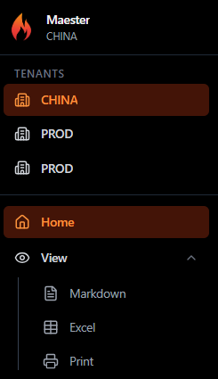
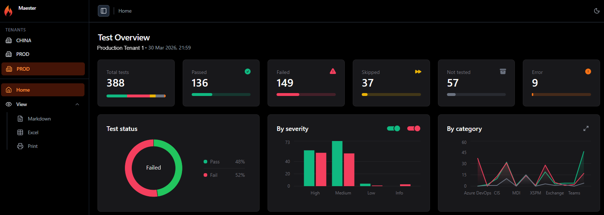
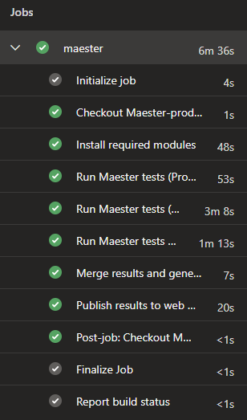

We are excited to announce that Maester now supports multi-tenant reports! Run your security tests across multiple tenants and view the results in a single report. 🚀

<!-- truncate -->

## Multi-Tenant Reports


If you're like me and manage multiple Microsoft 365 tenants, you probably know the pain of having to open separate reports for each one. Not anymore!

### Quick Stats

- 🚀 Run Maester tests across multiple tenants in a single pipeline run
- 🔥 Switch between tenants in one report using the sidebar
- 🤝 Full dashboard per tenant, charts, filters, everything
- 🔐 Each tenant uses its own service connection with read only permissions

### How it looks

The sidebar now shows a **Tenants** section when you have multiple tenants in the report. Click any tenant to switch the entire dashboard to that tenant's data.

{/* TODO: Add screenshot showing the tenant selector in the sidebar */}


Each tenant gets the full experience. Test overview, severity charts, category breakdown and the detailed test results table with all the filters you're used to.

{/* TODO: Add screenshot showing a different tenant selected */}


Single tenant reports continue to work exactly as before. The tenant selector only appears when there are multiple tenants in the report.

## How it works

The approach is straightforward:

1. Run Maester separately for each tenant using its own service connection
2. Save the JSON results from each run
3. Merge them using `Merge-MtMaesterResult`
4. Generate a single HTML report from the merged results

### PowerShell example

```powershell
# Run Maester against two tenants and save JSON results
Connect-MgGraph -TenantId $tenantA
$resultA = Invoke-Maester -PassThru -OutputJsonFile ./tenantA.json
Disconnect-MgGraph

Connect-MgGraph -TenantId $tenantB
$resultB = Invoke-Maester -PassThru -OutputJsonFile ./tenantB.json
Disconnect-MgGraph

# Load results and merge
$a = Get-Content ./tenantA.json -Raw | ConvertFrom-Json
$b = Get-Content ./tenantB.json -Raw | ConvertFrom-Json
$merged = Merge-MtMaesterResult -MaesterResults @($a, $b)

# Generate the multi-tenant HTML report
New-MtMultiTenantHtmlReport -MaesterResults $merged -OutputFile ./MultiTenantReport.html
```

## Azure DevOps Pipeline

For automated monitoring we use an Azure DevOps pipeline with separate service connections per tenant. Each one uses workload identity federation to authenticate with read only permissions.

The pipeline uses a `${{ each }}` loop to generate a step per tenant, so adding more tenants is just adding another entry to the YAML:

```yaml
parameters:
  - name: tenants
    type: object
    default:
      - name: Production
        serviceConnection: sc-maester-production
        tenantId: <your-production-tenant-id>
        clientId: <your-production-client-id>
      - name: Development
        serviceConnection: sc-maester-development
        tenantId: <your-dev-tenant-id>
        clientId: <your-dev-client-id>
```

Each tenant's tests run under their own `AzurePowerShell@5` task with their own service connection. The results are saved as JSON, merged in a separate step, and published to an Azure Web App.

A full example pipeline is available at [`powershell/examples/multi-tenant-pipeline.yml`](https://github.com/maester365/maester/blob/main/powershell/examples/multi-tenant-pipeline.yml).

{/* TODO: Add screenshot of the pipeline running in Azure DevOps */}


### Want to add another tenant?

Just add a new entry to the `tenants` parameter array. The pipeline generates the gather step automatically and the merge picks up all JSON files. No other changes needed.

### Get Started

Follow the example pipeline and the [Maester permissions docs](https://maester.dev/docs/installation#configure-permissions) to set up your multi-tenant monitoring.

## Contributor

- [Sebastian Claesson](/blog/authors/sebastian)
