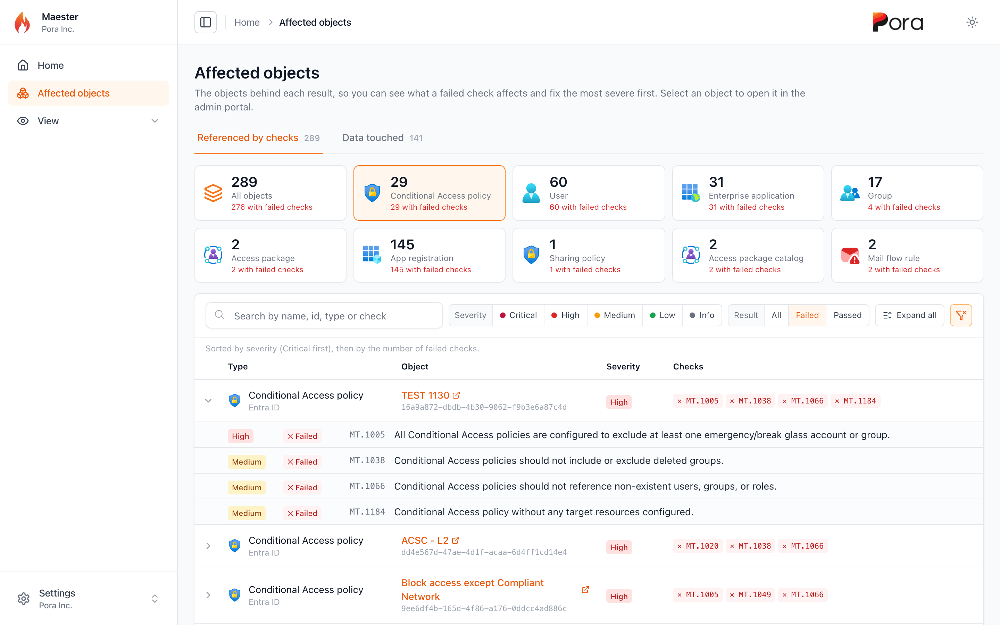
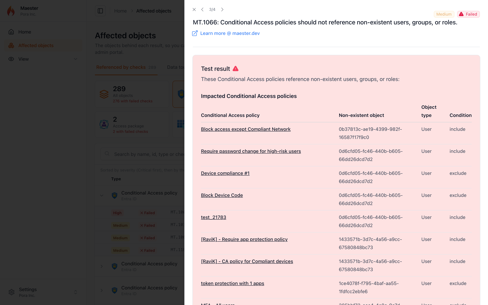
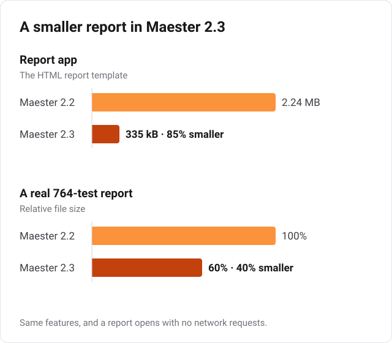

Maester 2.3 is here.

2.2 went wide. 2.3 goes deep: the objects behind every failed check, AI agents in Microsoft Entra, the latest CIS benchmark, the Macs and code repositories in your estate, and a hard look at how Maester itself handles the data it collects from your tenant.

<!-- truncate -->

## Highlights

- **Security hardening** for the report, email, and pipeline output. Please update.
- **14 Microsoft Entra Agent ID checks** for orphaned, over-privileged, and unowned AI agent identities
- **CIS Microsoft 365 Foundations Benchmark v7.0.0**, with updated logic and guidance across the CIS checks
- **4 new Entra ID checks** for dynamic group rules (including the `memberOf` operator Microsoft retires on November 3) and app registration credentials
- **4 macOS checks** for Intune compliance and enrollment
- **7 Azure DevOps checks** for GitHub Advanced Security Secret Protection, Code Security, and Copilot code review
- **Multi-forest Active Directory**, Kerberos (GSSAPI) over SSH for testing AD from Linux and macOS, and severity ratings for the AD checks
- **A new Affected objects report** that shows every policy, user, app, and group behind your failed checks, plus optional user identity redaction
- **A rebuilt HTML report** that's about 85% smaller and opens without a single network request
- **A clearer `Connect-Maester`** that ends with a per-service summary and keeps going when one service fails
- **More reliable runs**: Graph retries, sovereign cloud fixes, PIM license fallback, and skips that are no longer reported as errors

## Security hardening

A Maester report is built from data in your tenant, and some of that data is controlled by people you don't fully trust. Anyone who can register an app or accept a guest invite can choose a display name.

[Jan-Henrik Damaschke](https://github.com/itpropro) privately reported that a crafted display name could break out of the report's embedded data and run script when the report was opened ([GHSA-65g9-g8h8-qw5g](https://github.com/maester365/maester/security/advisories/GHSA-65g9-g8h8-qw5g)). Thank you for the responsible disclosure. That's fixed, and we went looking for related problems while we were there:

- **Report data** is escaped before it's embedded, so values can no longer end the script block
- **Markdown injection**: tenant-controlled names are now escaped in 48 checks, so a name can't render as a fake link, a tracking image, or a broken table. As a backstop, the report only renders images that are embedded or hosted on maester.dev
- **Email alerts**: `Send-MtMail` now HTML-encodes every dynamic value, and `Invoke-Maester` validates `-MailTestResultsUri` before the run starts
- **GitHub Actions**: token and input handling in our workflows has been tightened

**We recommend everyone update to 2.3, and run `Update-MaesterTests` so your test files pick up the escaping changes too.** If you write custom tests, wrap any tenant-controlled value in `Get-MtSafeMarkdown` before adding it to a result.

Special thanks to [Fabian Bader](/contributors/f-bader) for the email hardening and [Travis McDade](/contributors/thetechgy) for the GitHub Actions hardening.

## Security checks for Microsoft Entra Agent ID

AI agents are getting their own identities in Microsoft Entra, and they come with all the identity problems you already know: no owner, no sponsor, stale credentials, too many permissions. They're also new enough that most tenants have no process for reviewing them yet.

Fourteen new preview checks (`MT.1200`, `MT.1201`, `MT.1203` to `MT.1213`, and `MT.1223`) cover the Agent ID lifecycle:

- **Orphaned objects**: agent identities, agent users, and blueprint principals whose parent no longer exists
- **Ownership and sponsorship**: agents and blueprints that need active, enabled owners and assigned sponsors
- **Inactive agents**: enabled agent identities with no sign-in activity in 180 days
- **Privileged access**: agents holding privileged directory roles, membership in role-assignable groups, or high-risk Microsoft Graph permissions, including foreign and multi-tenant agents
- **Blueprint hygiene**: expired or long-lived credentials, `allAllowed` permission inheritance, unassigned app roles, and wildcard or plain-HTTP redirect URIs

The Agent ID Graph APIs are still in preview, so these checks are tagged `Preview` and need the preview scopes. Several of them make a Graph call per object, so those are also tagged `LongRunning`:

```powershell
Connect-Maester -IncludePreview
Invoke-Maester -IncludePreview -IncludeLongRunning
```

Special thanks to [Agnivesh](/contributors/agnivesh) for building this coverage.

## CIS Microsoft 365 Foundations Benchmark v7.0.0

The CIS checks now follow v7.0.0 of the benchmark. This is more than a version bump:

- Two controls moved from Level 2 to Level 1 (device compliance, and blocking users from registering applications)
- The attachment-filter check verifies that all 53 CIS default extensions are blocked, not just that the filter is on, and the comprehensive filter list picks up `apk` and `library`
- The DKIM check now excludes initial (`onmicrosoft.com`) and coexistence domains entirely, instead of passing them automatically
- SharePoint guest access expiration must be exactly 30 days
- The Microsoft 365 group audit only looks at unified groups, matching the new benchmark audit
- The Teams app permission policy check has been retitled and drops the retired "Microsoft apps" step
- The guest dynamic group control (5.1.3.1) is no longer in the benchmark, so we've removed it

Rationale, impact, and remediation text has been refreshed across the CIS documentation. If you report against CIS, expect some results to change after you update.

Special thanks to [Morten Mynster](/contributors/mynster9361) for the v7.0.0 update.

## More Entra ID checks

Four new checks look at things that are easy to set up once and forget:

| Test | What it checks |
| --- | --- |
| `MT.1196` | Dynamic group rules that use attributes users or other parties may be able to change |
| `MT.1197` | Dynamic groups that use the `memberOf` rule operator, which Microsoft is retiring on November 3, 2026 |
| `MT.1198` | App registration certificates issued with excessive validity periods (default: over 365 days) |
| `MT.1199` | App registration certificates and secrets that have expired or expire within 30 days |

`MT.1198` closes a gap that app management policies leave open. Those policies only apply to credentials added after the policy takes effect, so a tenant can pass `MT.1002` and still authenticate with multi-year certificates issued years ago.

### `memberOf` dynamic groups stop updating on November 3

Microsoft sent its final reminder on October 5:

<div style={{ border: '1px solid var(--ifm-color-emphasis-300)', borderRadius: '12px', padding: '1rem 1.25rem', margin: '1.25rem 0', maxWidth: '640px', background: 'var(--ifm-background-surface-color)', boxShadow: 'var(--ifm-global-shadow-lw)' }}>
  <div style={{ fontSize: '0.8rem', color: 'var(--ifm-color-emphasis-700)' }}>Message Center · <a href="https://mc.merill.net/message/MC1488834">MC1488834</a></div>
  <div style={{ fontWeight: 700, fontSize: '1.05rem', lineHeight: 1.35, margin: '0.35rem 0 0.75rem' }}>Microsoft Entra ID: Final reminder to replace MemberOf rule operator configurations by November 3, 2026</div>
  <div style={{ display: 'flex', flexWrap: 'wrap', alignItems: 'center', gap: '0.5rem 1.25rem', fontSize: '0.85rem' }}>
    <span><span style={{ color: 'var(--ifm-color-emphasis-700)' }}>Published</span> <strong>Oct 5, 2026</strong></span>
    <span><span style={{ color: 'var(--ifm-color-emphasis-700)' }}>Act by</span> <strong style={{ color: 'var(--ifm-color-danger-dark)' }}>Nov 3, 2026</strong></span>
    <span style={{ display: 'inline-flex', gap: '0.35rem', flexWrap: 'wrap' }}><span style={{ display: 'inline-block', padding: '0.05rem 0.5rem', borderRadius: '999px', background: 'var(--ifm-color-emphasis-200)', fontSize: '0.75rem', fontWeight: 600 }}>Retirement</span><span style={{ display: 'inline-block', padding: '0.05rem 0.5rem', borderRadius: '999px', background: 'var(--ifm-color-emphasis-200)', fontSize: '0.75rem', fontWeight: 600 }}>Admin impact</span><span style={{ display: 'inline-block', padding: '0.05rem 0.5rem', borderRadius: '999px', background: 'var(--ifm-color-emphasis-200)', fontSize: '0.75rem', fontWeight: 600 }}>User impact</span></span>
  </div>
</div>

After November 3, dynamic groups that use the `memberOf` operator stop updating. Their membership freezes, and anything that relies on them, like license assignments and Conditional Access policies, keeps working from that stale membership.

**Run Maester 2.3 and `MT.1197` finds these groups for you.** It lists each affected group with its source groups, assigned licenses, and any Conditional Access policies that reference it, so you can see what breaks before it does:

```powershell
Invoke-Maester -Tag "MT.1197"
```

`MT.1197` checks dynamic groups. The retirement also covers administrative units and entitlement management policies that use `memberOf`, so review those as well.

Special thanks to [Agnivesh](/contributors/agnivesh) for the dynamic group checks and [Simon Vedder](/contributors/simon-vedder) for the app registration credential checks.

## macOS coverage in Intune

Until now, Maester's Apple coverage stopped at certificate and token expiry. Four new checks look at the Macs themselves:

| Test | What it checks |
| --- | --- |
| `MT.1214` | A macOS compliance policy requires System Integrity Protection |
| `MT.1215` | Gatekeeper restricts where apps can be downloaded from |
| `MT.1216` | A macOS compliance policy requires a Defender machine risk score |
| `MT.1217` | macOS LAPS is configured on Automated Device Enrollment profiles |

The three compliance checks only count policies that are actually assigned. `MT.1217` looks at every Automated Device Enrollment profile, and flags any that create an admin account without rotating its password, since that gives every Mac the same static local admin password.

On the Windows side, the BitLocker (`MT.1123`) and Attack Surface Reduction (`MT.1178`) checks now detect settings configured through the Settings catalog.

Special thanks to [Daniel Lystad](/contributors/daniellystad) for the macOS checks and [Roy Klooster](/contributors/royklo) for the Settings catalog fixes.

## Azure DevOps: Advanced Security and Copilot code review

GitHub Advanced Security for Azure DevOps is now sold as two separate plans, Secret Protection and Code Security. The existing `AZDO.1026` check only covered the old bundled offering, so organizations on the new plans got no signal at all.

Six new checks, `AZDO.1039` to `AZDO.1044`, cover each plan from three angles: whether new repositories are enrolled automatically, whether existing repositories are enrolled, and whether the protections are actually on (push protection for secrets, dependency and CodeQL alerts for code). Splitting these matters. Auto-enrollment only applies to new repositories, so an organization can have the toggle on and still leave a large share of its existing repositories unprotected.

A seventh preview check, `AZDO.1045`, reports whether Copilot code review is allowed for repositories.

Special thanks to [Sebastian Claesson](/contributors/sebastianclaesson) for these checks.

## Active Directory: multi-forest and cross-platform

The Active Directory checks we shipped in 2.2 got a lot of real-world feedback, and 2.3 acts on it:

- **Multi-forest targeting**: `Connect-Maester` accepts `-ActiveDirectoryDomain` and `-ActiveDirectoryForest` so you can target child domains and separate forests
- **Kerberos over SSH**: run AD checks from Linux and macOS through GSSAPI-authenticated SSH, with domain controller discovery through DNS SRV records
- **Richer forest data**: FSMO role holders, UPN and SPN suffixes, and cross-forest references
- **More resilient LDAP**: individual queries recover from missing attributes instead of failing the whole collection, and AD libraries only load when you actually test AD
- **Computer name targeting** when collecting domain state
- **Connection fixes**: WinRM falls back to HTTP with Negotiate encryption when HTTPS fails and you've supplied credentials, and a domain controller without LDAPS or StartTLS now gives a clear error
- **Cache scoped to the target**: switching between domains no longer returns cached data from the previous one
- **SYSVOL on PowerShell 7.2**: SYSVOL content collection now works on PowerShell 7.2
- **Easier troubleshooting**: `-Verbose` now shows each step of the LDAP connection, certificate problems are detected and explained, and a new troubleshooting guide covers the common connection errors. On Linux and macOS, Maester skips StartTLS by default because of an upstream .NET bug

The AD checks also have **severity ratings** now. Checks that match a checkpoint in the [CERT-FR (ANSSI) Active Directory checklist](https://www.cert.ssi.gouv.fr/uploads/ad_checklist.html) take their severity from it and link to it in their docs. Inventory-only checks are rated `Info`. A small number that need a closer look are still unrated. The AD checks also have their own pages in the Tests section of maester.dev, so you can browse them like any other suite.

The AD checks are still in preview and we're still working through feedback, so keep it coming.

Special thanks to [Mike Soule](/contributors/soulemike) for the refactor and connection fixes, [Agnivesh](/contributors/agnivesh) for the severity ratings and AD test pages, and everyone who ran the preview against their own domains and told us what broke.

## See what your failed checks actually affect

A Maester report tells you which checks failed. The question that usually comes next is *what does this affect?* Which Conditional Access policies, which users, which apps? Until now, the answer was buried in the details of each result.

The new **Affected objects** report turns that around. Run Maester with `-IncludeAffectedObjects` and the HTML report gets a new page that lists every object your checks pointed at, alongside every check that pointed at it:

```powershell
Invoke-Maester -IncludeAffectedObjects
```



- **One tile per object type**, showing how many objects have failed checks. The tiles work like tabs: *All objects* shows everything, and selecting a type, such as *User*, shows only that type
- **Sorted for remediation**: by severity, Critical first, then by the number of failed checks, so the objects to fix first are at the top
- **Filters for severity and result**. Select *Failed*, and each row shows only its failed checks. One click on the clear filter button resets everything
- **Expand a row** to see each check that referenced the object, and select a check to open its result without leaving the page
- **Select the object's name** to open it in the admin portal



A second tab, **Data touched**, lists everything the run read, with a tile for each area: Intune, Entra roles, PIM alerts, and so on. It's a quick way to see the scope of what Maester looked at.

The same list is also saved next to your results as `<name>-affected-objects.json`, and as a CSV when you use `-ExportCsv`, so you can feed it into your own tooling. Nothing is collected unless you pass the switch.

Running Maester from the [GitHub Action](/docs/monitoring/github)? Set `include_affected_objects: true` and the report and JSON file are included in the uploaded results:

```yaml
- uses: maester365/maester-action@main
  with:
    tenant_id: ${{ secrets.AZURE_TENANT_ID }}
    client_id: ${{ secrets.AZURE_CLIENT_ID }}
    include_affected_objects: true
```

### Redact user identities

Sharing a report outside your security team? `-RedactUserIdentity` replaces user display names, UPNs, and object IDs with a stable token:

```powershell
# Redact the HTML report, keep real identifiers in the JSON, CSV, and other exports
Invoke-Maester -IncludeAffectedObjects -RedactUserIdentity HtmlOnly

# Redact every output
Invoke-Maester -RedactUserIdentity AllOutputs
```

Two things to know before you rely on it. This is pseudonymization, not anonymization: the token is an unsalted hash, so anyone with a list of candidate users can reverse it. And it's best effort: only users the run read from Microsoft Graph (plus the signed-in account) are replaced, and email and Teams notifications aren't redacted.

Special thanks to [Thomas Naunheim](/contributors/cloud-architekt) for building the Affected objects report and redaction.

## A smaller, faster report

The HTML report has been rebuilt on a much smaller stack. It looks the same, and filters, search, deep links, keyboard navigation, and multi-tenant reports all work as before, but:



- The report app is **about 85% smaller** (2.24 MB down to 335 kB)
- The favicon is embedded, so a report opens with **no network requests at all**. That helps when you open reports offline, send them by email, or host them behind a strict Content Security Policy
- Reports no longer embed each test's internal PowerShell error record. That shaved 40% off a real 764-test report, and stops local file paths (like your user name) from leaking into reports you share
- The result panel slides in more smoothly, the theme toggle is instant, the table no longer jumps when you select a row, and long test IDs are truncated instead of overlapping the title

Special thanks to [Jan-Henrik Damaschke](https://github.com/itpropro) for the rebuild.

## A clearer `Connect-Maester`

`Connect-Maester -Service All` used to print a stream of warnings, even for services you never meant to use. Now it finishes with a single table that shows what happened to each service:

```text
Service                Status     Details
-------                ------     -------
Microsoft Graph        Connected  admin@contoso.com
Azure                  Connected  admin@contoso.com
Dataverse              Skipped    No environment found, set DataverseEnvironmentUrl in maester-config.json
Exchange Online        Connected  admin@contoso.com
Security & Compliance  Connected  admin@contoso.com
Microsoft Teams        Connected  admin@contoso.com
SharePoint Online      Skipped    -SharePointClientId was not provided
```

- **One failure no longer stops the rest.** Previously, a sign-in error from one service stopped `Connect-Maester`, and every service after it was never tried. Now that service is marked `Failed` with the first line of the error, and the rest still connect
- **Missing modules** show the `Install-Module` command you need
- **The full details** are still available with `-Verbose`
- **Admin consent**: Global Readers and other non-admins who hit "Approval required" now get clear steps to get consent, instead of a cryptic `User canceled authentication`

Special thanks to [Morten Mynster](/contributors/mynster9361) for the idea and proposal behind the connection summary, and [Rafał Fitt](/contributors/rafalfitt) for the admin consent guidance.

## More reliable runs

A lot of this release is about Maester behaving well in tenants that aren't quite like ours:

- **Transient Graph errors**: `500` and `502` responses are retried, with backoff, for requests that are safe to repeat
- **PIM licensing**: when the PIM API rejects a tenant's license, role lookups fall back to role assignments instead of erroring out the CIS checks that depend on them
- **Sovereign clouds**: requests that were hard-coded to the global Graph endpoint now use the cloud you connected to
- **Long runs**: `Connect-Maester -ClientTimeout` passes a longer HTTP timeout through to Microsoft Graph
- **Skips stay skips**: a check that skipped from inside its own error handling was reported as **Error**. That affected 17 checks, and it's now fixed centrally, so your custom tests benefit too
- **Azure DevOps**: a saved ADOPS sign-in with an expired token no longer turns every Azure DevOps test into an error. The tests now skip with "Not connected to Azure DevOps"
- **Copilot Studio**: when the agent query fails, the `MT.1113` to `MT.1122` skips now say why (for example, a missing Dataverse permission) instead of dumping raw JSON to the console
- **ORCA checks in scripts**: when the module was imported from inside a script (as many CI pipelines do), every ORCA check failed with `Cannot find type [PolicyInfo]`. The ORCA classes now load in the module's own scope
- **No runtime downloads for role tiers**: the privileged-role classification used by the permanent role and PIM alert checks now ships with the module instead of being downloaded from GitHub at runtime. It's refreshed automatically through a reviewed pull request each month
- **Exposure Management**: the XSPM identity queries use the correct Advanced Hunting schema, and the external data sources they use can be pointed at your own mirrors
- **Fewer false positives**: the MFA checks ignore risk-scoped Conditional Access policies, break-glass accounts are excluded from risk recommendations, `MT.1011` explains why browser-scoped policies don't match, and checks that can't be verified now skip with a reason instead of failing silently

Special thanks to [Nathan McNulty](/contributors/nathanmcnulty), [Sebastian Claesson](/contributors/sebastianclaesson), [Matthias](/contributors/blindzero), [Rafał Fitt](/contributors/rafalfitt), [eduardarbona](/contributors/earbona23), [Sam Erde](/contributors/samerde), and [Massimo Mazzariol](/contributors/massimomazzariol).

## Website and docs

- EIDSCA test pages now include the remediation action for each setting
- "Edit this page" links work again
- Product names and accessibility were cleaned up across the docs
- And yes, the homepage will now tell you how to pronounce Maester 🔊

## Thank you to every contributor

Maester 2.3 includes contributions from 25 people:

- [Agnivesh](/contributors/agnivesh) for the Agent ID and dynamic group checks, Active Directory severity ratings, and generated docs fixes.
- [Beerd Veldman](/contributors/brianveldman) for fixing typos across the docs.
- [Daniel Lystad](/contributors/daniellystad) for the four macOS checks.
- [eduardarbona](/contributors/earbona23) for fixing false positives and silent failures in several Entra and Global Secure Access checks.
- [Fabian Bader](/contributors/f-bader) for hardening `Send-MtMail` against HTML injection.
- [Haris Habib](/contributors/amlhive-tech) for handling missing DKIM signing configurations.
- [Jan Bakker](/contributors/bakkerjan) for teaching the homepage how to say "Maester".
- [Jan-Henrik Damaschke](https://github.com/itpropro) for responsibly disclosing the report vulnerability and rebuilding the report.
- [John Flores](/contributors/buckeyeguyjflo) for branding and accessibility fixes across the docs.
- [Massimo Mazzariol](/contributors/massimomazzariol) for fixes to BitLocker, Azure DevOps, Entra recommendation links, and unit tests.
- [Matthias](/contributors/blindzero) for the Graph client timeout, the CISA DKIM coexistence fix, and clearer Entra Connect guidance.
- [Michael Morten Sonne](/contributors/michaelmsonne) for documenting the risks of client secret authentication.
- [Mike Soule](/contributors/soulemike) for multi-forest, cross-platform Active Directory support, AD connection fixes, and the AD troubleshooting guide.
- [Morten Mynster](/contributors/mynster9361) for updating the CIS checks to v7.0.0 and proposing the `Connect-Maester` connection summary.
- [Nathan McNulty](/contributors/nathanmcnulty) for Graph retries, the PIM fallback, the embedded role classification, and XSPM data sources.
- [Rafał Fitt](/contributors/rafalfitt) for admin consent guidance in `Connect-Maester` and fixing the XSPM identity queries.
- [Roy Klooster](/contributors/royklo) for Settings catalog support in the BitLocker and ASR checks.
- [Sam Erde](/contributors/samerde) for MFA check fixes, telemetry timeouts, and agent instructions for contributors.
- [Sebastian Claesson](/contributors/sebastianclaesson) for the Azure DevOps Advanced Security checks and sovereign cloud fixes.
- [Simon Vedder](/contributors/simon-vedder) for the app registration credential checks.
- [Stefan Wey](/contributors/weycc81) for EIDSCA remediation docs and fixing "Edit this page".
- [Thomas Naunheim](/contributors/cloud-architekt) for the Affected objects report and user identity redaction.
- [Thomas S. Schmidt](/contributors/thomas-s-schmidt) for centralizing the module preamble.
- [Travis McDade](/contributors/thetechgy) for hardening our GitHub Actions workflows.
- [Merill Fernando](/contributors/merill) for security hardening, the `Connect-Maester` summary, report polish, and release and automation improvements.

Thank you as well to everyone who reviewed a pull request, reported an issue, tested a preview build, or ran the AD checks against a domain we'll never see. Your feedback shaped this release.

## Get Maester 2.3

Update the module and your test collection:

```powershell
Update-Module Maester
Update-MaesterTests
```

Then explore what's new:

```powershell
# Affected objects report
Invoke-Maester -IncludeAffectedObjects

# Microsoft Entra Agent ID (preview)
Connect-Maester -IncludePreview
Invoke-Maester -Tag "MT.1200", "MT.1201", "MT.1203", "MT.1204", "MT.1205", "MT.1206", "MT.1207", "MT.1208", "MT.1209", "MT.1210", "MT.1211", "MT.1212", "MT.1213", "MT.1223" -IncludePreview -IncludeLongRunning

# Dynamic groups and app registration credentials
Invoke-Maester -Tag "MT.1196", "MT.1197", "MT.1198", "MT.1199"

# macOS
Invoke-Maester -Tag "MT.1214", "MT.1215", "MT.1216", "MT.1217"

# CIS Microsoft 365 Foundations Benchmark v7.0.0
Invoke-Maester -Tag "CIS"
```

Maester now tests the agents you're deploying, the Macs and repositories they run on, and itself, and shows you exactly which objects each failure affects. Go check the agent identities in your tenant before someone else does.

## A sneak peek at Maester 3.0

While 2.3 was coming together, we started on something much bigger: a rewrite of how Maester discovers and runs tests. It's still early, and the details may change, but here's where it's heading:

- **A native test engine.** Maester 3.0 runs its checks itself instead of through Pester. Pester becomes optional, and your existing custom Pester tests keep working alongside the native ones. There's also a converter if you want to move them over.
- **Built-in tests ship inside the module.** No more copying hundreds of test files into your repo or keeping them up to date with `Update-MaesterTests`. Your tests folder only holds your own tests and configuration.
- **The engine handles connections and licences.** Each check declares which services and licences it needs, and the engine decides whether to run or skip it, with a consistent reason.
- **More control over each run.** Pick tests by ID, preview a run with `-DryRun`, and keep your settings in a single run configuration file.
- **Ready for parallel runs.** 3.0 still runs one test at a time, but it's built so a later release can run tests in parallel.

One heads-up: Maester 3.0 will need PowerShell 7.4 or later. If you're still on Windows PowerShell 5.1, now is a good time to plan the move.

It's a big change under the hood, and it gives us the room to build what's next without fighting the framework. You can follow along, and share your feedback, in the [Maester 3.0 RFC](https://github.com/maester365/maester/discussions/2050).

## Thank you to our Maester Cloud supporters

A big thank you to everyone who supports [Maester Cloud](https://maester.cloud). Your support is what lets Merill Fernando spend more time on open-source Maester, and much of what's in this release comes from that time.

If you'd like to help too, take a look at the [Maester Cloud supporters page](https://maester.cloud/supporters).

Happy testing! 🎉
