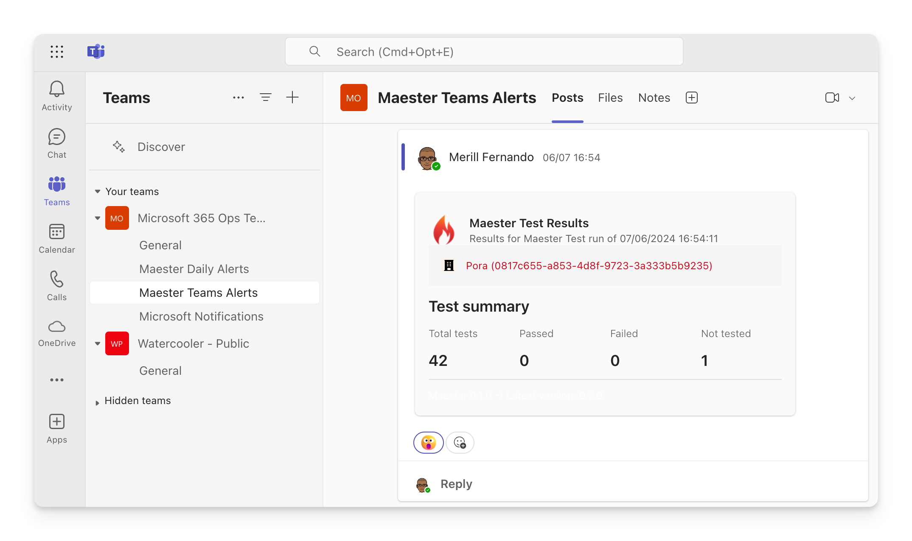

import Tabs from '@theme/Tabs';
import TabItem from '@theme/TabItem';

# Set up Maester Teams Alerts

Your Maester monitoring workflow can be configured to send an adaptive card in a team channel with the summary of the Maester test results at the end of each monitoring cycle. This guide will walk you through the steps to set up Teams alerts in Maester.



There are two ways you can send alerts to Teams:

- **Teams webhook workflow**: Uses a Teams webhook triggered from Maester.
  - This method is simpler to set up, does not require any additional Graph permissions and users a PowerAutomate workflow. However the workflow is tied to the account that set up the workflow which may need to be updated if the account is disabled.
- **Graph API**: Uses a Graph API call to send the message to a Teams channel.
  - This method takes a few extra steps and requires consenting to the Teamwork.Migrate.All graph permissions. There are no dependencies on PowerAutomate workflows with this option.

<Tabs>
<TabItem value="wif" label="Teams webhook workflow" default>

## Create a Teams webhook

- To get the Webhook Uri, right-click on the channel in Teams and select `Workflow`.
- Create a workflow using the `Post to a channel when a webhook request is received` template.
- Copy the Webhook Uri provided. You will need this Uri for the next step.

## Invoke-Maester with the webhook

Update your GitHub/Azure DevOps daily monitoring workflow to send the alert using the `TeamChannelWebhookUri` parameter with the url from the previous step.

```powershell
Invoke-Maester -TeamChannelWebhookUri 'https://some-url.logic.azure.com/workflows/invoke?api-version=2016-06-01'
```

Alternatively, you can use the `Send-MtTeamsMessage` cmdlet to send the message to a specific Teams channel.

```powershell
# Get the results of the Maester tests using -PassThru
$results = Invoke-Maester -Path tests/Maester/ {...} -PassThru

# Send the summary using the results
Send-MtTeamsMessage -MaesterResults $MaesterResults TeamChannelWebhookUri 'https://some-url.logic.azure.com/workflows/invoke?api-version=2016-06-01' -Subject 'Maester Results' -TestResultsUri "https://github.com/contoso/maester/runs/123456789"

```

:::note

The TeamChannelWebhookUri should be kept secure and not shared publicly to avoid unauthorized users posting messages to your channel. If using GitHub Actions, it is recommended to store the webhook uri as a secret.

:::

### Github Action Webhook

The latest version of the Github action has support for sending the notification to Teams. Add the url as a secret for your github actions with the name `TEAMS_WEBHOOK_URL`, and update your workflow.

```yaml
jobs:
  run-maester-tests:
    name: Run Maester Tests
    runs-on: ubuntu-latest
    steps:
    - name: Run Maester action
      uses: maester365/maester-action@main
      with:
        client_id: ${{ secrets.AZURE_CLIENT_ID }}
        tenant_id: ${{ secrets.AZURE_TENANT_ID }}
        include_public_tests: true # Optional: Set to false if you are keeping to a certain version of tests or have your own tests
        include_exchange: false    # Optional: Set to true if you want to include Exchange tests
        step_summary: true         # Optional: Set to false if you don't want a summary added to your GitHub Action run
        artifact_upload: true      # Optional: Set to false if you don't want summaries uploaded to GitHub Artifacts
        install_prerelease: false  # Optional: Set to true if you want to use Measter Preview Build when running tests
        disable_telemetry: false   # Optional: Set to true If you want telemetry information not to be logged.
        notification_teams_webhook: ${{ secrets.TEAMS_WEBHOOK_URL }} # Optional: Send the results to this Teams Webhook URI
```

</TabItem>

  <TabItem value="gha-wif" label="Graph API" default>

## Prerequisites

### ChannelMessage.Send graph permissions

The app that sends the Teams alerts needs the `Teamwork.Migrate.All` permission to send messages. To configure

- Open the [Entra admin center](https://entra.microsoft.com) > **Identity** > **Applications** > **App registrations**
- Search for the application you created to run as the `Maester DevOps Account`.
- Select **API permissions** > **Add a permission**
- Select **Microsoft Graph** > **Application permissions**
- Search for `Teamwork.Migrate.All` and check the box next to the permission
- Select **Add permissions**
- Select **Grant admin consent for [your organization]**
- Select **Yes** to confirm

## Add the Teams alert step to your workflow

Update your GitHub/Azure DevOps daily monitoring workflow to send the alert using `Send-MtTeamsMessage` after the Maester tests have been run.

```powershell
# Get the results of the Maester tests using -PassThru
$results = Invoke-Maester -Path tests/Maester/ {...} -PassThru

# Send the summary using the results
Send-MtTeamsMessage -MaesterResults $MaesterResults -TeamId '00000000-0000-0000-0000-000000000000' -TeamChannelId '19%3A00000000000000000000000000000000%40thread.tacv2' -Subject 'Maester Results'

```

:::info

- To get the TeamId, right-click on the channel in Teams and select 'Get link to channel'. Use the value of groupId. e.g. ?groupId=< TeamId >
- To get the TeamChannelId, right-click on the channel in Teams and select 'Get link to channel'. Use the value found between channel and the channel name. e.g. /channel/< TeamChannelId >/my%20channel
  :::

### Github Action Teams notification

The latest version of the Github action has support for sending the notification to Teams. Add the TeamId and TeamChannelId as secrets for your github actions with the names `TEAMS_TEAM_ID` and `TEAMS_CHANNEL_ID`, and update your workflow.

```yaml
jobs:
  run-maester-tests:
    name: Run Maester Tests
    runs-on: ubuntu-latest
    steps:
    - name: Run Maester action
      uses: maester365/maester-action@main
      with:
        client_id: ${{ secrets.AZURE_CLIENT_ID }}
        tenant_id: ${{ secrets.AZURE_TENANT_ID }}
        include_public_tests: true # Optional: Set to false if you are keeping to a certain version of tests or have your own tests
        include_exchange: false    # Optional: Set to true if you want to include Exchange tests
        step_summary: true         # Optional: Set to false if you don't want a summary added to your GitHub Action run
        artifact_upload: true      # Optional: Set to false if you don't want summaries uploaded to GitHub Artifacts
        install_prerelease: false  # Optional: Set to true if you want to use Measter Preview Build when running tests
        disable_telemetry: false   # Optional: Set to true If you want telemetry information not to be logged.
        notification_teams_team_id: ${{ secrets.TEAMS_TEAM_ID }} # Optional: Send the results to this Team
        notification_teams_channel_id: ${{ secrets.TEAMS_CHANNEL_ID }} # Optional: Send the results to this Teams Channel
```

</TabItem>

</Tabs>

## Adding a link to detailed Maester results

The cmdlet has a `-TestResultsUri` parameter that can be used to include a link to the detailed Maester results in the alert.

To use this parameter, you need to provide the URL of the Maester results page. Use the appropriate url format based on the CI/CD system you are using.

### GitHub

**Link:** `${{ github.server_url }}/${{ github.repository }}/actions/runs/${{ github.run_id }}`

```powershell
$testResultsUri = "${{ github.server_url }}/${{ github.repository }}/actions/runs/${{ github.run_id }}"

Send-MtTeamsMessage -MaesterResults $results -TestResultsUri $testResultsUri ...

```

### Azure DevOps

**Link:** `$(System.CollectionUri)$(System.TeamProject)/_build/results?buildId=$(Build.BuildId)`

```powershell
$testResultsUri = "$(System.CollectionUri)$(System.TeamProject)/_build/results?buildId=$(Build.BuildId)"

Send-MtTeamsMessage -MaesterResults $results -TestResultsUri $testResultsUri ...
```
