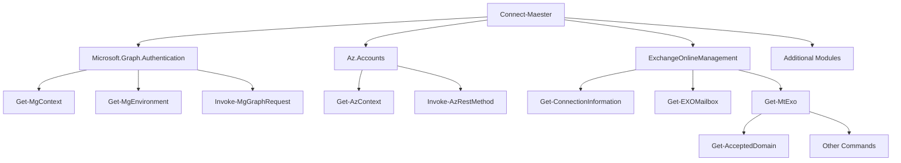

# Connect-Maester Advanced

import CreateEntraApp from '../sections/create-entra-app.md';

## Overview

There are two main methods of authenticating sessions for use with Maester:

- Within the Maester module
- Within the respective modules for the tests

### Module Integrations

The Maester module integrates with the following modules:

- Microsoft.Graph.Authentication
- Az.Accounts
- ExchangeOnlineManagement
- MicrosoftTeams

### Within the Maester module

:::tip
Recommended for interactive use
:::

The Maester module includes [`Connect-Maester`](/docs/commands/Connect-Maester) to provide coverage for common scenarios. The parameter set options afford a user of the module the ability to test with common interactive methods. The Microsoft Graph API is the default authentication service, and more specifically the Microsoft Graph PowerShell SDK. Coverage for tests shipping with Maester have at least one option available in general.

> The objective of the Maester module is not to replace or consolidate the authentication options across the many possible testing sources.

### Within the respective modules for the tests

**Recommended for automation use**

The Maester module provides a framework for creating, executing, and reporting on configuration state using tests. Each test can rely on one or more sources to perform validation. Each source a test validates may be available without authentication (e.g., Domain Name System) or may require authentication to a specific environment (e.g., Microsoft Graph API).

The recommendation for authenticating to modules necessary to support tests for the most extensibility is to authenticate within those source modules and running `Invoke-Maester` with the `-SkipGraphConnect` property.

As an example, connecting to the Microsoft Graph PowerShell SDK module as a managed identity and then running Maester.

> Running `Connect-Maester` is not required to use `Invoke-Maester`.

```powershell
Connect-MgGraph -Identity -NoWelcome
Invoke-Maester -SkipGraphConnect -NonInteractive
```

The following diagram provides a general overview of command dependency relationships. You can extend Maester with your own tests that leverage other modules as may be beneficial. There is no dependency for your own tests to rely on the `Connect-Maester` capabilities.


```mermaid
graph TD;
  Connect-Maester-->Microsoft.Graph.Authentication;
  Connect-Maester-->Az.Accounts;
  Connect-Maester-->ExchangeOnlineManagement;
  Connect-Maester-->a[Additional Modules];
  Microsoft.Graph.Authentication-->Get-MgContext;
  Microsoft.Graph.Authentication-->Get-MgEnvironment;
  Microsoft.Graph.Authentication-->Invoke-MgGraphRequest;
  Az.Accounts-->Get-AzContext;
  Az.Accounts-->Invoke-AzRestMethod;
  ExchangeOnlineManagement-->Get-ConnectionInformation;
  ExchangeOnlineManagement-->Get-EXOMailbox;
  ExchangeOnlineManagement-->Get-MtExo;
  Get-MtExo-->Get-AcceptedDomain;
  Get-MtExo-->o[Other Commands];
```

You can [write tests](/docs/writing-tests) that expand Maester to validate the configuration state of infrastructure in the cloud, on-premises, and entirely unrelated to Microsoft products.

For use with the Maester tests the following provides an overview of creating the necessary service principal.

<CreateEntraApp/>

## Authenticating Across Tenants

You may have a need to use Maester with multiple tenants. The Maester tests enable you to accomplish this, but it is best to authenticate within the respective modules for the tests you wish to run.

:::note Resource URLs vary by Azure cloud environment
The resource URLs used with `Get-AzAccessToken` differ depending on your Azure cloud. The examples below use Azure Global (Commercial). Replace them with the appropriate URLs for your environment:

| Service                      | Global                                         | US Gov (GCC High / DoD)                         | China (21Vianet)                                      |
| ---------------------------- | ---------------------------------------------- | ----------------------------------------------- | ----------------------------------------------------- |
| Microsoft Graph              | `https://graph.microsoft.com`                  | `https://graph.microsoft.us`                    | `https://microsoftgraph.chinacloudapi.cn`             |
| Exchange Online              | `https://outlook.office365.com`                | `https://outlook.office365.us`                  | `https://partner.outlook.cn`                          |
| Security & Compliance (IPPS) | `https://ps.compliance.protection.outlook.com` | `https://ps.compliance.protection.office365.us` | `https://ps.compliance.protection.partner.outlook.cn` |

:::

### Microsoft Graph PowerShell SDK Module

The Microsoft Graph PowerShell SDK Module provides many [options for authenticating](https://learn.microsoft.com/en-us/powershell/microsoftgraph/authentication-commands).

#### OAuth token-based authentication (recommended for automation)

If you already have an authenticated Azure context, you can use `Get-AzAccessToken` to obtain an OAuth token and pass it directly to `Connect-MgGraph`.

```powershell
$graphToken = Get-AzAccessToken -ResourceUrl 'https://graph.microsoft.com' -AsSecureString
Connect-MgGraph -AccessToken $graphToken.Token -NoWelcome
```

#### Certificate-based authentication

Below is an example of using a X.509 Certificate private key file, `$cert`, to authenticate to `$tenantId` as the `$applicationId` service principal.

```powershell
#$applicationId = "xxxxxxxx-xxxx-Mxxx-Nxxx-xxxxxxxxxxxx"
#$tenantId = "xxxxxxxx-xxxx-Mxxx-Nxxx-xxxxxxxxxxxx"
#$b64 = Get-Content .\path\to\cert.pfx -Raw
#$b64 = Get-AzKeyVaultSecret -VaultName $keyVaultName -Name $applicationDisplayName -AsPlainText
#$bytes = [Convert]::FromBase64String($b64)
#$cert = [System.Security.Cryptography.X509Certificates.X509Certificate2]::new($bytes)

Connect-MgGraph -AppId $applicationId -Certificate $cert -TenantId $tenantId -NoWelcome
```

### Microsoft Azure Accounts PowerShell Module

The Microsoft Azure Accounts PowerShell Module provides many [options for authenticating](https://learn.microsoft.com/en-us/powershell/azure/authenticate-noninteractive). Below is an example of using a X.509 Certificate private key file to authenticate to `$tenantId` as the `$applicationId` service principal.

```powershell
#$applicationId = "xxxxxxxx-xxxx-Mxxx-Nxxx-xxxxxxxxxxxx"
#$tenantId = "xxxxxxxx-xxxx-Mxxx-Nxxx-xxxxxxxxxxxx"

Connect-AzAccount -ServicePrincipal -ApplicationId $applicationId -TenantId $tenantId -CertificatePath /cert.pfx
```

### Microsoft Exchange Online and Security & Compliance PowerShell Modules

The Microsoft Exchange Online and Security & Compliance PowerShell Modules provide many [options for authenticating](https://learn.microsoft.com/en-us/powershell/exchange/app-only-auth-powershell-v2).

#### OAuth token-based authentication (recommended for automation)

If you already have an authenticated Azure context (e.g., managed identity, workload identity federation, or `Connect-AzAccount`), you can use `Get-AzAccessToken` to obtain OAuth tokens and pass them directly. This eliminates the need for certificate management.

```powershell
#$clientId = "xxxxxxxx-xxxx-Mxxx-Nxxx-xxxxxxxxxxxx"
#$tenantId = "xxxxxxxx-xxxx-Mxxx-Nxxx-xxxxxxxxxxxx"
#$moera = "contoso.onmicrosoft.com"

# Exchange Online
$outlookToken = ConvertFrom-SecureString -SecureString (Get-AzAccessToken -ResourceUrl 'https://outlook.office365.com' -AsSecureString).Token -AsPlainText -Force
Connect-ExchangeOnline -AccessToken $outlookToken -AppId $clientId -Organization $tenantId -ShowBanner:$false

# Security & Compliance (IPPS)
$isspToken = ConvertFrom-SecureString -SecureString (Get-AzAccessToken -ResourceUrl 'https://ps.compliance.protection.outlook.com' -AsSecureString).Token -AsPlainText -Force
Connect-IPPSSession -AccessToken $isspToken -Organization $moera
```

> `Connect-ExchangeOnline` accepts the tenant ID as the `-Organization` value, while `Connect-IPPSSession` requires the tenant's Microsoft Online Email Routing Address (MOERA), e.g., `contoso.onmicrosoft.com`.

#### Certificate-based authentication

Below is an example of using a X.509 Certificate private key file, `$cert`, to authenticate to `$tenantId` as the `$applicationId` service principal.

> These modules don't reference the tenant ID GUID for authentication, they instead use the tenant's Microsoft Online Email Routing Address (MOERA).

```powershell
#$applicationId = "xxxxxxxx-xxxx-Mxxx-Nxxx-xxxxxxxxxxxx"
#$b64 = Get-Content .\path\to\cert.pfx -Raw
#$b64 = Get-AzKeyVaultSecret -VaultName $keyVaultName -Name $applicationDisplayName -AsPlainText
#$bytes = [Convert]::FromBase64String($b64)
#$cert = [System.Security.Cryptography.X509Certificates.X509Certificate2]::new($bytes)
#$domains = Invoke-MgGraphRequest -Uri https://graph.microsoft.com/v1.0/domains
#$moera = ($domains.value|?{$_.isInitial}).id

Connect-ExchangeOnline -Certificate $cert -AppID $applicationId -Organization $moera -ShowBanner:$false
Connect-IPPSSession -Certificate $cert -AppID $applicationId -Organization $moera -ShowBanner:$false
```

### Microsoft Teams PowerShell Module

The Microsoft Teams PowerShell Module supports both interactive and non-interactive [authentication methods](https://learn.microsoft.com/powershell/module/teams/connect-microsoftteams?view=teams-ps).

#### OAuth token-based authentication (recommended for automation)

`Connect-MicrosoftTeams` accepts two access tokens via the `-AccessTokens` parameter: a Microsoft Graph token and a Teams-specific token. This approach works well when you already have an authenticated Azure context.

```powershell
$graphToken = Get-AzAccessToken -ResourceUrl 'https://graph.microsoft.com' -AsSecureString
$teamsToken = Get-AzAccessToken -ResourceUrl '48ac35b8-9aa8-4d74-927d-1f4a14a0b239' -AsSecureString

$tokens = @(
    (ConvertFrom-SecureString -SecureString $graphToken.Token -AsPlainText -Force),
    (ConvertFrom-SecureString -SecureString $teamsToken.Token -AsPlainText -Force)
)

Connect-MicrosoftTeams -AccessTokens $tokens
```

> The resource URL `48ac35b8-9aa8-4d74-927d-1f4a14a0b239` is the application ID for the Microsoft Teams PowerShell module.

#### Interactive and certificate-based authentication

For interactive sessions, you can use the standard login prompt. For non-interactive use with certificates, service principal authentication is supported.

```powershell
# Interactive
Connect-MicrosoftTeams

# Non-Interactive (Service Principal)
$cert = New-Object System.Security.Cryptography.X509Certificates.X509Certificate2("C:\exampleCert.pfx",$password)
Connect-MicrosoftTeams -Certificate $cert -ApplicationId $applicationId -TenantId $tenantId
```

### Copilot Studio (via Dataverse)

The Copilot Studio security tests (MT.1113–MT.1122) use the Dataverse OData API via `Az.Accounts`. Authenticate with `Connect-AzAccount` and then connect Maester for Copilot Studio access.

```powershell
# Authenticate to Az (SPN example)
Connect-AzAccount -ServicePrincipal -ApplicationId $applicationId -TenantId $tenantId -CertificatePath /cert.pfx

# Connect Graph separately for SPN
Connect-MgGraph -AppId $applicationId -Certificate $cert -TenantId $tenantId -NoWelcome

# Connect Maester for Copilot Studio only (Graph already connected)
Connect-Maester -Service Dataverse
```

> The service principal must be registered as an Application User in Power Platform with a security role that grants read access to the `bot`, `botcomponent`, `systemuser`, and `connectionreference` tables.

### Azure DevOps (via ADOPS)

The Azure DevOps security tests (AZDO.*) use the community [`ADOPS`](https://www.powershellgallery.com/packages/ADOPS) PowerShell module. This module is not bundled with Maester; install it separately and connect to your organization before running `Invoke-Maester`. If `ADOPS` is not installed or there is no active connection, the Azure DevOps tests are skipped.

#### OAuth token-based authentication (recommended for automation)

If you already have an authenticated Azure context (e.g., managed identity, workload identity federation, or `Connect-AzAccount`), you can use `Get-AzAccessToken` to obtain an OAuth token and pass it directly to `Connect-ADOPS`. This avoids the need to manage Personal Access Tokens.

```powershell
#$tenantId = "xxxxxxxx-xxxx-Mxxx-Nxxx-xxxxxxxxxxxx"
#$devOpsOrganization = "<your-azure-devops-organization>"

$DevOpsToken = ConvertFrom-SecureString `
  -SecureString (Get-AzAccessToken -AsSecureString -TenantId $tenantId).Token `
  -AsPlainText
Connect-ADOPS -Organization $devOpsOrganization -OAuthToken $DevOpsToken
```

#### Interactive authentication

For interactive sessions (e.g., local runs), use the standard sign-in flow:

```powershell
Install-Module ADOPS -Scope CurrentUser
Connect-ADOPS -Organization <your-organization>
```

> Some Azure DevOps tests require organization-level permissions such as *Project Collection Administrator* (e.g., AZDO.1030) or tenant-level permissions such as *Azure DevOps Administrator* (e.g., AZDO.1032–1036). See [Manage policies as Administrator](https://learn.microsoft.com/en-us/azure/devops/organizations/accounts/manage-pats-with-policies-for-administrators?view=azure-devops#prerequisites) and the [installation guide](../installation.md#installing-azure-devops-powershell-module).
