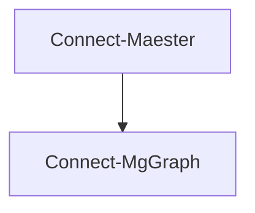

# Connect-Maester

## Overview

`Connect-Maester` is a helper command that simplifies the process of authenticating to the services required to run Maester tests including Microsoft Graph PowerShell, Azure PowerShell and Exchange Online PowerShell.

While `Connect-Maester` will handle the most common interactive authentication scenarios, it does not replicate all of the authentication options available in the respective modules.

:::tip
The `Connect-Maester` command is completely optional if your current PowerShell session is already connected to Microsoft Graph using Connect-MgGraph.
:::

Examining the code for `Connect-Maester` will reveal that it simply calls `Connect-MgGraph`.



What this means is that you can use `Connect-MgGraph` directly if you prefer to have more control over the authentication process. See the [Connect-MgGraph: Microsoft Graph authentication](https://learn.microsoft.com/en-us/powershell/microsoftgraph/authentication-commands) documentation for more information on all the options available including the use of certificates, secrets, managed identities, different clouds and more.

## Using Connect-Maester

### Connect to Microsoft Graph

To connect to Microsoft Graph, use the following command:

```powershell
Connect-Maester
```

Running `Connect-Maester` is the same as running the following:

```powershell
Connect-MgGraph -Scopes (Get-MtGraphScope)
```

#### Send Mail and Teams message

Connects to Microsoft Graph with the Mail.Send scope in addition to the default Maester scopes. This allows you to use the required permission to send email when using the `Send-MtMail` command or when using `Invoke-Maester -MailRecipient john@contoso.com`

```powershell
Connect-Maester -SendMail
```

This is the same as running

```powershell
Connect-MgGraph -Scopes (Get-MtGraphScope -SendMail)
```

The same applies to the `-SendTeamsMessage` in `Connect-Maester`.

#### Privileged scope

Maester is designed to require read-only access to a tenant to run tests. Unfortunately, the Graph API command to query global admin roles in Microsoft Entra Privileged Identity Management requires the **RoleEligibilitySchedule.ReadWrite.Directory** command. For these tests to run accurately you will need to explicitly opt into using this additional privilege by connecting with

```powershell
Connect-Maester -Privileged
```

For technical details on this requirement see

* [Graph API - List roleEligibilityScheduleRequests](https://learn.microsoft.com/en-us/graph/api/rbacapplication-list-roleeligibilityschedulerequests?view=graph-rest-1.0&tabs=http#permissions)
* [Maester Issue #195](https://github.com/maester365/maester/issues/195#issuecomment-2170879665)

#### Device code

The `-DeviceCode` switch allows you to sign in using the device code flow. This will open a browser window to prompt for authentication and is useful on Windows when you want to avoid single signing on as the current user.

```powershell
Connect-Maester -UseDeviceCode
```

### Connect to Azure, Exchange Online and Teams

`Connect-Maester` also provides options to connect to Azure, Exchange Online adn Teams for running tests that use the Azure PowerShell, Exchange Online PowerShell or Teams PowerShell modules.

The `-All` switch can be used to connect to all the services used by the Maester tests. This includes Microsoft Graph, Azure, Exchange Online, Security Compliance and Microsoft Teams.

```powershell
Connect-Maester -Service All
```

If you need to connect to just a subset of the services you can specifiy them using the `-Service` parameter.

```powershell
Connect-Maester -Service Azure,Graph,Teams
```

### Connect to US Government, US DoD, China and Germany and other clouds

`Connect-Maester` also provides options to connect to the US Government, China and Germany clouds for Microsoft Graph, Azure and Exchange Online.


#### US Government

```powershell
Connect-Maester -Environment USGov -AzureEnvironment AzureUSGovernment -ExchangeEnvironmentName O365USGovGCCHigh
```

#### US Department of Defense (DoD)

```powershell
Connect-Maester -Environment USGovDoD -AzureEnvironment AzureUSGovernment -ExchangeEnvironmentName O365USGovDoD
```

#### China

```powershell
Connect-Maester -Environment China -AzureEnvironment AzureChinaCloud -ExchangeEnvironmentName O365China
```

#### Germany

```powershell
Connect-Maester -Environment Germany
```
