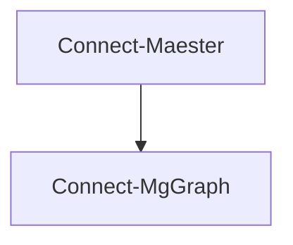

# Connect-Maester

## Overview

`Connect-Maester` is a helper command that simplifies the process of authenticating to the services required to run Maester tests including Microsoft Graph PowerShell, Azure PowerShell and Exchange Online PowerShell.

While `Connect-Maester` will handle the most common interactive authentication scenarios, it does not replicate all of the authentication options available in the respective modules.

:::tip
The `Connect-Maester` command is completely optional if your current PowerShell session is already connected to Microsoft Graph using Connect-MgGraph.
:::

Examining the code for `Connect-Maester` will reveal that it simply calls `Connect-MgGraph`.


```mermaid
graph TD;
    Connect-Maester-->Connect-MgGraph;
```

What this means is that you can use `Connect-MgGraph` directly if you prefer to have more control over the authentication process. See the [Connect-MgGraph: Microsoft Graph authentication](https://learn.microsoft.com/en-us/powershell/microsoftgraph/authentication-commands) documentation for more information on all the options available including the use of certificates, secrets, managed identities, different clouds and more.

## Using Connect-Maester

### Connect to Microsoft Graph

To connect to Microsoft Graph, use the following command:

```powershell
Connect-Maester
```

Running `Connect-Maester` is the same as running the following:

```powershell
Connect-MgGraph -Scopes (Get-MtGraphScope)
```

#### Approval required when connecting

Global Reader and other non-admin accounts can't consent to the Microsoft Graph permissions that Maester requests. When they run `Connect-Maester`, they see an **Approval required** prompt for **Microsoft Graph Command Line Tools**, and the connection then fails with `User canceled authentication`.

Approving this request from **Admin consent requests** in the Entra admin center can fail with `AADSTS70011: ... openid scope is required`. Instead, ask a Global Administrator or Privileged Role Administrator to grant consent in one of these ways.

**Option 1: Grant consent for the organization (recommended)**

The admin runs the following command, signs in, and selects **Consent on behalf of your organization** before selecting **Accept**.

```powershell
Connect-MgGraph -Scopes (Get-MtGraphScope)
```

Add the same switches you use with `Connect-Maester`, such as `-SendMail` or `-Privileged`, to `Get-MtGraphScope`. If you connect with `-TenantId` or `-Environment`, add those to `Connect-MgGraph` too, for example:

```powershell
Connect-MgGraph -Scopes (Get-MtGraphScope -SendMail) -TenantId '<tenant-id>' -Environment USGov
```

Afterwards, run `Connect-Maester` again with your own account. If the connection fails after an approval prompt, `Connect-Maester` prints these commands with your switches already filled in.

**Option 2: Use a custom app registration**

Create an app registration with the Maester delegated permissions and grant admin consent. Then connect with its client ID. See [Connect using a custom application](#connect-using-a-custom-application).

```powershell
Connect-Maester -GraphClientId '<application-client-id>'
```

Keep any other parameters you normally use, such as `-TenantId`, `-Environment`, `-SendMail` or `-Privileged`.

#### Send Mail and Teams message

Connects to Microsoft Graph with the Mail.Send scope in addition to the default Maester scopes. This allows you to use the required permission to send email when using the `Send-MtMail` command or when using `Invoke-Maester -MailRecipient john@contoso.com`

```powershell
Connect-Maester -SendMail
```

This is the same as running

```powershell
Connect-MgGraph -Scopes (Get-MtGraphScope -SendMail)
```

The same applies to the `-SendTeamsMessage` in `Connect-Maester`.

#### Privileged scope

Maester is designed to require read-only access to a tenant to run tests.

However, certain tests like [Test-MtExoMoeraMailActivity](../commands/Test-MtExoMoeraMailActivity.mdx) require privileged permission scopes to call certain APIs. If the permission is not granted, the specific test will be skipped.

Connecting with privileged scopes is optional. To connect with privileged scopes, use the `-Privileged` switch:

```powershell
Connect-Maester -Privileged
```

#### Device code

The `-DeviceCode` switch allows you to sign in using the device code flow. This will open a browser window to prompt for authentication and is useful on Windows when you want to avoid single signing on as the current user.

```powershell
Connect-Maester -UseDeviceCode
```

### Connect to SharePoint Online (optional)

Maester includes SharePoint Online security tests that use the [PnP PowerShell](https://pnp.github.io/powershell/) module.

Install the PnP PowerShell module if you haven't already:

```powershell
Install-Module PnP.PowerShell -Scope CurrentUser
```

A dedicated Entra ID app registration configured for PnP interactive login is required. The easiest way to create one is to follow the official [PnP app registration guide](https://pnp.github.io/powershell/articles/registerapplication.html) and run `Register-PnPEntraIDAppForInteractiveLogin`, which outputs the **Client ID** you will supply to `-SharePointClientId`. For the Maester-specific SharePoint permission setup, see [Grant permissions to SharePoint Online](../sections/create-entra-app.md).


Connect to SharePoint Online together with Microsoft Graph (the admin URL is auto-discovered from your tenant's initial domain):

```powershell
Connect-Maester -Service Graph,SharePointOnline -SharePointClientId '<Client ID>'
```

If auto-discovery does not work (e.g. in government or custom-domain tenants), supply the admin URL explicitly:

```powershell
Connect-Maester -Service Graph,SharePointOnline -SharePointClientId '<Client ID>' -SharePointAdminUrl 'https://contoso-admin.sharepoint.com'
```

If the PnP PowerShell module is not installed or there is no active connection, all SharePoint Online tests are skipped automatically.

### Connect to Azure, Exchange Online, Copilot Studio and Teams

`Connect-Maester` also provides options to connect to Azure, Copilot Studio (via the Dataverse API), Exchange Online and Teams for running tests that use the Azure PowerShell, Dataverse OData API, Exchange Online PowerShell or Teams PowerShell modules.

The `-All` switch can be used to connect to all the services used by the Maester tests. This includes Microsoft Graph, Azure, Copilot Studio (Dataverse), Exchange Online, Security Compliance, Microsoft Teams, and SharePoint Online.

If `-SharePointClientId` is not provided, the SharePoint Online connection is skipped.

```powershell
Connect-Maester -Service All
```

When it finishes, `Connect-Maester` shows the status of each service it tried to connect to:

```text
Service                Status     Details
-------                ------     -------
Microsoft Graph        Connected  admin@contoso.com
Azure                  Connected  admin@contoso.com (existing session)
Dataverse              Skipped    No environment found, set DataverseEnvironmentUrl in maester-config.json
Exchange Online        Connected  admin@contoso.com
Security & Compliance  Connected  admin@contoso.com (UPN from Exchange Online)
Microsoft Teams        Connected  admin@contoso.com
SharePoint Online      Skipped    -SharePointClientId was not provided

For details, run Connect-Maester again with -Verbose.
```

A service is shown as `Skipped` when it can't be used with the options you passed, `Not installed` when its PowerShell module is missing (the details show the `Install-Module` command), and `Failed` when sign-in failed. Run `Connect-Maester` with `-Verbose` to see the full messages.

If you need to connect to just a subset of the services you can specifiy them using the `-Service` parameter.

```powershell
Connect-Maester -Service Azure,Graph,Teams
```

### Connect to Copilot Studio (via Dataverse)

To run the Copilot Studio Security Tests (MT.1113–MT.1122), connect with the `Dataverse` service:

```powershell
Connect-Maester -Service Graph,Dataverse
```

This uses `Az.Accounts` to authenticate and obtain a Dataverse access token for the Copilot Studio environment configured in `maester-config.json`.

### Connect to GitHub (optional)

Maester includes optional GitHub security tests that require an active GitHub organization connection. GitHub is not included in `Connect-Maester -Service All` because it is not a Microsoft 365 service. Add `GitHub` explicitly when you want to run GitHub tests.

For interactive sessions, the preferred option is the [Maester GitHub App](https://github.com/apps/maester-cli). It uses GitHub OAuth device flow, so you do not need to create, paste, or store a personal access token for day-to-day interactive use.

```powershell
Connect-Maester -Service Graph,GitHub -GitHubOrganization '<github-organization>'
```

You can also connect only to GitHub:

```powershell
Connect-Maester -Service GitHub -GitHubOrganization '<github-organization>'
```

The first time you connect, Maester opens the GitHub device authorization page and shows a code to enter. If the Maester GitHub App is not installed or approved for the organization, Maester explains why the app is needed and asks before opening the [install page](https://github.com/apps/maester-cli/installations/new). A GitHub organization owner may need to install or approve the app for the organization.

You can avoid typing the organization every time by setting `GitHubOrganization` in `maester-config.json`:

```json
{
  "GlobalSettings": {
    "GitHubOrganization": "contoso"
  }
}
```

Then connect with:

```powershell
Connect-Maester -Service Graph,GitHub
```

For automation, use a GitHub token instead of the interactive GitHub App device flow. `Connect-Maester` checks `MAESTER_GITHUB_TOKEN` first and then `GH_TOKEN`.

```powershell
$env:MAESTER_GITHUB_TOKEN = '<token>'
Connect-Maester -Service Graph,GitHub -GitHubOrganization '<github-organization>'
```

Use a token that can read organization membership and organization administration settings. For example, use a classic PAT with `admin:org`, or a fine-grained token with **Organization Members: read** and **Organization Administration: read**.

Use `Disconnect-Maester` or `Disconnect-MtGitHub` to clear the in-memory GitHub session when you are finished.

### Connect to Azure DevOps (optional)

Maester includes an *optional* set of Azure DevOps security tests (AZDO.*).
These tests require the community [`ADOPS`](https://www.powershellgallery.com/packages/ADOPS) PowerShell module and an active connection to your Azure DevOps organization.

Connecting to Azure DevOps is **not** part of `Connect-Maester` and must be done separately:

```powershell
Install-Module ADOPS -Scope CurrentUser
Connect-ADOPS -Organization <your-organization>
```

If the `ADOPS` module is not installed or there is no active connection, the Azure DevOps tests are skipped automatically.

See the [installation guide](../installation.md#installing-azure-devops-powershell-module) for prerequisites and permissions, and the [Azure DevOps tests for Maester](/blog/azuredevops-tests-for-maester) blog post for the full list of available tests.

### Connect to US Government, US DoD, China and Germany and other clouds

`Connect-Maester` also provides options to connect to the US Government, China and Germany clouds for Microsoft Graph, Azure and Exchange Online.

#### US Government

```powershell
Connect-Maester -Environment USGov -AzureEnvironment AzureUSGovernment -ExchangeEnvironmentName O365USGovGCCHigh
```

#### US Department of Defense (DoD)

```powershell
Connect-Maester -Environment USGovDoD -AzureEnvironment AzureUSGovernment -ExchangeEnvironmentName O365USGovDoD
```

#### China

```powershell
Connect-Maester -Environment China -AzureEnvironment AzureChinaCloud -ExchangeEnvironmentName O365China
```

#### Germany

```powershell
Connect-Maester -Environment Germany
```

### Connect using a custom application

You can use `Connect-Maester` to connect to Microsoft Graph using a custom application by specifying the `-GraphClientId` parameter. This is useful if you wish to use a custom application for Maester instead of using the default Graph PowerShell application.

```powershell
Connect-Maester -GraphClientId 'f45ec3ad-32f0-4c06-8b69-47682afe0216'
```

To learn more about how to create a custom application for Microsoft Graph PowerShell see [Use delegated access with a custom application for Microsoft Graph PowerShell](https://learn.microsoft.com/en-us/powershell/microsoftgraph/authentication-commands?view=graph-powershell-1.0#use-delegated-access-with-a-custom-application-for-microsoft-graph-powershell).
