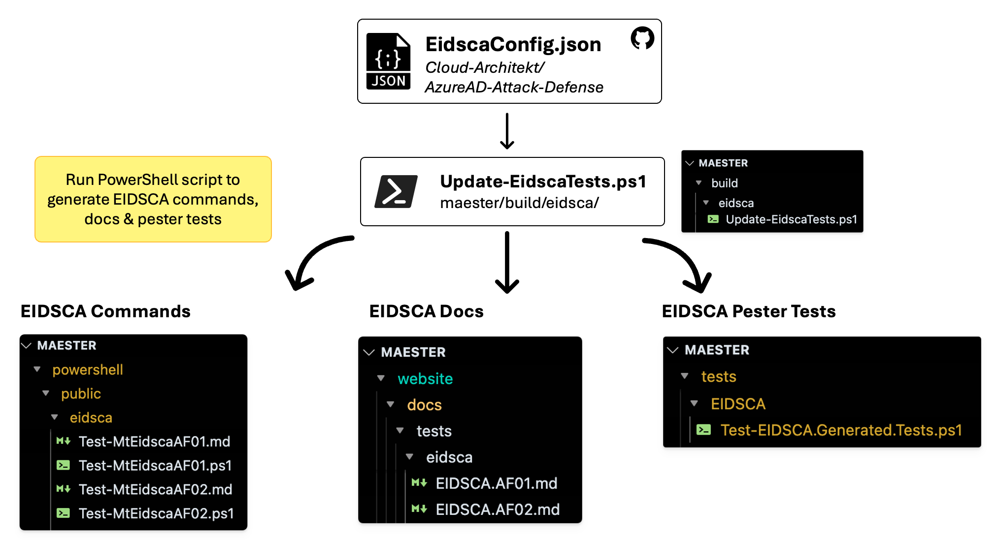

import TOCInline from '@theme/TOCInline';

# Contributing

<TOCInline toc={toc} />

## Introduction

This guide is for anyone who wants to contribute to the Maester project. Whether you want to contribute to the code, documentation, or just have an idea for a new feature, we welcome your input.

Follow the guide below to set up Maester for development on your local machine, make changes, and submit a pull request.

## Repository layout

Maester has a fixed folder layout so that anyone, person or AI agent, can tell where a file belongs from what it
does. The rules below are checked by `powershell/tests/general/RepositoryLayout.Tests.ps1`, which runs with the
other unit tests, so a pull request that breaks them fails CI. [AGENTS.md](https://github.com/maester365/maester/blob/main/AGENTS.md)
carries the same rules for AI coding and review agents.

### The rules

1. **Folder names are lowercase kebab-case**: `tests/maester/global-secure-access`, `powershell/internal/services/azure-devops`.
   This applies to every folder under `tests/`, `powershell/` and `build/`. Files keep their own conventions:
   `Test.<ID>.ps1` and `Test.<ID>.md` for checks, `Verb-Noun.ps1` for functions.
2. **One name per service.** A service folder has the same name wherever it appears:
   `ad`, `azure`, `azure-devops`, `copilot`, `copilot-studio`, `defender`, `entra`, `exchange`, `foundry`, `github`,
   `global-secure-access`, `graph`, `intune`, `purview`, `sharepoint`, `teams`, `xspm`. Adding a service means adding
   it to this list and to the layout test.
3. **A file goes in the group that matches its job**, not in the suite that first needed it (see the trees below).
4. **Generated code lives in `generated/` folders**, so it is obvious from the path that it must not be edited by hand.

```text
tests/                              The security checks: Test.<ID>.ps1 + Test.<ID>.md, nothing else
  maester/<service>/                MT.xxxx checks, one folder per service (plus drift/)
  maester/xspm/                     Exposure management; has its own suite.json (the nearest one applies)
  cis/                              CIS benchmark checks
  cisa/<service>/                   CISA SCuBA checks
  ad/<area>/                        Active Directory checks
  eidsca/  orca/                    Generated by build/eidsca and build/orca
  custom/                           Reserved for users' own tests; nothing is committed here

powershell/
  public/                           Exported commands, grouped by what the user is doing
    run/                            Run, list, create and convert tests (Invoke-Maester, Get-MtTest, New-MtTest, ...)
    connect/                        Connect, check the session, clear caches (Connect-Maester, Test-MtConnection, ...)
    report/                         Reports and result files (Get-MtHtmlReport, Send-MtMail, Merge-MtMaesterResult, ...)
    app/                            The Maester Entra app (New-MtMaesterApp, ...)
    services/<service>/             Data helpers that custom tests call (Get-MtUser, Get-MtExo, Invoke-MtGraphRequest, ...)
  internal/                         Not exported
    engine/                         Discovery, selection, planning and execution of tests
    session/                        Module state, configuration, versions, progress and telemetry
    connect/                        Connection checks and consent help
    report/                         Result conversion, Markdown reports, affected objects
    app/                            Helpers for the Maester Entra app
    services/<service>/             Reusable data access for one service (the GitHub client, Graph caching, ...)
    checks/<suite>/<service>/       Helpers used by the checks of one suite
    generated/eidsca/  orca/        Generated; regenerate, never edit
    utility/                        Small helpers with no domain (query strings, object properties, prompts)
  assets/  lib/  tools/             Data files, the compiled engine, developer tools
  tests/                            Unit tests of the module itself
```

### Why this layout

- **Lowercase kebab-case avoids case bugs.** Windows and macOS ignore case in paths, Linux does not. Mixed case
  (`Maester/Entra` beside `cisa/entra`) leads to code that passes locally and fails in CI on Linux, and to
  case-only renames that Git on Windows and macOS handles badly. All-lowercase names also match the website URLs
  (`/docs/tests/cis/...`) and the rest of the module (`public`, `internal`, `assets`). Prowler, the closest open
  source project to Maester, uses the same convention.
- **Suites are found by `suite.json`, not by folder name**, so a folder name can follow the convention without
  changing a suite's ID, tags or documentation URLs. That is what lets `XSPM` live in `maester/xspm`.
- **Grouping by job, then by service, gives every file one obvious home.** Before 3.0, Exchange code could be in four
  places (a suite folder under `public/`, a suite folder under `internal/checks/`, a loose file, or a service
  folder). Well-run projects separate the layers the same way: ScubaGear splits connection, per-product data
  providers, evaluation and reporting; Prowler keeps each service's client beside that service's checks and shared
  code in `lib/`; PSFramework and dbatools split exported and internal functions, then group by feature.
- **`public/` is grouped by what the user is doing**, so the folder tells you which commands belong together in the
  [command reference](./commands/readme.md).
- **Folders name products, tags name themes.** A check goes in the folder of the product whose settings it reads,
  because that is what an author knows when adding a check and what an admin knows when looking for one. Themes
  that cut across products, such as AI, are tags: Copilot Studio agent checks live in `maester/copilot-studio/`,
  an Entra agent identity check lives in `maester/entra/`, and both carry the `AI` tag, so `Invoke-Maester -Tag AI`
  runs them together. A theme folder such as `ai/` would end up holding checks for Copilot, Copilot Studio,
  Foundry, Entra Agent ID and Purview, each with its own API, portal and permissions.
- **Data access is shared, check logic is not.** Code that reads a service (`services/`) is reused by many checks and
  by custom tests. Code that only one suite's checks need stays in `checks/<suite>/`.

### Making an internal helper public

Custom tests are loaded into their own private module, so they can call only the commands Maester exports. When
users need one of the internal helpers in their own tests, promote it instead of copying it:

1. Move the file from `powershell/internal/services/<service>/` to `powershell/public/services/<service>/` with
   `git mv`, so its history follows it.
2. Add the function to `FunctionsToExport` in `powershell/Maester.psd1`.
3. Give it complete comment-based help: synopsis, description, every parameter, at least one example and a
   `.LINK` to `https://maester.dev/docs/commands/<Name>`. The command reference page is generated from it.
4. Review the name and parameters before you merge. Once a command is exported it is public API: renaming it,
   removing a parameter or changing what it returns is a breaking change for users' tests.

`Manifest.Tests.ps1` fails if a file in `public/` is not exported or an internal function is, and `Help.Tests.ps1`
fails if an exported command's help is incomplete, so a half-finished promotion does not pass CI. Helpers that
belong to one suite's checks (`internal/checks/`) are not candidates: move the reusable part into
`services/<service>/` first.

## Maester PowerShell module dev guide

### Build and load Maester locally

After changing files under `./powershell` or `./tests`, run the following command
from the repository root:

```powershell
./build/Build-LocalMaester.ps1
```

This command:

- Builds the consolidated, publishable module in `./module`.
- Generates the companion test metadata used by reports.
- Validates the build output.
- Unloads any other Maester module and imports the local build into the current PowerShell session.

Run the packaged tests with `Invoke-Maester -Path ./module/maester-tests`. Run
`Build-LocalMaester.ps1` again whenever you change module or test source.

After changing files under `./report`, include `-BuildReport` to build the report,
copy its generated template into the PowerShell assets, and include it in the
local module:

```powershell
./build/Build-LocalMaester.ps1 -BuildReport
```

### Build and load with VS Code

Press F5 with the **PowerShell: Build and Load Local Maester** launch
configuration selected. VS Code runs `Build-LocalMaester.ps1` and leaves the
local build loaded in its interactive PowerShell session.

The consolidated module is the closest match to the artifact published in a
release. If you specifically need source-file breakpoints, use the source-only
workflow below; source breakpoints do not map to the generated
`./module/Maester.psm1` file.

### Source-only debugging

- Source files live in `./powershell` (module functions) and `./tests` (bundled test suites). Never edit files in `./module` — it is generated build output.
- For source-level breakpoints or quick iteration, load the PowerShell module directly from source. Repeat this whenever you change code in `./powershell`.
  - `Import-Module ./powershell/Maester.psd1 -Force`
- Run Maester
  - `Invoke-Maester`
- Before submitting a change, use `./build/Build-LocalMaester.ps1` to verify the consolidated module.

### Building the module

The publishable Maester module is produced by a build script that consolidates the source files into an optimized module for faster import:

- For normal development, run `./build/Build-LocalMaester.ps1` to build, validate, and import the publishable module in one step.
- To produce the artifact without validating or importing it, run `./build/Build-MaesterModule.ps1`.
- `./module` is a build artifact: it is ignored by git and never committed to source control. Built modules are attached to GitHub Releases and published to the PowerShell Gallery from CI.
- The `FunctionsToExport` list in the built `Maester.psd1` is auto-generated at build time from the public source files. Do not edit the built manifest manually.
- The bundled test files in `./module/maester-tests` are copied at build time from `./tests`. Do not edit build output manually.

### Code style

- Use the One True Brace Style (OTBS): the opening brace goes on the same line as the statement.
- Use Pascal Case for all variable and parameter names.
- Use 4-space indentation. No tabs.
- Save all `.ps1` and `.psm1` files as UTF-8 with BOM (`utf8BOM`).
- Use approved PowerShell verbs only. Run `Get-Verb` for the authoritative list.
- Avoid trailing whitespace. End every file with one blank line (a single trailing newline).
- Place comment-based help inside the function body (immediately after the opening brace), not above the `function` keyword.

### File organization

- One function per file, and the filename must match the function name exactly.
- Exported functions go in a group folder under `./powershell/public`, internal ones under `./powershell/internal`. See [Repository layout](#repository-layout) for which folder.
- Built-in security checks are native tests in `./tests/<suite>/[<service>/]Test.<ID>.ps1`, each with a `Test.<ID>.md` beside it. They are module source: the build defines their functions in the module.

### Pester Tests

- QA tests for the Maester module framework itself are at `./powershell/tests`. These are distinct from the bundled security test suites in `./tests`.
- When making changes to the module you can run the QA tests locally by running `./powershell/tests/pester.ps1`
- The **PSScriptAnalyzer**, **PSFramework** and **PSModuleDevelopment** modules are required to run the tests, install them with `Install-Module PSFramework, PSModuleDevelopment, PSScriptAnalyzer`
- The tests are run automatically on PRs and commits to the main branch and will fail if the tests do not pass

## Contributing new tests and updating existing tests

### Test folder convention

Every built-in check is a [native test](./writing-tests/index.mdx): `Test.<ID>.ps1` plus `Test.<ID>.md`, in the [tests](https://github.com/maester365/maester/tree/main/tests) folder of its suite:

- `/maester` - Maester tests (`MT.xxxx`), with a subfolder per service such as `/entra`, `/exchange`, `/teams`
- `/maester/xspm` - Exposure management tests (MT IDs, with their own suite)
- `/cisa` - CISA tests, with a subfolder per service
- `/cis` - CIS tests
- `/eidsca` - EIDSCA tests (generated, see below)
- `/orca` - ORCA tests (generated by `build/orca/Update-OrcaTests.ps1`)
- `/ad` - Active Directory tests
- `/custom` - Folder for users to add tests (do not add any tests to this folder).

Each suite folder has a `suite.json` with the suite's tags, default category and source. Folder names follow the
[repository layout](#repository-layout).

### Checklist for writing good tests

When contributing tests, please ensure the following:

#### Before writing the test

- [x] Check if your new idea is not already covered by an existing test (you can also jump on the [Maester Discord](https://discord.entra.news) to discuss). `Get-MtTest` lists every test.
- [x] Reserve a unique id for your test. See [#️⃣ Pick next Maester test sequence number](https://github.com/maester365/maester/issues/697) on how to reserve a unique id for your new test.

#### Writing the test

- [x] Scaffold the files in the right suite folder, for example `New-MtTest -Id MT.1234 -Title '...' -Service Graph -Category 'Maester/Entra' -Path ./tests/maester/entra`, then follow [Writing native tests](./writing-tests/index.mdx).
- [x] Built-in tests must set `Severity`, `Service` (or `None`) and `Author` (your GitHub handle) in the `[MaesterTest]` attribute, and describe every parameter.
- [x] Do not check connections or licences in the test and do not wrap it in a `try`/`catch` that only reports `-SkippedBecause Error`: declare `Service` and `CompatibleLicense` and let the engine handle it. The unit tests enforce this.
- [x] Tunable values (thresholds, objects to exclude) are parameters of the test function, not hard-coded.
- [x] The test's `.md` file explains the test in detail and provides all the context required for the user to resolve the issue, including deep links to the admin portal page to resolve the issue. This will be shown to the user when they view the test report. The file should include:
  - [x] Link to the admin portal blade where the setting can be configured
  - [x] A `#### Remediation action` section, and `<!--- Results --->` followed by `%TestResult%` at the end
  - [x] If there are multiple objects (e.g. list of CA policies, Users, etc) then use the `GraphObjects` and `GraphObjectType` parameters in [Add-MtTestResultDetail](https://github.com/maester365/maester/blob/main/powershell/public/Add-MtTestResultDetail.ps1). These include deep links to the admin portal. If the object type you wish is not available you can add it to [Get-GraphObjectMarkdown.ps1](https://github.com/maester365/maester/blob/main/powershell/internal/Get-GraphObjectMarkdown.ps1). Feel free to ask on Discord if you need help with this.
- [x] The test's page under `website/docs/tests/` is generated from the test files; do not write it by hand.
- [x] Check the test with `Get-MtTest -Path <file>` and run it with `Invoke-MtTest -Path <file>` against a tenant.

When in doubt always check the existing tests for the conventions used, feel free to discuss on [Discord](https://discord.entra.news) or [GitHub Issues](https://github.com/maester365/maester/issues).

#### Before creating the Pull Request

##### Test your code

- We run a bunch of pester tests on your code when a PR is raised and will block merge until the issues are addressed.
- Before you submit the PR, run the tests locally by running `/powershell/tests/pester.ps1`
- Fix any issues that are reported. If you need help see the `Common Pester test failures and how to fix` section below. Reach out on Discord if you need help.
- The **PSScriptAnalyzer**, **PSFramework** and **PSModuleDevelopment** modules are required to run the tests, install them with `Install-Module PSFramework, PSModuleDevelopment, PSScriptAnalyzer`
- If a test is not applicable (e.g. it says not to use plural but the product name is AzureDevOps then you can add a `SuppressMessageAttribute` tag (see Invoke-Maester.ps1 which has suppression tags at the beginning of the function).

### Updating EIDSCA tests and documentation

The EIDSCA tests and documentation are maintained in the [EIDSCA repository → EidscaConfig.json](https://github.com/Cloud-Architekt/AzureAD-Attack-Defense/blob/AADSCAv4/config/EidscaConfig.json) file.

The [/build/eidsca/Update-EidscaTests.ps1](https://github.com/maester365/maester/blob/main/build/eidsca/Update-EidscaTests.ps1) script is used to generate the EIDSCA commands in the Maester module along with the EIDSCA tests and documentation.

The script is currently run manually and is not automated as part of the build process as we need to verify the changes before they are committed.

The illustration below shows the workflow for integrating EIDSCA tests and documentation into Maester.



When generating the EIDSCA commands and tests, manual verification should be performed to ensure the EIDSCA tests are being run correctly and the results are accurate.

## Common Pester test failures and how to fix

### PSUseBOMForUnicodeEncodedFile

The quick fix for this is to run this script. Make sure you give the right path to the affected file.

```powershell
$affectedFilePath = '/path/to/maester/powershell/public/run/Invoke-Maester.ps1'
$content = Get-Content $affectedFilePath -Raw; $content | Out-File $affectedFilePath -Encoding UTF8BOM
```

## Contributing to Maester docs and blog posts

Simple edits can be made in the GitHub UI by selecting the `Edit this page` link at the bottom of each page or you can browse to the [docs](https://github.com/maester365/maester/tree/main/website/docs) folder on GitHub.

For more complex changes, you can fork the repository and submit a pull request.

The docs/commands folder is auto-generated based on the comments in the PowerShell cmdlets. If you want to update the documentation for a command, you will need to update the comment-based help in the .ps1 file for the command.

### Running documentation locally

The [Maester.dev](https://maester.dev) website is built using [Docusaurus](https://docusaurus.io/).

Follow this guide if you want to run the documentation locally and view changes in real-time.

#### Pre-requisites

[Node.js](https://nodejs.org/en/download/) version 24.0 or above (which can be checked by running node -v). When installing Node.js, you are recommended to check all checkboxes related to dependencies.

#### Installation

When running the documentation for the first time, you will need to install the dependencies. This can be done by running the following command in ./website folder.

```shell
npm install
```

#### Starting the site

While in the ./website folder, run the following command to start the site locally. This will start a local server and open the site in your default browser to [http://localhost:3000/](http://localhost:3000/)

```shell
npm start
```

#### Editing content

You will now be able to edit add and edit markdown files in the ./website/docs folder and see the changes in real-time in your browser.

- Read the [markdown documentation](https://docusaurus.io/docs/markdown-features) for more information on some of the custom markdown features available.
- You can search for icons at [Iconify](https://icon-sets.iconify.design/) and include them in the markdown. See the [Daily Automation](https://maester.dev/docs/automation/) page for examples.
- The `Command Reference` section is auto-generated. To update the documentation for this, the .ps1 file for the command needs to be updated with comment-based documentation.

### Site versioning

There are two versions of the Maester website:

- [Production](https://maester.dev) - This is the live version of the site that is updated whenever a new version of the Maester module is released.
- [Preview](https://preview.maester.dev) - This is the version of the site that is updated with every commit to the main branch. This allows you to see changes before they are published to production.

| Environment | URL | Branch | Update Trigger |
| --- | --- | --- | --- |
| Production | [https://maester.dev](https://maester.dev) | website-prod | New Maester module release |
| Preview | [https://preview.maester.dev](https://preview.maester.dev) | main | Every commit to the main branch |

When a new version of the Maester module is released, the documentation will be updated to reflect the changes in that version.

#### Urgent changes to blog posts and documentation

If a blog post or doc change is urgent and cannot wait till the next release, create a PR against the `website-prod` branch directly.

Once that is reviewed and merged, you will need to create another PR to bring the changes into the `main` branch.

This is because the `website-prod` branch is deleted and recreated with every Maester module release to ensure it is always in sync with the released version of the module.

This process ensures any interim changes to the production site are intentional.
