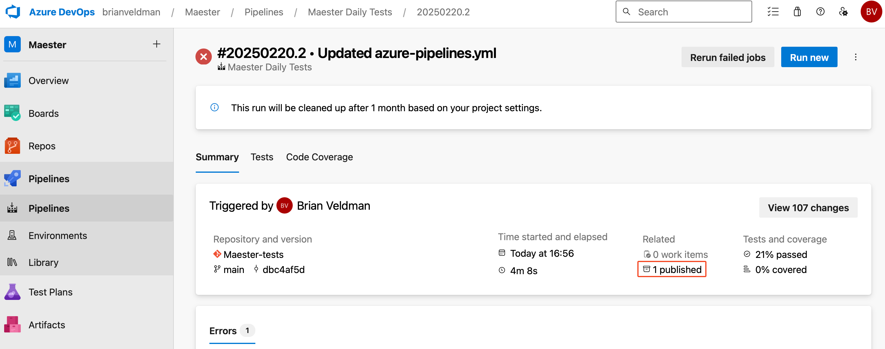
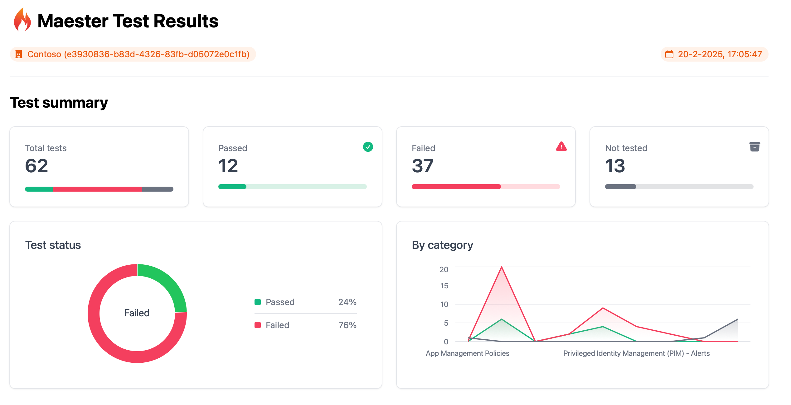
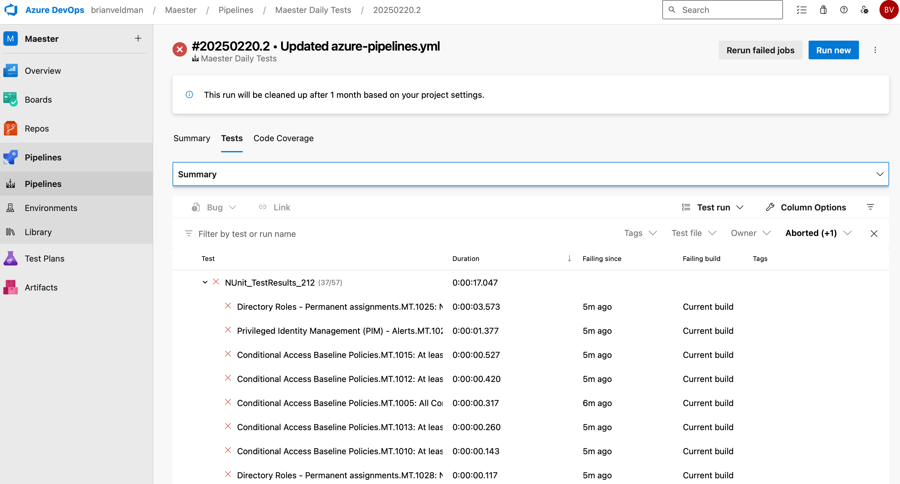

import Tabs from '@theme/Tabs';
import TabItem from '@theme/TabItem';
import GraphPermissions from '../sections/permissions.md';
import PrivilegedPermissions from '../sections/privilegedPermissions.md';
import CreateEntraApp from '../sections/create-entra-app.md';
import CreateEntraClientSecret from '../sections/create-entra-client-secret.md';

# <IIcon icon="vscode-icons:file-type-azurepipelines" height="48" /> Set up Maester in Azure DevOps

This guide will walk you through setting up Maester in Azure DevOps and automate the running of tests using Azure DevOps Pipelines.

## Why Azure DevOps & Terraform?

Azure DevOps is a great way to automate the daily running of Maester tests to monitor your tenant. You can use Azure DevOps to run Maester tests on a schedule, such as daily, and view the results in the Azure DevOps interface. 

Azure DevOps comes with a [free tier](https://azure.microsoft.com/pricing/details/devops/azure-devops-services/) that includes 1,800 minutes of Maester test runs per month (unlimited hours if you use a self-hosted agent).

Azure DevOps has native integration with Microsoft Entra including single sign on, user and group management as well as support for conditional access policies.

Terraform is an open-source Infrastructure as Code (IaC) tool used to configure and deploy infrastructure across platforms like AWS, GCP, and Azure. We've created a Terraform module to simplify and streamline the deployment of Maester to Azure DevOps.


### Pre-requisites

- If this is your first time using Azure DevOps, you will first need to create an organization.
  - [Azure DevOps - Create an organization](https://learn.microsoft.com/azure/devops/organizations/accounts/create-organization)
    :::tip
    To enable the free tier, to use a Microsoft-hosted agent, for Azure Pipelines you will need to submit this form https://aka.ms/azpipelines-parallelism-request (it can take a few days before you can use the pipeline.) In the interim you can use a [self-hosted agent](https://learn.microsoft.com/azure/devops/pipelines/agents/agents?view=azure-devops&tabs=yaml%2Cbrowser#self-hosted-agents) to get started.
    :::
- You must have the **Global Administrator** role in your Entra tenant. This is so the necessary permissions can be consented to the Managed Identity.
- You must have the permissions to create a temporary PAT (Personal Access Token) with Full Access in Azure DevOps to deploy the necessary Azure DevOps resources.
  - You can safely delete the PAT after deployment.
- You must also have Terraform & Azure CLI installed on your machine:
  - [Azure CLI installation](https://learn.microsoft.com/en-us/cli/azure/install-azure-cli)
  - [Terraform installation](https://developer.hashicorp.com/terraform/tutorials/aws-get-started/install-cli)

## Terraform Module Deployment
Now it's time to deploy the Maester Terraform module! 🔥
First, add the temporary Personal Access Token (PAT) to your environment variables. 

- `export AZDO_PERSONAL_ACCESS_TOKEN=<pat>`
- `export AZDO_ORG_SERVICE_URL=https://dev.azure.com/<devOpsOrganizationName>`

You can then easily use the Terraform module by creating a `main.tf` file with the following content. 
- Make sure to update the required variables based on your environment information.

```terraform
module "maester" {
  source  = "maester365/maester/azuredevops"
  version = "1.0.0"
  azure_tenant_id = "tenantId"
  azure_subscription_id = "subscriptionId"
  azure_subscription_name = "subscriptionName"
  azure_devops_org_name  = "devOpsOrganizationName"
}
```

Initialize the Configuration:
- `terraform init -upgrade`

Plan and Apply:
- `terraform plan -out main.tfplan`
- `terraform apply main.tfplan`

Grab a coffee and come back in a few minutes to check the resources. ☕️

## Viewing codebase

- Select **Repos** > **Files** and switch to **Maester-tests** repository

:::info Maester 3.0
The module creates the **Maester-tests** repository by importing the Maester 2.x test repository, and its pipeline installs the latest Maester module from the PowerShell Gallery. With Maester 3.0 the built-in tests ship inside the module and run from it: the copied test files in the repository are recognised and skipped, so the pipeline keeps working. You can delete the copied test folders and keep only your own `Custom` folder and `maester-config.json`. See [Upgrading from 2.x](../upgrading-from-2x.md).

The generated `azure-pipelines.yml` calls `New-PesterConfiguration`, which needs Pester. Microsoft-hosted agents include Pester; on other agents, or to drop the Pester dependency, replace the test result configuration in `azure-pipelines.yml` with a hashtable, which Maester 3.0 handles itself:

```powershell
# Configure test results (Maester writes the NUnit XML file, Pester is not required)
$PesterConfiguration = @{
  TestResult = @{
    Enabled      = $true
    OutputPath   = '$(System.DefaultWorkingDirectory)/test-results/test-results.xml'
    OutputFormat = 'NUnitXml'
  }
}

# Run Maester tests: the built-in tests run from the module, -Path adds any custom tests and maester-config.json in the repository
Invoke-Maester -Path '$(System.DefaultWorkingDirectory)' -PesterConfiguration $PesterConfiguration -OutputFolder '$(System.DefaultWorkingDirectory)/test-results'
```
:::

## Viewing test results

- Select **Pipelines** > **Runs** to view the status of the pipeline
- Select on a run to view the test results

### Summary view

The summary view shows the status of the pipeline run, the duration, and the number of tests that passed, failed, and were skipped.



### Maester report

The Maester report can be downloaded and viewed by selecting the **Published** artifact.



### Tests view

The **Tests** tab shows a detailed view of each test, including the test name, duration, and status.




## Keeping your Maester tests up to date

The Maester team will add new tests over time. The built-in tests ship inside the Maester PowerShell module, and the pipeline installs the latest module on every run, so new tests are picked up automatically. There is no need to redeploy the Terraform module or update the repository to get new tests.

## Contributors

- Original author: [Brian Veldman](https://www.linkedin.com/in/brian-veldman/) | Technology Enthusiast
- Co-author: [Merill Fernando](https://www.linkedin.com/in/merill/) | Microsoft Product Manager
