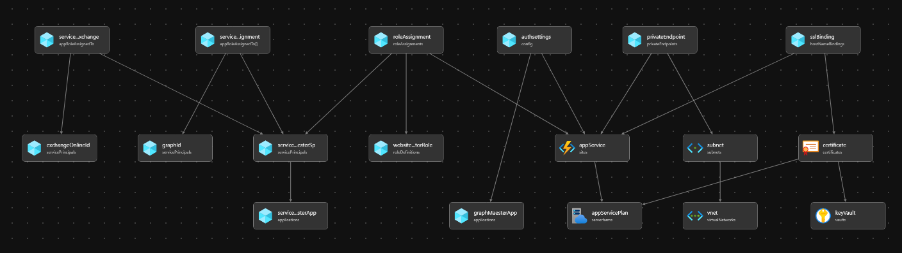
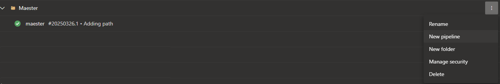
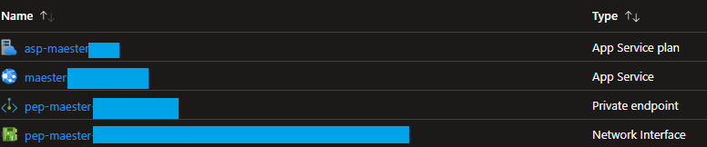

import GraphPermissions from '../sections/permissions.md';
import PrivilegedPermissions from '../sections/privilegedPermissions.md';

# <IIcon icon="devicon:azure" height="48" /> Setup Maester in Azure Web App using Azure DevOps

This guide will demonstrate how to get Maester running on an Azure Web App using Azure DevOps pipeline to produce the result and provide an Azure Bicep template for automated deployment.
-  This setup will allow you to perform security configuration checks on your Microsoft tenant by accessing the Azure Web App, which is protected with Entra ID Authentication through the Bicep deployment.🔥

It includes support for Microsoft Teams, Exchange Online and Microsoft Azure Information Protection service (Using certificate for authentication).

## Why Azure Web App & Azure DevOps & Azure Bicep?

Azure Web Apps provide the functionality to host your own websites. By running Maester in an interactive web app, you can easily check the security recommendations for your organization. Azure DevOps generates a new Maester report every 12th hour, which is then uploaded to the Azure Web App using federated credentials.

 Azure Bicep is a domain-specific language that uses declarative syntax to deploy Azure resources. It simplifies the process of defining, deploying, and managing Azure resources. Here’s why Azure Bicep stands out:
- **Simplified Syntax**: Bicep provides concise syntax, reliable type safety, and support for reusing code.easier to read.
- **Support for all resource types and API versions**: Bicep immediately supports all preview and GA versions for Azure services.
- **Modular and Reusable**: Bicep enables the creation of modular templates that can be reused across various projects, ensuring consistency and minimizing duplication.



### Pre-requisites

- If this is your first time using Microsoft Azure, you must set up an [Azure Subscription](https://learn.microsoft.com/azure/cost-management-billing/manage/create-subscription) so you can create resources and are billed appropriately.
- You must have the **Global Administrator** OR **Privileged Role Administrator** and **Application Administrator** role in your Entra tenant. This is so the necessary permissions can be consented to the Workload Identity that Azure DevOps will use.
- You must also have Azure Bicep & Azure CLI installed on your machine, this can be easily done with, using the following commands:

```PowerShell
winget install -e --id Microsoft.AzureCLI
winget install -e --id Microsoft.Bicep
```

#### Optional pre-requisites
- **Exchange Online** tests will require that you have **Exchange Administrator** role in your Entra tenant. This is so the necessary permissions can be manually assigned to the Workload Identity that Azure DevOps will use.
After creation of the workload identity for the Azure DevOps service connection you can run the following commands to assign the role **View-only Configuration**:
> [!IMPORTANT]
> This requires the [Exchange Online Management PowerShell module](https://learn.microsoft.com/en-us/powershell/exchange/exchange-online-powershell-v2?view=exchange-ps).

```PowerShell
# Creates the Service Principal object in Exchange Online
New-ServicePrincipal -AppId <Application ID> -ObjectId <Object ID> -DisplayName <ApppDisplayName>
# Assigns the 'View-Only Configuration' role to the workload identity
New-ManagementRoleAssignment -Role "View-Only Configuration" -App <ApppDisplayName>
```
- **Security & Compliance (IPPS)** tests require that you have **Global Administrator** OR **Privileged Role Administrator** and **Application Administrator** role in your Entra tenant. This is so the **Security Role** can be manually assigned to the Workload Identity that Azure DevOps will use.

- **Microsoft Teams** tests require that you have **Global Administrator** OR **Privileged Role Administrator** and **Application Administrator** role in your Entra tenant. This is so the **Teams Communications Support Engineer** can be manually assigned to the Workload Identity that Azure DevOps will use.

## Template Walkthrough
This section will guide you through the template required to deploy Maester on Azure. Depending on your needs, this can be done locally or through CI/CD pipelines.
- For instance, using your favorite IDE such as VS Code.
- Alternatively, through Azure DevOps.

To be able to declare Microsoft Graph resources in a Bicep file, you need to enable the Bicep preview feature and specify the Microsoft Graph Bicep type versions, by configuring ```bicepconfig.json```

```json
{
    "experimentalFeaturesEnabled": {
        "extensibility": true
    },
    // specify an alias for the version of the v1.0 dynamic types package you want to use
    "extensions": {
      "microsoftGraphV1_0": "br:mcr.microsoft.com/bicep/extensions/microsoftgraph/v1.0:0.1.8-preview"
    }
}
```

The ```main.bicepparam``` template defines our input parameters, such as the environment, location, custom domain name, networking options and app roles for the workload identity.
### Example with custom domain name and private networking
```bicep
using 'main.bicep'

param publicNetworkAccess = 'Disabled'
param environment = 'prod'
param certificateResource = {
  certificateReferenceName: 'maester-prod'
  customHostName: 'maester.domainName.domainSuffix'
  keyVaultName: 'kv-certificate-store'
  resourceGroupName: 'rg-mgmt-cert-store'
  subscriptionId: '6e5c9040-f1ad-4028-888d-4f98863e919a'
}

param subnetResource = {
  subnetName: 'snet-pe-001'
  vnetName: 'vnet-maester-001'
  resourceGroupName: 'rg-maester-infra'
}
```

### Example with public networking and without custom domain name
```bicep
using 'main.bicep'

param publicNetworkAccess = 'Enabled'
param environment = 'prod'
```

### Example with public networking and custom domain name
```bicep
using 'main.bicep'

param publicNetworkAccess = 'Enabled'
param environment = 'prod'
param certificateResource = {
  certificateReferenceName: 'maester-prod'
  customHostName: 'maester.domainName.domainSuffix'
  keyVaultName: 'kv-certificate-store'
  resourceGroupName: 'rg-mgmt-cert-store'
  subscriptionId: '6e5c9040-f1ad-4028-888d-4f98863e919a'
}
```

The ```main.bicep``` template holds all the resources in Azure and Graph to be provisioned.

```bicep
metadata name = 'Maester Automation as Code <3'
metadata owner = 'Maester'

extension microsoftGraphV1_0

@description('Web app name')
@minLength(2)
param webAppName string = 'app-maester-${uniqueString(subscription().id)}'

@description('Location for all resources')
param location string = resourceGroup().location

@description('The public network access of the web app')
@allowed([
  'Enabled'
  'Disabled'
])
param publicNetworkAccess string = 'Enabled'

param environment string = 'prod'

param certificateResource certificateResourceType?

param subnetResource subnetResourceType

param __maesterAppRoles__ array = [
  'Directory.Read.All'
  'DirectoryRecommendations.Read.All'
  'IdentityRiskEvent.Read.All'
  'Policy.Read.All'
  'Policy.Read.ConditionalAccess'
  'PrivilegedAccess.Read.AzureAD'
  'Reports.Read.All'
  'RoleEligibilitySchedule.Read.Directory'
  'RoleManagement.Read.All'
  'SharePointTenantSettings.Read.All'
  'UserAuthenticationMethod.Read.All'
  'Mail.Send'
]

@allowed([
  'F1'
  'B1'
  'P1v3'
  'I1v2'
  'FC1'
])
@description('The name of the SKU will Determine the tier, size, family of the App Service Plan. Default value is B1')
param skuASPName string = 'B1'
@description('Optional. Number of workers associated with the App Service Plan. This defaults to 3, to leverage availability zones.')
param skuASPCapacity int = 3

resource keyVault 'Microsoft.KeyVault/vaults@2024-04-01-preview' existing = if (!empty(certificateResource)) {
  name: certificateResource.keyVaultName
  scope: resourceGroup(
    certificateResource.?subscriptionId ?? subscription().subscriptionId,
    certificateResource.?resourceGroupName ?? resourceGroup().name
  )
}

resource vnet 'Microsoft.Network/virtualNetworks@2024-05-01' existing = if (!empty(subnetResource)) {
  name: subnetResource.vnetName
  scope: resourceGroup(
    subnetResource.?subscriptionId ?? subscription().subscriptionId,
    subnetResource.?resourceGroupName ?? resourceGroup().name
  )
}

resource subnet 'Microsoft.Network/virtualNetworks/subnets@2024-05-01' existing = if (!empty(subnetResource)) {
  name: subnetResource.subnetName
  parent: vnet
}

resource appServicePlan 'Microsoft.Web/serverfarms@2024-04-01' = {
  name: 'asp-maester-${environment}'
  location: location
  kind: 'linux'
  sku: {
      name: skuASPName
      capacity: skuASPName == 'FC1' ? null : skuASPCapacity
      tier: skuASPName == 'FC1' ? 'FlexConsumption' : null
  }
}

resource graphMaesterApp 'Microsoft.Graph/applications@v1.0' = {
  uniqueName: 'app-maester-${environment}'
  signInAudience: 'AzureADMyOrg'
  displayName: 'app-maester-${environment}'
  web: {
    redirectUris: [
      'https://${webAppName}.azurewebsites.net/.auth/login/aad/callback'
    ]
    implicitGrantSettings: {
      enableIdTokenIssuance: true
      enableAccessTokenIssuance: false
    }
  }
  requiredResourceAccess: [
    {
      resourceAppId: '00000003-0000-0000-c000-000000000000' // Microsoft Graph
      resourceAccess: [
        {
          id: 'e1fe6dd8-ba31-4d61-89e7-88639da4683d' // User.Read
          type: 'Scope'
        }
      ]
    }
  ]
}

@description('This is the built-in Website Contributor. See https://learn.microsoft.com/en-us/azure/role-based-access-control/built-in-roles/web-and-mobile#website-contributor')
resource websiteContributorRole 'Microsoft.Authorization/roleDefinitions@2018-01-01-preview' existing = {
  scope: subscription()
  name: 'de139f84-1756-47ae-9be6-808fbbe84772'
}

resource roleAssignment 'Microsoft.Authorization/roleAssignments@2020-10-01-preview' = {
  name: guid(appService.id, subscription().id, websiteContributorRole.id)
  scope: appService
  properties: {
    roleDefinitionId: websiteContributorRole.id
    principalId: serviceConnectionMaesterSp.id
    principalType: 'ServicePrincipal'
  }
}

resource serviceConnectionMaesterApp 'Microsoft.Graph/applications@v1.0' = {
  uniqueName: 'sc-app-maester-${environment}'
  signInAudience: 'AzureADMyOrg'
  displayName: 'sc-app-maester-${environment}'
}

@description('Role Assignment Deployment')
resource graphId 'Microsoft.Graph/servicePrincipals@v1.0' existing = {
  appId: '00000003-0000-0000-c000-000000000000'
}

@description('Role Assignment Deployment')
resource exchangeOnlineId 'Microsoft.Graph/servicePrincipals@v1.0' existing = {
  appId: '00000002-0000-0ff1-ce00-000000000000'
}

resource serviceConnectionRoleAssignment 'Microsoft.Graph/appRoleAssignedTo@v1.0' = [for appRole in __maesterAppRoles__: {
  appRoleId: (filter(graphId.appRoles, role => role.value == appRole)[0]).id
  principalId: serviceConnectionMaesterSp.id
  resourceId: graphId.id
}]

resource serviceConnectionRoleAssignmentExchange 'Microsoft.Graph/appRoleAssignedTo@v1.0' =  {
  appRoleId: (filter(exchangeOnlineId.appRoles, role => role.value == 'Exchange.ManageAsApp')[0]).id
  principalId: serviceConnectionMaesterSp.id
  resourceId: exchangeOnlineId.id
}

// Identity for the Service Connection App
resource serviceConnectionMaesterSp 'Microsoft.Graph/servicePrincipals@v1.0' = {
  appId: serviceConnectionMaesterApp.appId
}

resource appService 'Microsoft.Web/sites@2023-01-01' = {
  name: webAppName
  location: location
  properties: {
    httpsOnly: true
    serverFarmId: appServicePlan.id
    publicNetworkAccess: publicNetworkAccess
    siteConfig: {
      appSettings: [
        {
          name: 'WEBSITE_RUN_FROM_PACKAGE'
          value: '1'
        }
      ]
      minTlsVersion: '1.2'
      ftpsState: 'FtpsOnly'
      publicNetworkAccess: publicNetworkAccess
      defaultDocuments: [
        'index.html'
      ]
    }
  }
}

resource authsettings 'Microsoft.Web/sites/config@2022-09-01' = {
  parent: appService
  name: 'authsettingsV2'
  properties: {
    globalValidation: {
      redirectToProvider: 'Microsoft'
      requireAuthentication: true
      unauthenticatedClientAction: 'RedirectToLoginPage'
    }
    identityProviders: {
      azureActiveDirectory: {
        enabled: true
        registration: {
          clientId: graphMaesterApp.appId
          openIdIssuer: 'https://sts.windows.net/${subscription().tenantId}/v2.0'
          clientSecretSettingName: 'MICROSOFT_PROVIDER_AUTHENTICATION_SECRET'
        }
        validation: {
          jwtClaimChecks: {}
          allowedAudiences: [
            'api://${graphMaesterApp.appId}'
          ]
        }
      }
    }
  }
}

resource privateEndpoint 'Microsoft.Network/privateEndpoints@2024-05-01' = if (!empty(subnetResource)) {
  name: 'pep-${appService.name}'
  location: location
  properties: {
    subnet: {
      id: subnet.id
    }
    privateLinkServiceConnections: [
      {
        name: 'pe-sc-${appService.name}'
        properties: {
          privateLinkServiceId: appService.id
          groupIds: ['sites']
        }
      }
    ]
  }
}

resource certificate 'Microsoft.Web/certificates@2023-12-01' = if (!empty(certificateResource)) {
  name: '${certificateResource.customHostName}-certificate'
  location: location
  properties: {
    keyVaultId: keyVault.id
    keyVaultSecretName: certificateResource.certificateReferenceName
    serverFarmId: appServicePlan.id
  }
}

resource sslBinding 'Microsoft.Web/sites/hostNameBindings@2023-12-01' = if (!empty(certificateResource)) {
  parent: appService
  name: certificateResource.customHostName
  properties: {
    sslState: 'SniEnabled'
    thumbprint: certificate.properties.thumbprint
  }
}

type subnetResourceType = {
  subscriptionId: string?
  resourceGroupName: string?
  vnetName: string
  subnetName: string
}?

type certificateResourceType = {
  @description('Custom host name')
  customHostName: string
  @description('Name of the keyvault that holds the certificate')
  keyVaultName: string
  @description('The certificate needed for the domain')
  certificateReferenceName: string
  @description('The subscription id of where the keyvault resides, Defaults to the same subscription as deployment')
  subscriptionId: string?
  @description('The resource group name of where the keyvault resides, Defaults to the same resource group as deployment')
  resourceGroupName: string?
}

output appServiceName string = appService.name
output domainVerificationId string = !empty(certificateResource) ? appService.properties.customDomainVerificationId : 'Custom Domain Name not specified'

```

## Deployment
> [!NOTE]
> As we are using the New-AzResourceGroupDeployment command, it will require that the Resource group is created before deployment.

- You have the flexibility to deploy either based on deployment stacks or directly to the Azure Subscription.
- Using Deployment Stacks allows you to bundle solutions into a single package, offering several advantages
  - Management of resources across different scopes as a single unit
  - Securing resources with deny settings to prevent configuration drift
  - Easy cleanup of development environments by deleting the entire stack


Directly deployed based:
```PowerShell
#Connect to Azure
Connect-AzAccount

#Getting current context to confirm we deploy towards right Azure Subscription
Get-AzContext

# If not correct context, change, using:
# Get-AzSubscription
# Set-AzContext -SubscriptionID "ID"

#Deploy to Azure Resource Group
New-AzResourceGroupDeployment -ResourceGroupName 'rg-maester-prod' -Name Maester -Location WestEurope -TemplateFile .\main.bicep -TemplateParameterFile .\main.bicepparam
```

Deployment Stack based:
```PowerShell
#Connect to Azure
Connect-AzAccount

#Getting current context to confirm we deploy towards right Azure Subscription
Get-AzContext

# If not correct context, change, using:
# Get-AzSubscription
# Set-AzContext -SubscriptionID "ID"

#Change DenySettingsMode and ActionOnUnmanage based on your needs..
New-AzResourceGroupDeploymentStack -ResourceGroupName 'rg-maester-prod' -Name Maester -Location WestEurope -DenySettingsMode None -ActionOnUnmanage DetachAll -TemplateFile .\main.bicep -TemplateParameterFile .\main.bicepparam
```

## Azure DevOps Pipeline

Select/Create a new Azure DevOps repository.
1. Add the main.yaml file (as defined below)
1. Configure the variables to suit your environment
```yaml
variables:
  ## Define service connection to be used
  ServiceConnection: sc-maester-prod
  ## Web App information
  WebAppSubscriptionId: e687a125-dd45-41af-ac62-42fe38cba48a
  WebAppResourceGroup: rg-maester-prod
  WebAppName: app-maester-3kl6lixbgbk40
  ## Entra information
  TenantId: bc81ae6d-e776-4673-a188-881ce2372d96
  ClientId: a7918611-949c-4b97-8ae4-f6d84b9130ef
  ## Included products (Optional)
  IncludeTeams: false
  IncludeExchange: false
  ## ISSP Configuration requirements (Optional)
  IncludeISSP: false
  OrganizationName: contoso.onmicrosoft.com
  ### Requires Keyvault Secrets User over the RBAC-enabled keyvault containing the certificate for authentication towards IPPS
  KeyVaultName: kv-maester-prod
  CertificateName: maester

```
1. Import the pipeline in Azure DevOps

   1. Select "Azure Repos Git"
   1. Select the Maester repository
   1. Select "Existing Azure Pipelines YAML file" and select the main.yaml file.

1. [Manually configure Federated Credential Service Connection in Azure DevOps](https://learn.microsoft.com/en-us/azure/devops/pipelines/release/configure-workload-identity?view=azure-devops&tabs=app-registration)

### Azure DevOps pipeline yaml
The Azure DevOps pipeline yaml has been updated to generate an HTML report, which is then zipped. This package is uploaded to the Azure Web App and published using the workload identity using federated credentials configured in Azure DevOps.
```yaml
trigger: none

variables:
  ## Define service connection to be used
  ServiceConnection: sc-maester-prod
  ## Web App information
  WebAppSubscriptionId: e687a125-dd45-41af-ac62-42fe38cba48a
  WebAppResourceGroup: rg-maester-prod
  WebAppName: app-maester-3kl6lixbgbk40
  ## Entra information
  TenantId: bc81ae6d-e776-4673-a188-881ce2372d96
  ClientId: a7918611-949c-4b97-8ae4-f6d84b9130ef
  ## Included products (Optional)
  IncludeTeams: false
  IncludeExchange: false
  ## ISSP Configuration requirements (Optional)
  IncludeISSP: false
  OrganizationName: contoso.onmicrosoft.com
  ### Requires Keyvault Secrets User over the RBAC-enabled keyvault containing the certificate for authentication towards IPPS
  KeyVaultName: kv-maester-prod
  CertificateName: maester

schedules:
- cron: "0 0,12 * * *"
  displayName: every 12h
  always: true
  branches:
    include:
    - main

jobs:
- job: maester
  timeoutInMinutes: 0

  pool:
    vmImage: ubuntu-latest

  steps:
  - checkout: self
    fetchDepth: 1

  - task: AzurePowerShell@5
    inputs:
      azureSubscription: '$(ServiceConnection)'
      ScriptType: 'InlineScript'
      pwsh: true
      azurePowerShellVersion: latestVersion
      Inline: |
        Install-Module 'Maester', 'Pester', 'NuGet', 'PackageManagement', 'Microsoft.Graph.Authentication', 'ExchangeOnlineManagement', 'MicrosoftTeams' -Confirm:$false -Force
    displayName: 'Install required modules'

  - task: AzurePowerShell@5
    inputs:
      azureSubscription: '$(ServiceConnection)'
      ScriptType: 'InlineScript'
      pwsh: true
      azurePowerShellVersion: latestVersion
      Inline: |
        # Define script variables
        $appName = "$(WebAppName)"
        $resourceGroupName = "$(WebAppResourceGroup)"
        $includeExchange = [bool]::parse('$(IncludeExchange)')
        $IncludeTeams = [bool]::parse('$(IncludeTeams)')
        $IncludeISSP = [bool]::parse('$(IncludeISSP)')
        $TenantId = '$(TenantId)'
        $ClientId = '$(ClientId)'

        Write-verbose "Fetch a token to connect to Microsoft Graph API" -verbose
        $graphToken = Get-AzAccessToken -ResourceUrl 'https://graph.microsoft.com' -AsSecureString

        # Connect to Microsoft Graph with Mi
        Write-verbose "Connecting to Microsoft Graph API" -verbose

        # Connect to Microsoft Graph with the token as secure string
        Connect-MgGraph -AccessToken $graphToken.Token -NoWelcome

        # Check if we need to connect to Exchange Online
        if ($IncludeExchange) {
            Import-Module ExchangeOnlineManagement
            Write-verbose "Connecting to Exchange Online using Federated Credentials" -verbose
            $outlookToken = Get-AzAccessToken -ResourceUrl 'https://outlook.office365.com'
            Connect-ExchangeOnline -AccessToken $outlookToken.Token -AppId $ClientId -Organization $TenantId -ShowBanner:$false
            if ($IncludeISSP) {
              Write-Verbose "Connecting to Security and Compliance PowerShell"  -Verbose
              $Secret = Get-AzKeyVaultSecret -VaultName '$(KeyVaultName)' -name '$(CertificateName)' -AsPlainText -ErrorAction SilentlyContinue
              $PrivateCertKVBytes = [System.Convert]::FromBase64String($Secret)
              $Certificate = New-Object System.Security.Cryptography.X509Certificates.X509Certificate2 -argumentlist $PrivateCertKVBytes, $null, "Exportable, PersistKeySet"
              Connect-IPPSSession -AppId $ClientId -Certificate $Certificate -Organization '$(OrganizationName)'
            }

        } else {
            Write-Host 'Exchange Online tests will be skipped.'
        }

        # Check if we need to connect to Teams
        if ($IncludeTeams) {
            Import-Module MicrosoftTeams
            Write-verbose "Connecting to Teams using Federated Credentials" -verbose
            $teamsToken = Get-AzAccessToken -ResourceUrl '48ac35b8-9aa8-4d74-927d-1f4a14a0b239'

            $regularGraphToken = ConvertFrom-SecureString -SecureString $graphToken.Token -AsPlainText
            $tokens = @($regularGraphToken, $teamsToken.Token)
            Connect-MicrosoftTeams -AccessTokens $tokens -Verbose
        } else {
            Write-Host 'Teams tests will be skipped.'
        }

        # Create output folder
        $date = (Get-Date).ToString("yyyyMMdd-HHmm")
        $FileName = "MaesterReport" + $date + ".zip"

        Write-verbose "Installing Maester tests from GitHub" -verbose
        # Run Maester report
        md maester-tests
        cd maester-tests
        $TempOutputFolder = 'temp' + $date
        if (!(Test-Path $TempOutputFolder -PathType Container)) {
            New-Item -ItemType Directory -Force -Path $TempOutputFolder
            New-Item -ItemType File -Force -Path $TempOutputFolder -name "index.html"
        }
        Install-MaesterTests .\tests

        # Invoke Maester for HTML page
        Write-verbose "Running Maester tests" -verbose
        Invoke-Maester -OutputHtmlFile "$TempOutputFolder/index.html" -Verbosity Normal

        # Create the zip file
        Write-verbose "Compressing Maester results to a zip file for zip-deployment" -verbose
        Compress-Archive -Path "$TempOutputFolder/*" -DestinationPath $FileName

        Select-AzSubscription -Subscription '$(WebAppSubscriptionId)'

        # Publish to Azure Web App <3
        Write-verbose "Publishing zip file to $appName" -verbose
        Publish-AzWebApp -ResourceGroupName $resourceGroupName -Name $appName -ArchivePath $FileName -Force
    displayName: 'Run Maester tests and upload result to web app'
```

## Viewing the Azure Resources
We can see the resources located in the resource group called ```rg-maester-prod```.



The schedule of the Azure DevOps trigger, which will trigger every 12th hour to upload new Maester report to the Azure Web App. [You can easily adjust the schedule](https://learn.microsoft.com/en-us/azure/devops/pipelines/process/scheduled-triggers?view=azure-devops&tabs=yaml#cron-syntax) to suit your needs:
```yaml
schedules:
- cron: "0 0,12 * * *"
  displayName: every 12h
  always: true
  branches:
    include:
    - main
```

## Viewing the Azure Web App


## FAQ / Troubleshooting

- Ensure you have the latest version of Azure Bicep, as the ```microsoftGraphV1_0``` module depends on the newer versions