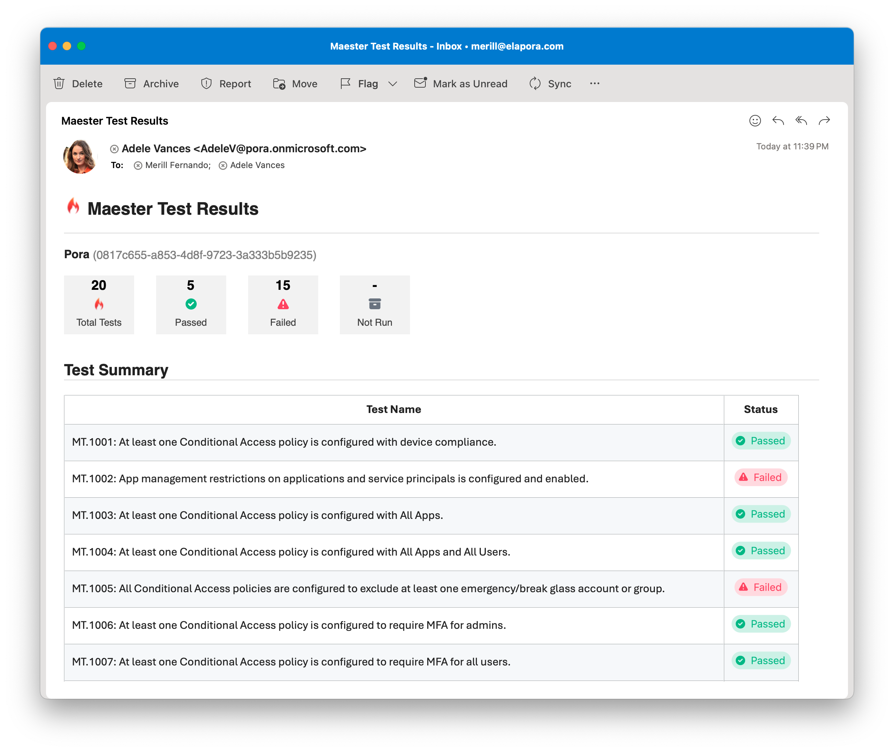

# Set up Maester Email Alerts

Your Maester monitoring workflow can be configured to send an email summary at the end of each monitoring cycle. This guide will walk you through the steps to set up email alerts in Maester.



## Prerequisites

Before you can send email alerts using Exchange Online you need to grant the application access to a mailbox. There's two ways to assign the this permissions:
- [Using RBAC for Applications](#using-rbac-for-applications) for scoped access **(Recommended)**
- [Using Graph permission](#using-graph-permissions) in Entra and limiting access to mailbox using Application Access Policy

### Using RBAC for Applications

[RBAC for Applications](https://learn.microsoft.com/en-us/exchange/permissions-exo/application-rbac) is the newest and most secure way to grant least privilege access to applications in Exchange Online. The example below will dynamically grant an app `Mail.Send` permission for the specific mailbox only.

The application should **not** be assigned `Mail.Send` application permission in Entra, see warning below.

```powershell
Import-Module ExchangeOnlineManagement

# Authenticate to Entra and Exchange Online
Connect-MgGraph -Scopes 'Application.Read.All'
Connect-ExchangeOnline

# Find your Maester service principal. Update filter with the name of your app registration or managed identity
$entraSP = Get-MgServicePrincipal -Filter "DisplayName eq 'Maester'"

# Register Maester service principal in Exchange
New-ServicePrincipal -AppId $entraSP.AppId -ObjectId $entraSP.Id -DisplayName $entraSP.DisplayName

# Find the mailbox you'd like to send from
$mailbox = Get-Mailbox maesterdemo@contoso.onmicrosoft.com
# Or create a new shared mailbox:
# $mailbox = New-Mailbox -Shared -Name "Maester" -PrimarySmtpAddress maester@contoso.onmicrosoft.com

# Create a RBAC scope to reference the mailbox
New-ManagementScope -Name "rbac_Maester" -RecipientRestrictionFilter "GUID -eq '$($mailbox.GUID)'"

# Assign Mail.Send role limited to only the Maester scope/mailbox
New-ManagementRoleAssignment -App $entraSP.AppId -Role "Application Mail.Send" -CustomResourceScope "rbac_Maester" -Name "Maester Send Mail RBAC"

# Verify access. This should show a line with Mail.Send permission and InScope = True
Test-ServicePrincipalAuthorization $entraSP.AppId -Resource $mailbox

Write-Host "Use '$($mailbox.ExternalDirectoryObjectId)' when calling Invoke-Maester -MailUserId or Send-MtMail -UserId"
```

:::warning Remove Mail.Send Graph Permission in Entra
Make sure the app has not been granted `Mail.Send` permissions in Entra. RBAC and Graph permissions live side-by-side. Leaving the `Mail.Send` application permission could grant the app tenant-wide access to all mailboxes.

If you previously used Graph Permission and optionally [Application Access Policy](https://learn.microsoft.com/graph/auth-limit-mailbox-access), removing both is important.
:::

### Using Graph permissions

This method is no longer recommended, but included for reference. To configure:

- Open the [Entra admin center](https://entra.microsoft.com) > **Identity** > **Applications** > **App registrations**
- Search for the application you created to run as the `Maester DevOps Account`.
- Select **API permissions** > **Add a permission**
- Select **Microsoft Graph** > **Application permissions**
- Search for `Mail.Send` and check the box next to the permission
- Select **Add permissions**
- Select **Grant admin consent for [your organization]**
- Select **Yes** to confirm

:::info Important
It is recommended to limit the scope of the `Mail.Send` permission to only the mailbox that will be used to send the email alerts.

This can be done by configuring an Application Access Policy in Exchange Online. For more information, see [Limiting application permissions to specific Exchange Online mailboxes](https://learn.microsoft.com/graph/auth-limit-mailbox-access).
:::

## Add the email alert step to your workflow

Update your GitHub/Azure DevOps daily monitoring workflow to send the email alert using `Send-MtMail` after the Maester tests have been run.

**Note:** A UserId is required when running under an application context. This can be the UserId of any user or mailbox account in the tenant and will be the mailbox from where this message is sent from.

```powershell
# Get the results of the Maester tests using -PassThru
$results = Invoke-Maester -Path tests/Maester/ {...} -PassThru

# Send the email summary using the results
Send-MtMail $results -Recipient john@contoso.com -UserId <guid>
```

## Adding a link to detailed Maester results in the email

The Send-MtMail cmdlet has a `-TestResultsUri` parameter that can be used to include a link to the detailed Maester results in the email.

To use this parameter, you need to provide the URL of the Maester results page. Use the appropriate url format based on the CI/CD system you are using.

### GitHub

**Link:** `${{ github.server_url }}/${{ github.repository }}/actions/runs/${{ github.run_id }}`

```powershell
$testResultsUri = "${{ github.server_url }}/${{ github.repository }}/actions/runs/${{ github.run_id }}"
Send-MtMail $results -Recipient $recipients -UserId $userId -TestResultsUri $testResultsUri
```

### Azure DevOps
**Link:** `$(System.CollectionUri)$(System.TeamProject)/_build/results?buildId=$(Build.BuildId)`

```powershell
$testResultsUri = "$(System.CollectionUri)$(System.TeamProject)/_build/results?buildId=$(Build.BuildId)"
Send-MtMail $results -Recipient $recipients -UserId $userId -TestResultsUri $testResultsUri
```
