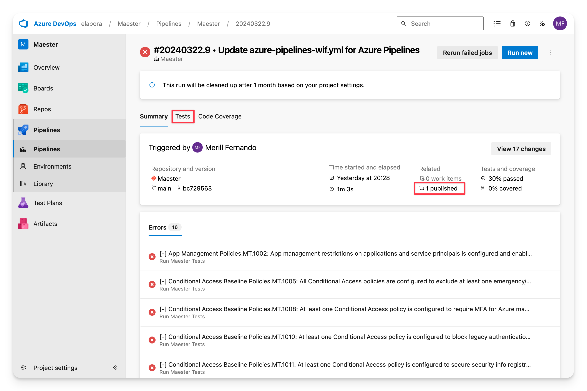

import Tabs from '@theme/Tabs';
import TabItem from '@theme/TabItem';
import GraphPermissions from '../sections/permissions.md';
import CreateEntraApp from '../sections/create-entra-app.md';

# <IIcon icon="mdi:github" height="48" /> Configure Maester in GitHub

This guide will walk you through setting up Maester in GitHub and automate the running of tests using GitHub Actions.

## Why GitHub?

GitHub is the quickest and easiest way to get started with automating Maester. The [free tier](https://github.com/pricing) includes 2,000 minutes per month for private repositories which is more than enough to run your Maester tests daily.

## Set up your Maester tests repository in GitHub

### Pre-requisites

- If you are new to GitHub, create an account at [github.com](https://github.com/join)

### Create a new repository and import the Maester Tests repository

- Open [https://github.com/new/import](https://github.com/new/import)
- Fill in the following fields:
  - **Your old repository’s clone URL**: `https://github.com/maester365/maester-tests`
  - **Repository name**: E.g. `maester-tests`
  - **Private**: Select this option to keep your tests private
- Click **Begin Import**

## Set up the GitHub Actions workflow

There are many ways to authenticate with Microsoft Entra from GitHub Actions. We recommend using [**workload identity federation**](https://learn.microsoft.com/entra/workload-id/workload-identity-federation) as it is more secure, requires less maintenance and is the easiest to set up.

If you’re unable to use more advanced options like certificates stored in Azure Key Vault, which need an Azure subscription, there’s also guidance available for using client secrets.

- <IIcon icon="gravity-ui:nut-hex" height="18" /> **Workload identity federation** (recommended) uses OpenID Connect (OIDC) to authenticate with Microsoft Entra protected resources without using secrets.
- <IIcon icon="material-symbols:password" height="18" /> **Client secret** uses a secret to authenticate with Microsoft Entra protected resources.

<Tabs>
  <TabItem value="wif" label="Workload identity federation (recommended)" default>

This guide is based on [Use GitHub Actions to connect to Azure](https://learn.microsoft.com/azure/developer/github/connect-from-azure)

### Pre-requisites

- An Azure subscription is required for this method.
  - If you don't have an Azure subscription, you can create one by following [Create a Microsoft Customer Agreement subscription](https://learn.microsoft.com/azure/cost-management-billing/manage/create-subscription) or ask your Azure administrator to create one.

  <CreateEntraApp/>

### Add federated credentials

- Select **Certificates & secrets** > **Client secrets** > **New client secret**
- Select **Federated credentials**, select **Add credential**
- For **Federated credential scenario**, select **GitHub Actions deploying Azure resources**
- Fill in the following fields
  - **Organization**: Your GitHub organization name or GitHub username. E.g. `jasonf`
  - **Repository**: Your GitHub repository name (from the previous step). E.g. `maester-tests`
  - **Entity type**: `Branch`
  - **GitHub branch name**: `main`
  - **Credential details** > **Name**: E.g. `maester-devops`
- Select **Add**

### Create GitHub secrets

- Open your `maester-tests` GitHub repository and go to **Settings**
- Select **Security** > **Secrets and variables** > **Actions**
- Add the three secrets listed below by selecting **New repository secret**
- To look up these values you will need to use the Entra portal, open the application you created earlier and copy the following values from the **Overview** page:
  - Name: **AZURE_TENANT_ID**, Value: The Directory (tenant) ID of the Entra tenant
  - Name: **AZURE_CLIENT_ID**, Value: The Application (client) ID of the Entra application you created
  - Name: **AZURE_SUBSCRIPTION_ID**, Value: Provide the ID of a subscription you own. Open the [Subscriptions](https://portal.azure.com/#view/Microsoft_Azure_Billing/SubscriptionsBladeV2) blade in the Azure portal
- Save each secret by selecting **Add secret**.

### Enable GitHub Actions

- Open your `maester-tests` GitHub repository and go to **Settings**
- Select **Actions** > **General** > **Actions permissions**
- Select **Allow all actions**
- Select **Save**

### Create GitHub Action

- Open your `maester-tests` GitHub repository and go to **Actions**
- Select **Skip this and set up a workflow yourself**
- Copy and paste the code below into the editor

```yaml
name: maester-daily-tests

on:
  push:
    branches: ["main"]
  # Run once day at midnight
  schedule:
    - cron: "0 0 * * *"
  # Allows to run this workflow manually from the Actions tab
  workflow_dispatch:

permissions:
      id-token: write
      contents: read

jobs:
  build-and-deploy:
    runs-on: ubuntu-latest
    steps:
    - name: 'Az CLI login'
      uses: azure/login@v1
      with:
          client-id: ${{ secrets.AZURE_CLIENT_ID }}
          tenant-id: ${{ secrets.AZURE_TENANT_ID }}
          subscription-id: ${{ secrets.AZURE_SUBSCRIPTION_ID }}
    - name: Run Maester
      uses: azure/powershell@v1
      with:
        inlineScript: |
          # Get Token
          $token = az account get-access-token --resource-type ms-graph

          # Connect to Microsoft Graph
          $accessToken = ($token | ConvertFrom-Json).accessToken | ConvertTo-SecureString -AsPlainText -Force
          Connect-MgGraph -AccessToken $accessToken

          # Install Maester
          Install-Module Maester -Force

          # Configure test results
          $PesterConfiguration = New-PesterConfiguration
          $PesterConfiguration.TestResult.Enabled = $true
          $PesterConfiguration.TestResult.OutputPath = '/test-results/test-results.xml'

          # Run Maester tests
          Invoke-Maester -Path /tests/Maester/ -PesterConfiguration $PesterConfiguration -OutputFolder '/test-results'
        azPSVersion: "latest"


  - publish: $(System.DefaultWorkingDirectory)/test-results
    displayName: Publish Maester Html Report
    artifact: TestResults
  - task: PublishTestResults@2
    displayName: Publish Pester Test Results
    inputs:
      testResultsFormat: "NUnit"
      testResultsFiles: "**/test-results.xml"
      failTaskOnFailedTests: true
```
- Select **Commit changes...** to save the workflow
- Select **Actions** > **maester-daily-tests** to view the status of the pipeline

  </TabItem>
  <TabItem value="cert" label="Client secret">

<CreateEntraApp/>

### Create a client secret

- Click **Certificates & secrets** > **Client secrets** > **New client secret**
- Enter a description for the secret (e.g. `Maester DevOps Secret`)
- Click **Add**
- Copy the value of the secret, we will use this value in the Azure Pipeline

### Create Azure Pipeline

- Open your Azure DevOps project
- Click **Pipelines** > **New pipeline**
- Select **Azure Repos Git** as the location of your code
- Select the repository where you imported the Maester tests
- Click **Starter pipeline**
- Click **Variable** to open the variables editor and add the following variables.
- In the Entra portal, open the application you created earlier and copy the following values from the **Overview** page:
  - Name: **TENANTID**, Value: The Directory (tenant) ID of the Entra tenant
  - Name: **CLIENTID**, Value: The Application (client) ID of the Entra application you created
  - Name: **CLIENTSECRET**, Value: The client secret you copied in the previous step
    - _Important: Tick the **Keep this value secret** checkbox_
- Replace the content of the `azure-pipelines.yml` file with the code below
- Click **Validate and save** > **Save**
- Click **Run** to run the pipeline
- Click **Job** to view the test results

```yaml
# Maester Daily Tests

trigger:
  - main

schedules:
  - cron: "0 0 * * *"
    displayName: Daily midnight build
    branches:
      include:
        - main

pool:
  vmImage: ubuntu-latest

steps:
  - pwsh: |
      # Connect to Microsoft Graph
      $clientSecret = ConvertTo-SecureString -AsPlainText $env:PS_ClientSecret -Force
      [pscredential]$clientSecretCredential = New-Object System.Management.Automation.PSCredential($env:CLIENTID, $clientSecret)
      Connect-MgGraph -TenantId $env:TENANTID -ClientSecretCredential $clientSecretCredential

      # Install Maester
      Install-Module Maester -Force

      # Configure test results
      $PesterConfiguration = New-PesterConfiguration
      $PesterConfiguration.TestResult.Enabled = $true
      $PesterConfiguration.TestResult.OutputPath = '$(System.DefaultWorkingDirectory)/test-results/test-results.xml'

      # Run Maester tests
      Invoke-Maester -Path $(System.DefaultWorkingDirectory)/tests/Maester/ -PesterConfiguration $PesterConfiguration -OutputFolder '$(System.DefaultWorkingDirectory)/test-results'
    env:
      PS_ClientSecret: $(CLIENTSECRET)
    continueOnError: true
    displayName: Run Maester Tests
  - publish: $(System.DefaultWorkingDirectory)/test-results
    artifact: TestResults
    displayName: Publish Maester Html Report
  - task: PublishTestResults@2
    inputs:
      testResultsFormat: "NUnit"
      testResultsFiles: "**/test-results.xml"
    displayName: Publish Pester Test Results
```

  </TabItem>
  </Tabs>

## Viewing test results

- Click **Pipelines** > **Runs** to view the status of the pipeline
- Click on a run to view the test results

### Summary view

The summary view shows the status of the pipeline run, the duration, and the number of tests that passed, failed, and were skipped.



### Maester report

The Maester report can be downloaded and viewed by selecting the **Published** artifact.


### Tests view

The **Tests** tab shows a detailed view of each test, including the test name, duration, and status.

## 

### Logs view

In the **Summary** tab click on any of the errors to view the raw logs from Maester.

## 

## Keeping your Maester tests up to date

The Maester team will add new tests over time. To get the latest updates, use the commands below to sync your Azure repository with [maester-tests](https://github.com/maester365/maester-tests).

Run this command once in your repository to add the maester-tests repository as a remote:

```bash
git remote add public https://github.com/maester365/maester-tests
```

Run the following command to pull in updates from the maester-tests repository:

```bash
git pull public main
```
