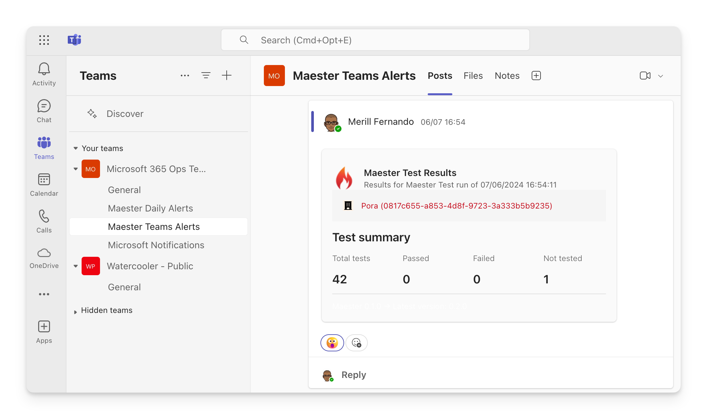

# Set up Maester Teams Alerts

Your Maester monitoring workflow can be configured to send an adaptive card in a team channel with the summary of the Maester test results at the end of each monitoring cycle in Slack. This guide will walk you through the steps to set up Teams alerts in Maester.



## Prerequisites

### ChannelMessage.Send graph permissions

The app that sends the Teams alerts needs the `ChannelMessage.Send` permission to send messages. To configure

- Open the [Entra admin center](https://entra.microsoft.com) > **Identity** > **Applications** > **App registrations**
- Search for the application you created to run as the `Maester DevOps Account`.
- Select **API permissions** > **Add a permission**
- Select **Microsoft Graph** > **Application permissions**
- Search for `ChannelMessage.Send` and check the box next to the permission
- Select **Add permissions**
- Select **Grant admin consent for [your organization]**
- Select **Yes** to confirm


## Add the Teams alert step to your workflow

Update your GitHub/Azure DevOps daily monitoring workflow to send the alert using `Send-MtTeamsMessage` after the Maester tests have been run.

```powershell
# Get the results of the Maester tests using -PassThru
$results = Invoke-Maester -Path tests/Maester/ {...} -PassThru

# Send the summary using the results
Send-MtTeamsMessage -MaesterResults $MaesterResults -TeamId '00000000-0000-0000-0000-000000000000' -TeamChannelId '19%3A00000000000000000000000000000000%40thread.tacv2' -Subject 'Maester Results'

```

:::info
* To get the TeamId, right-click on the channel in Teams and select 'Get link to channel'. Use the value of groupId. e.g. ?groupId=< TeamId >
* To get the TeamChannelId, right-click on the channel in Teams and select 'Get link to channel'. Use the value found between channel and the channel name. e.g. /channel/< TeamChannelId >/my%20channel
:::

## Adding a link to detailed Maester results

The cmdlet has a `-TestResultsUri` parameter that can be used to include a link to the detailed Maester results in the alert.

To use this parameter, you need to provide the URL of the Maester results page. Use the appropriate url format based on the CI/CD system you are using.

### GitHub

**Link:** `${{ github.server_url }}/${{ github.repository }}/actions/runs/${{ github.run_id }}`

```powershell
$testResultsUri = "${{ github.server_url }}/${{ github.repository }}/actions/runs/${{ github.run_id }}"

Send-MtTeamsMessage -MaesterResults $results -TeamId $teamId -TeamChannelId $teamChannelId -Subject 'Maester Results' -TestResultsUri $testResultsUri

```

### Azure DevOps
**Link:** `$(System.CollectionUri)$(System.TeamProject)/_build/results?buildId=$(Build.BuildId)`

```powershell
$testResultsUri = "$(System.CollectionUri)$(System.TeamProject)/_build/results?buildId=$(Build.BuildId)"

Send-MtTeamsMessage -MaesterResults $results -TeamId $teamId -TeamChannelId $teamChannelId -Subject 'Maester Results' -TestResultsUri $testResultsUri
```
