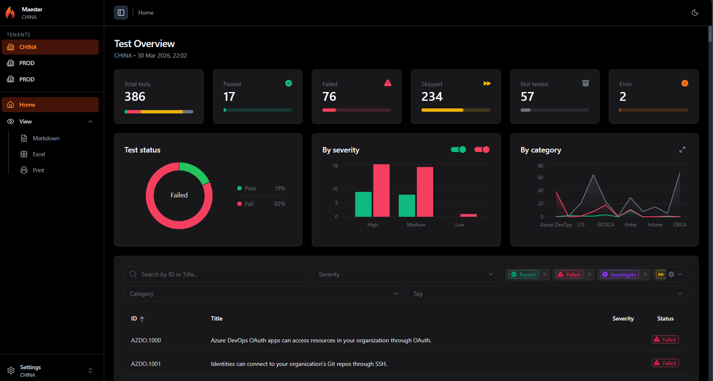

# Multi-Tenant Reports

Maester supports running security tests across multiple Microsoft 365 tenants and viewing the results in a single HTML report.

## Features

- Run Maester tests across multiple tenants in a single pipeline run
- Switch between tenants in one report using the sidebar
- Full dashboard per tenant including charts, filters, and detailed test results
- Each tenant uses its own service connection with read-only permissions

## How it looks

The sidebar shows a **Tenants** section when there are multiple tenants in the report. Click any tenant to switch the entire dashboard to that tenant's data.

Each tenant gets the full experience: test overview, severity charts, category breakdown, and the detailed test results table with all filters.

Single-tenant reports continue to work exactly as before. The tenant selector only appears when there are multiple tenants in the report.

## How it works

1. Run Maester separately for each tenant using its own service connection
2. Save the JSON results from each run
3. Merge and generate the report: `Merge-MtMaesterResult -Path *.json | Get-MtHtmlReport | Out-File report.html`

See [Merging Results](./merging-results) for the PowerShell example and [Azure DevOps Pipeline](./azure-devops-pipeline) for a complete CI/CD setup.
