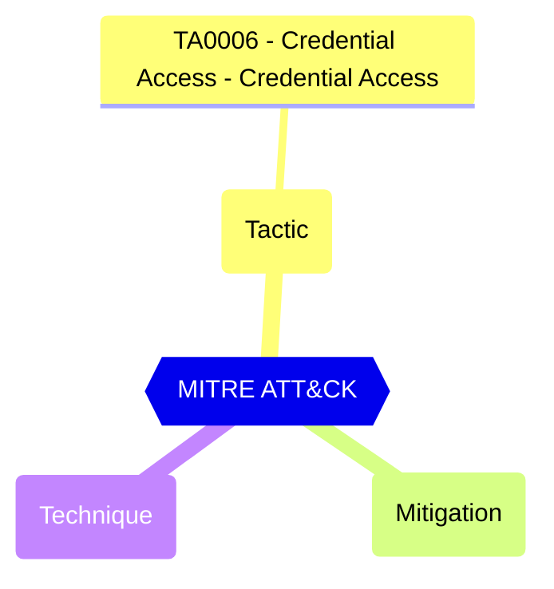

# Default Authorization Settings - Enabled Self service password reset for administrators

Indicates whether administrators of the tenant can use the Self-Service Password Reset (SSPR). The policy applies to some critical critical roles in Microsoft Entra ID.

| | |
|-|-|
| **Name** | allowedToUseSSPR |
| **Control** | Default Authorization Settings |
| **Description** | Manages authorization settings in Azure AD |
| **Severity** | Informational |

## How to fix

### Details of configuration item
| | |
|-|-|
| **Recommendation** | Administrators with sensitive roles should use phishing-resistant authentication methods only and therefore not able to reset their password using SSPR. |
| **Configuration** | policies/authorizationPolicy |
| **Setting** | `allowedToUseSSPR` |
| **Recommended Value** | 'false' |
| **Default Value** | true |
| **Graph API Docs** | [authorizationPolicy resource type - Microsoft Graph v1.0 - Microsoft Learn](https://learn.microsoft.com/en-us/graph/api/resources/authorizationpolicy) |
| **Graph Explorer** | [Open in Graph Explorer](https://developer.microsoft.com/en-us/graph/graph-explorer?request=policies/authorizationPolicy&method=GET&version=beta&GraphUrl=https://graph.microsoft.com) |

## MITRE ATT&CK

|Tactic|Technique|Mitigation|
|---|---|---|
|[TA0006 - Credential Access - Credential Access](https://attack.mitre.org/tactics/TA0006)|||

