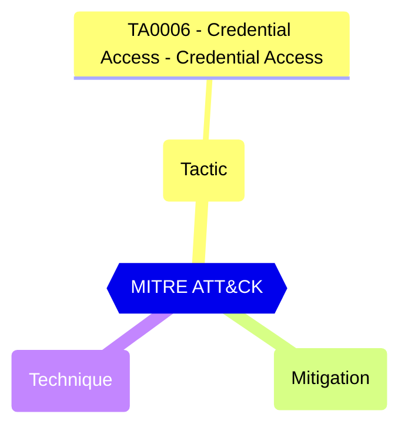

<!-- This file is generated by website/scripts/generate-test-docs.mjs. Do not edit manually. -->

# EIDSCA.AP01 - Default Authorization Settings - Enabled Self service password reset for administrators.

## Overview

Indicates whether administrators of the tenant can use the Self-Service Password Reset (SSPR). The policy applies to some critical critical roles in Microsoft Entra ID.

Administrators with sensitive roles should use phishing-resistant authentication methods only and therefore not able to reset their password using SSPR.

#### Test script
```
https://graph.microsoft.com/beta/policies/authorizationPolicy
.allowedToUseSSPR -eq 'false'
```

#### Related links

- [Open in Graph Explorer](https://developer.microsoft.com/en-us/graph/graph-explorer?request=policies/authorizationPolicy&method=GET&version=beta&GraphUrl=https://graph.microsoft.com)
- [authorizationPolicy resource type - Microsoft Graph v1.0 | Microsoft Learn](https://learn.microsoft.com/en-us/graph/api/resources/authorizationpolicy)
- [View in Microsoft Entra admin center](https://entra.microsoft.com/#view/Microsoft_AAD_IAM/PasswordResetMenuBlade/~/AdminPasswordResetPolicy)

## MITRE ATT&CK


```mermaid
mindmap
  root{{MITRE ATT&CK}}
    (Tactic)
      TA0006 - Credential Access - Credential Access
    (Mitigation)

    (Technique)

```
|Tactic|Technique|Mitigation|
|---|---|---|
|[TA0006 - Credential Access - Credential Access](https://attack.mitre.org/tactics/TA0006)|||

## Test Metadata

| Field | Value |
| --- | --- |
| Test ID | EIDSCA.AP01 |
| Severity | High |
| Suite | Entra ID SCA |
| Category | General |
| PowerShell test | [Test-MtEidscaAP01](/docs/commands/Test-MtEidscaAP01) |
| Tags | EIDSCA, EIDSCA.AP01 |

## Source

- Pester test: `tests/EIDSCA/Test-EIDSCA.Generated.Tests.ps1`
- PowerShell source: `powershell/internal/eidsca/Test-MtEidscaAP01.ps1`
